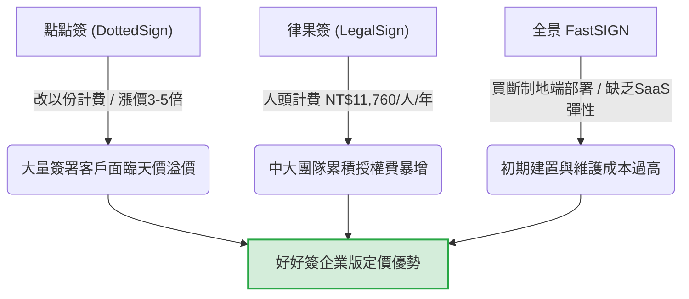

# 好好簽 電子簽章定價成本結構與利潤邊際分析報告

> **報告日期**：2026-05-25  
> **分析對象**：好好簽 (BreezySign) 商業定價模型、毛利邊際與財務安全防線  
> **數據來源**：結合前線業務反饋之變動成本通道、ISO 合規年費、人事管銷編制、每月 PMax/Search 廣告投放以及競品（點點簽、律果簽）之最新定價痛點。

---

## 一、 📊 財務模型：年度總成本結構分析 (Cost Structure)

我們將好好簽的營運成本劃分為**變動成本 (Variable Costs)** 與**固定管銷成本 (Fixed Operating Costs)**，以建立真實的損益模型：

### 1. 變動成本 (Variable Cost per Transaction)
變動成本直接與客戶的「簽署任務量」與「通道選擇」掛鉤：
*   **AATL 憑證成本**：向中華電信採購，每簽署一份文件需要加蓋 1 份 AATL 憑證，成本為 **NT$1.5 / 份** (完簽才計)。
*   **簡訊催簽與驗證成本**：每則簡訊通道成本為 **NT$0.85 / 則**。
    *   *註：若客戶選擇「Email 傳簽」或「Line 傳簽」，簡訊成本為 NT$0；實務上 B2B 團隊月約 50% 任務採用 Email 傳簽，B2C 旅行社約 70% 採用 LINE 傳簽，簡訊發送率約控制在 15% 左右。*
*   **郵件發送與 GCP 平台分攤**：GCP 伺服器運算與資料庫儲存，連同 Amazon SES 等郵件通道費，分攤至單一簽署任務，平均成本極低，約為 **NT$0.05 / 份**。
*   **單份合約平均變動成本 (MC)**：
    *   *最優場景 (LINE/Email 完簽)*：**NT$1.55 / 份** (僅 AATL + 郵件)。
    *   *常規混合場景 (15%簡訊發送率)*：NT$1.55 + (NT$0.85 × 15%) = **NT$1.68 / 份**。
    *   *高變動場景 (簡訊傳簽 + 簡訊OTP驗證)*：NT$1.50 + NT$0.85 × 2 = **NT$3.20 / 份**。

### 2. 固定管銷成本 (Fixed Operating Costs)
這是維持好好簽系統正常運作、合規背書、人事推廣的年度固定費用：
*   **安全與驗證維持費 (Compliance & Audit)**：
    *   ISO 27001 (資訊安全管理系統) 驗證與外部年審維持費：約 **NT$300,000 / 年**。
    *   ISO 27701 (隱私資訊管理系統) 驗證與外部年審維持費：約 **NT$300,000 / 年**。
    *   *小計*：**NT$600,000 / 年**。
*   **人事管銷費用 (Personnel SG&A - 以 10 人編制計)**：
    *   技術研發 (R&D)：3 人（平均年薪含勞健保分攤 $900k，共計 NT$2,700,000）。
    *   業務開發與客成 (Sales & CSM)：4 人（平均年薪 $700k，共計 NT$2,800,000）。
    *   行銷與運營 (Marketing & Ops)：2 人（平均年薪 $700k，共計 NT$1,400,000）。
    *   財務與管理 (HR & Finance)：1 人（年薪 $800k）。
    *   *小計*：**NT$7,700,000 / 年** (每月人事管銷固定支出約 NT$641,600)。
*   **行銷與顧問推廣費用 (Marketing & Ads)**：
    *   行銷顧問年費：**NT$360,000 / 年** (每月 NT$30,000)。
    *   Google Ads (Search + Pmax) 廣告費：依 2026 上半年花費 $22,223 USD 換算，全年度預算約 **NT$1,440,000 / 年** (每月 NT$120,000)。
    *   *小計*：**NT$1,800,000 / 年**。
*   **GCP 伺服器基本租用費**：約 **NT$400,000 / 年**。

### 3. 年度總固定成本 (Total Annual Fixed Costs)
$$\text{TFC} = 600,000 + 7,700,000 + 1,800,000 + 400,000 = \text{\textbf{NT\$10,500,000 / 年}}$$
*(換算每月最低固定管銷開支約為 **NT\$875,000**)*

---

## 二、 📈 損益平衡與利潤邊際分析 (Break-Even & Margin Defense)

由於好好簽目前採取「吃到飽」的定價方案（如企業版年租 NT$15,000/年，不限份數；專業年約 NT$3,000/年），變動成本（AATL 憑證 NT$1.5 與簡訊 NT$0.85）將會隨客戶簽署量膨脹而對「利潤邊際」產生稀釋風險。

我們對主流付費方案進行**毛利安全邊際分析**：

### 1. 專業方案 (NT$3,000 / 年，單人版月上限限制與加購機制)
*   **平均變動成本 (混合場景)**：NT$1.68 / 份。
*   **單一客戶年保本簽署上限**：
    $$\frac{\text{NT\$3,000}}{\text{NT\$1.68}} = \text{\textbf{1,785 份/年}}$$
*   **大戶定價第一道防線：月上限與加購憑證包機制 (New!)**：
    為了防範大量簽署大戶（如聖美麗、浸信會）利用低成本的 NT$3,000 專業方案進行無限量簽署，對好好簽造成憑證成本倒貼風險，**專業方案將訂定每月簽署上限，超過則提供憑證加購包，每次最少加購 5 份**：
    *   **每月簽署上限**：**150 份 / 月** (年額 1,800 份，精準卡在保本線 1,785 份邊緣，確保單一客戶絕不虧本)。
    *   **超額加購機制**：當月超出 150 份時，系統自動阻斷並引導購買加購包，**每次最少加購 5 份**。
    *   **加購單價財務精算對照**：
        1. **方案 A (每份 NT$15，每次加購 NT$75)**：
           * *常規混合場景 (成本 $1.68)*：毛利 NT$13.32 / 份，**毛利率 88.8%**。
           * *簡訊 OTP 場景 (成本 $3.20)*：毛利 NT$11.80 / 份，**毛利率 78.7%**。
        2. **方案 B (每份 NT$30，每次加購 NT$150)**：
           * *常規混合場景 (成本 $1.68)*：毛利 NT$28.32 / 份，**毛利率 94.4%**。
           * *簡訊 OTP 場景 (成本 $3.20)*：毛利 NT$26.80 / 份，**毛利率 89.3%**。
           這兩種加購方案皆能為好好簽帶來極為豐厚的超額利潤，使高頻大戶轉變為核心利潤引擎。
*   **現狀統計**：對外正式官網的個人專業版客戶（如恆峰不動產、夢曦文化傳媒），每月實際用量多在 5 份至 20 份以內，遠低於 150 份上限，仍享受 **88% ~ 97%** 的極高毛利率；而對於異常高頻的客戶，則能透過加購機制穩健貢獻毛利。

### 2. 企業方案 (NT$15,000 / 年，含 5 個帳號不限份數)
*   **平均變動成本 (混合場景)**：NT$1.68 / 份。
*   **單一企業客戶保本簽署上限**：
    $$\frac{\text{NT\$15,000}}{\text{NT\$1.68}} = \text{\textbf{8,928 份/年}}$$
    *   *解讀*：當企業版客戶每年簽署量低於 8,928 份（平均每月低於 744 份）時，該帳戶為**毛利貢獻者**。
    *   *現狀統計*：好好簽絕大多數 5 人企業客戶，如麻吉行得通（年用量 500~600 份）、台灣奇恭 (GiGO)（年用量 80~100 份），其實際簽署量遠低於此門檻，毛利率高達 **93% 以上**。

### 3. 大量簽署大戶之「客製化防線」 (High Volume Custom Defense)
對於超大簽署量的移轉客戶，例如 **福安管理顧問企業社**（年用量高達 20,000 份，點點簽 6/30 到期流失）：
*   **若直接套用 NT$15,000 企業版**：我方變動成本將達 $20,000 \times 1.68 = \text{NT\$33,600}$，會產生 **-$18,600** 的毛利虧損！
*   **截擊定價戰術 (Custom Pricing)**：對於此類大戶，必須啟動「大戶防線價格」，Kelly 之前已精準報價 **企業版 50人 NT$68,000 / 60人 NT$76,000**。
    *   *以 NT$68,000 方案計算毛利*：
        $$\text{毛利} = 68,000 - (20,000 \times 1.68) = \text{NT\$34,400} \quad (\text{毛利率 50.5\%})$$
    *   這既完美解決了點點簽開出十幾萬天價以份計費對福安產生的價格抗拒，又為好好簽穩穩守住 **50% 的高毛利防線**，同時人均年費僅 NT$1,360，對比競品極具殺傷力。

---

## 三、 ⚔️ 競品定價劣勢分析與好好簽包抄定位

我們分析對手點點簽、律果簽與 FastSIGN 的定價抗性，並將其作為好好簽的截擊賣點：

### 1. 點點簽 (DottedSign) ── 改採以份計費，大漲 3-5 倍
*   **痛點**：將原本不限人數的任務包改制，續約全面調漲。例如太平洋旅行社 40 人版年約限制 2000 份，報價竟高達 7 萬多台幣，且超額份數費用極其昂貴。
*   **好好簽包抄策略**：以 **40 人企業版年約 NT$60,000 (吃到飽)** 精準攔截，徹底打消客戶對份數超額的焦慮，且提供 UNIFY 範本共用功能。

### 2. 律果簽 (LegalSign) ── 強制按人頭 (Per User) 計費
*   **痛點**：企業版每人每年收費 NT$11,760。如果一個公司有 20 人使用，每年固定授權費達 NT$235,200；40 人團隊則需高達 NT$470,400。
*   **好好簽包抄策略**：好好簽採取固定人數區間吃到飽（如 5人 NT$15,000 / 年；40人 NT$60,000 / 年），人均成本僅需對方的 **10% ~ 25%**，尤其適合非法律密集型、但需要跨部門多人使用的常規簽署團隊（如行政、人資、業務部門）。

### 3. 全景 FastSIGN ── 偏重地端買斷，缺乏 SaaS 彈性
*   **痛點**：主打地端買斷與資安高牆，但建置費動輒數十萬起跳，且每年需支付 15%~20% 的維護年費，對中小型與成長型企業門檻極高。
*   **好好簽包抄策略**：輕量快速 SaaS 隨開即用，以最低 NT$3,000 起的年費提供通過國家能量登錄與 ISO 認證的同等法律效力。

---

## 四、 🎯 定價優化與市場截擊建議

為了在這波「點點簽漲價潮」中踩下油門擴張市佔率，同時守護好好簽的年度固定成本（1,020萬 NTD）以達成損益平衡，提出以下定價與行銷策略優化方針：

### 1. 建立「層級化」標準方案體系，守護吃到飽毛利
為了防範極少數「無限簽署」的超高頻用量客戶稀釋毛利，無論個人或企業版吃到飽，均應附加合理的「軟性安全閥值」與超額加購機制：
*   **個人專業方案 (NT$3,000 / 年，單人版)**：適合個人或微企大戶，設定當月簽署額度 **150 份 / 月**。當月超出則引導購買加購憑證包，**每份 NT$15 ~ NT$30** (每次最少加購 5 份，共 NT$75 ~ NT$150)，築起大戶防線第一關。
*   **企業入門方案 (NT$15,000 / 年，含 5 帳號)**：適合常規企業團隊，內含 AATL 憑證額度 5,000 份/年（已覆蓋 95% 客戶需求，毛利率達 50%）。超額按 AATL 憑證每份 NT$3.0 計收。
*   **企業商務方案 (NT$30,000 / 年，含 15 帳號)**：內含 AATL 憑證額度 12,000 份/年。超額按每份 NT$2.5 計收。
*   **企業旗艦方案 (NT$60,000 / 年，含 40 帳號)**：內含 AATL 憑證額度 25,000 份/年。超額按每份 NT$2.0 計收（如太平洋旅行社）。

### 2. 人事與行銷回本指標：損益平衡目標 (Break-Even Target)
若以年度總固定成本 **NT$10,500,000 / 年**（含 10 人人事管銷、60 萬 ISO 維護年費與 180 萬行銷顧問/廣告費）計算：
*   若好好簽付費客戶結構平均 ARPU 為 NT$6,000/年：
    $$\text{損益平衡客戶數} = \frac{10,500,000}{6,000} = \text{\textbf{1,750 家付費企業戶}}$$
*   目前我們月新增付費公司正以極高的 LTV:CAC 黃金比例 (258:1) 快速累計，當付費企業戶突破 1,700 家時，好好簽將迎來**完全的淨利爆發期**。
*   **行銷策略定調**：基於 258:1 的健康比例，現在應**維持每月 12 萬 NTD (每年 144 萬) 的 Google Ads/Pmax 行銷廣告預算**。這筆預算可在 1 年內完全回本，是吃下點點簽漲價客戶的最佳推進燃料。

---
*研究員：LLM Agent (Antigravity) | 財務模型建立：好好簽市場優化與定價分析小組 | 日期：2026-05-25*
