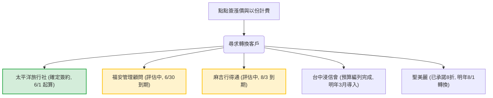

# 點點簽價格調漲與以份計費之轉單潮深度分析報告

> 本報告深度分析了 2026 年中旬競爭廠商「點點簽 (DottedSign)」在調整價格方案（特別是變更為以合約份數計費模式）後，對其既有客戶群所產生的強大推力，以及「好好簽 (BreezySign)」如何透過精準的定價策略、垂直行業特定功能與合規資產，成功實現客戶攔截與轉單的實戰態勢。

## 核心要點
- **點點簽定價改制痛點**：點點簽改採「以份計費」或大幅度調漲年約，對「大量簽署 (High Volume)」客戶群造成了極高的溢價壓力，是客戶大舉流失的根本誘因。
- **系統穩定度與功能漏洞**：除了定價大幅上漲外，點點簽部分手機用戶簽署卡頓，以及缺乏如 Line 傳簽等符合本土消費者習慣的便利功能，進一步削弱了其客戶黏著度。
- **好好簽的精準攔截武器**：
  1. **「吃到飽」定價方案**：以不限件數的定價優勢，徹底解決大量簽署客戶的費用焦慮。
  2. **UNIFY 範本分享與管理**：滿足中大型企業（如太平洋旅行社）對合約安全與權限控制的嚴格防禦需求。
  3. **Line 傳簽與公開表單簽**：高度契合旅遊業、顧問業等 B2C 行業的現場與線上敏捷交付場景。
  4. ** moda 能量登錄與 ISO 認證**：滿足特定受監管行業（如人力仲介與健康管理）對電子簽章法的合規門檻。

---

## 詳細內容

### 一、 點點簽改制定價引發的抗性分析

點點簽（DottedSign）在 2026 年中的定價策略調整，對不同量級的客戶造成了嚴重的成本衝擊，進而轉化為向好好簽移轉的直接動力：

| 客戶量級 | 代表案例 | 點點簽方案痛點 | 好好簽攔截契機 |
| :--- | :--- | :--- | :--- |
| **超大量級** (年簽 20,000+ 份) | **福安管理顧問企業社** | 以份計費在 20,000 份規模下年費極高，超出企業預算承受範圍。 | 評估企業版 50~60 人吃到飽方案（$68,000 ~ $76,000），年省高達數十萬元。 |
| **中大量級** (年簽 1,000~2,000 份) | **太平洋旅行社** | 40 人版年約限制 2000 份，調漲後報價達 7 萬多，且不包含 Line 傳簽。 | 以 40 人企業年約吃到飽（NT$60,000）成功簽約攔截，並提供 UNIFY 範本權限管理。 |
| **中等量級** (年簽 500~1,000 份) | **台中浸信會** **麻吉行得通** | 點點簽改以份計費，年約費用增至 25,000 元以上，且點點簽在使用中經常卡頓。 | 台中浸信會編列預算導入專業方案；麻吉行得通正評估企業方案（5 人版 $15,000 起）。 |
| **成長量級** (月簽 50~100 份) | **聖美麗健康管理顧問** | 點點簽以份計費導致續約費率翻倍。 | 承諾提供企業版 8 折優惠（NT$12,000），目前於體驗版進行轉換測試。 |

---

### 二、 好好簽的攔截戰術與競爭武器

面對點點簽暴露出的防線漏洞，好好簽在以下幾個維度上展現了極高的競爭力，成功搶佔市場份額：

#### 1. 吃到飽定價策略 (Flat-rate Pricing)
好好簽堅持「人數不限、份數不限」的彈性吃到飽或固定人數吃到飽方案，為企業提供了極高且透明的成本可預測性。以太平洋旅行社為例，NT$60,000 的 40 人年費方案可無限簽署，相較於點點簽有份數限制且高達 7 萬多的報價，好好簽在性價比上具有壓倒性優勢。

#### 2. 太平洋旅行社指標功能：UNIFY 範本權限共用
在中大型團隊導入電子簽章時，為防範基層員工擅自修改合約範本或自建不合規文件，**管理權限的控管**至關重要。
好好簽針對太平洋旅行社啟用的 **UNIFY 範本共用模式**，可限制「僅有主帳號可自建與分享範本，子帳號不再允許自建範本」。這項功能切中企業的內控合規痛點，成為與點點簽或 DocuSign 對抗時的關鍵籌碼。

#### 3. 垂直行業交付功能：Line 傳簽與公開表單簽
* **Line 傳簽**：深受台灣本土 B2C 行業（如旅遊業、包租代管）青睞。相較於電子信箱，透過 Line 傳送簽署連結的開卡率與完簽速度提升數倍。
* **公開表單簽**：如耐斯旅行社提出的「一團 20 人使用單一連結自主簽署定型化契約」需求。好好簽的公開表單只需發布單一連結，即可讓多人填寫個資並完簽，省去業務員 1 對 1 發送的行政成本。

#### 4. 合規與背書資產：moda 能量登錄與 ISO 認證
在健康管理（福安）、人力仲介（聖美麗）等受監管或高風險領域，客戶極度重視電子簽章是否完全符合「電子簽章法」。好好簽通過**數位發展部電子簽章解決方案服務能量登錄**並具備 ISO 認證，提供了與大廠同等的法律合規保障，成為促成點點簽用戶放心跳槽的安全防線。

---

### 三、 客戶轉單跟進與狀態清單

以下為本波「點點簽轉單潮」的重點客戶跟進軌跡與所處階段：

1. **[確定成交] 太平洋旅行社股份有限公司**
   - **當前狀態**：已於 5/21 確定採用年租 40 個帳號方案（NT$60,000），5/22 Jack 已提供電匯報價單，設定 UNIFY 範本功能，體驗版展延至 5/31，正式版自 6/1 起算。
   - **待辦事項**：跟進匯款與對帳，並於 6/1 切換為正式商務版。
2. **[高意願] 福安管理顧問企業社**
   - **當前狀態**：點點簽 6/30 到期。Kelly 之前已報價 50人($68,000) 及 60人($76,000) 企業方案。客戶要求成交後提供一場 Google Meet 線上教育訓練並錄影。
   - **待辦事項**：Jack 與 Kelly 主動跟進，並確認教育訓練大綱以加速客戶決策。
3. **[高意願] 麻吉行得通股份有限公司**
   - **當前狀態**：點點簽 8/3 到期，以份計費改制成本（約 $25,000/年）過高。體驗版於 5/21 到期，正評估好好簽 5 人企業版（$15,000）。
   - **待辦事項**：主動聯繫承辦人，詢問體驗展延或直接報價需求。
4. **[預算編列] 台中浸信會**
   - **當前狀態**：已完成明年的預算編列，承辦人將提案給行政執事，預計明年 3 月正式導入好好簽專業方案。
   - **待辦事項**：保持每季度的定期問候與進度關懷，並在明年初主動提供測試帳號。
5. **[中長線] 聖美麗健康管理顧問有限公司**
   - **當前狀態**：點點簽合約於明年 8/1 到期，承辦人計畫在到期前一個月（明年 6~7 月）開始測試。好好簽已承諾提供 8 折優惠（年費 NT$12,000），體驗版已協助展延至今年 6/21，目前任務數 74。
   - **待辦事項**：追蹤客戶在展延期間的試用體驗，為中長線移轉打下穩固互信。

---

## 相關連結
- [點點簽](../entities/dottedsign.md) — 競爭廠商實體頁面
- [國內電子簽章服務競品比較](../analyses/domestic-e-signature-comparison.md)
- [BZS SaaS 實質付費客戶分類清單 (按方案)](../analyses/bzs-saas-paid-subscribers-by-plan.md)

## 來源引用
- [BreezySign 好好簽 20260522 日報](../sources/bzs-daily-report-20260522.md) — 20260522 業務日報摘要
- [BreezySign 好好簽 20260522 週報](../sources/bzs-weekly-report-20260522.md) — 20260522 業務週報摘要
