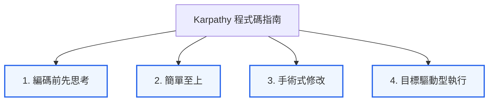

# Karpathy 程式碼指南 (Karpathy Coding Guidelines)

> **Karpathy 程式碼指南**是一套專為 LLM/AI 編碼代理（如 Claude Code, Cursor 等）設計的軟體工程實踐方法論。其核心思想源自前 OpenAI 聯合創辦人兼特斯拉 AI 負責人 **Andrej Karpathy** 對於 LLM 程式編寫致命病灶的實戰觀察，旨在透過約束與規範，發揮 AI 代理的最佳除錯與工程能力。

## 概念概述
隨著 AI 編碼代理的普及，開發者逐漸面臨「AI 默默猜測需求導致重大 Bug」、「過度工程化 (Over-engineering) 導致代碼庫臃腫」以及「擅自修改無關代碼引發副作用」等痛苦痛點。

Karpathy 程式碼指南將傳統軟體工程中的極簡主義（KISS 原則）、局部修改（Orthogonal Edit）與測試驅動開發（TDD）融入 LLM 提示詞工程中，提煉出四大黃金支柱，作為約束與引導 AI 代理行為的 `CLAUDE.md` 或 `.cursorrules` 標準規格。

---

## 四大核心支柱

### 1. 編碼前先思考 (Think Before Coding)
*   **理論核心**：對抗 LLM 的「盲信假設」與「隱藏困惑」。LLM 在面對語意模糊的需求時，往往會默默選擇一種容易寫錯的解讀方式並狂奔到底。
*   **實踐要求**：AI 代理在動手前，必須**明確大聲陳述其假設與多種解釋**。如有任何困惑或潛在衝突，必須立刻停下來請求人類澄清，不得自行猜測。

### 2. 簡單至上 (Simplicity First)
*   **理論核心**：YAGNI (You Aren't Gonna Need It) 精神的極致實施。LLM 具備極強的「知識發散性」，極度喜歡在簡單任務中堆砌抽象層、多餘的類別與未要求的「可配置性/擴充性」。
*   **實踐要求**：拒絕為一次性代碼做任何抽象，用最少的代碼（扁平直觀）解決問題。如果 200 行可以縮減到 50 行，必須進行簡化重寫。

### 3. 手術式修改 (Surgical Changes)
*   **理論核心**：局部編輯（Orthogonal Edit）與單一職責原則。LLM 經常因為不完全理解 codebase，而在解決 A 問題時，擅自刪改或「順手優化」與 A 無關的 B 區塊，造成意料之外的副作用。
*   **實踐要求**：**只碰你必須碰的東西**。不重構沒有損壞的程式碼，不擅自修改相鄰的格式或註解。每一行被修改的代碼，都必須能直接追溯到使用者的明確請求中。

### 4. 目標驅動型執行 (Goal-Driven Execution)
*   **理論核心**：聲明式程式設計（Declarative）與測試驅動（TDD）。LLM 的優勢在於**「擁有明確成功標準時，極其擅長在閉環中循環往復以達成目標」**。
*   **實踐要求**：將命令式的任務（如「修復 X 漏洞」）重構為聲明式目標與驗證循環（如「編寫能重現 X 漏洞的測試，然後修改代碼直至測試 100% 通過，且前後測試皆通過」）。

---

## 與 Vibe Coding 及 Harness Engineering 的連結

### 1. 防範 Vibe Coding 陷阱的「安全閥」
[Vibe Coding 範式](vibe-coding-paradigm.md) 強調人機協同中人類負責架構與方向、AI 負責代碼編寫的流暢體驗。然而，若缺乏約束，Vibe Coding 極易淪為「混亂編碼」。
*   **簡單至上** 與 **手術式修改** 正是阻斷 Vibe Coding 導致代碼庫臃腫崩潰的「安全閥」，確保 codebase 始終保持資深工程師認可的極簡度。

### 2. Harness Engineering 的引導方針
[Harness Engineering](harness-engineering.md) 專注於為 AI 鋪設成功軌道（如測試套件、驗證腳本）。
*   **目標驅動型執行** 完美對接了 Harness Engineering 的實踐：人類工程師的職責不再是教導 AI 怎麼寫代碼，而是為 AI 代理配置好強悍的**成功標準與驗證沙盒**（Verify Loop），讓 AI 能夠自主在沙盒中除錯並滾動直至達成目標。

---

## 相關連結
- [Vibe Coding 範式](vibe-coding-paradigm.md) — 人機協同的新浪潮。
- [Harness Engineering](harness-engineering.md) — 裝配工程與自我驗證設計。
- [Karpathy 啟發的 Claude 程式碼指南 (CLAUDE.md)](../sources/karpathy-claude-guidelines.md) — 來源摘要頁。
