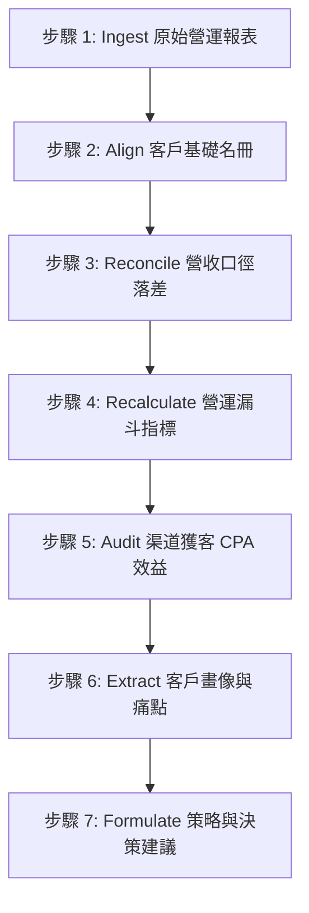

# SaaS 月度營運數據對齊與整體分析流程 SOP

## 1. 完成定義 (DoD)
- 當月新增之 PM 營運報表數據已完整登錄並完成與客成系統 (CSM) 的定量對帳。
- 對帳產生的口徑與時間落差（如跨月扣款、自動扣款失敗與線下專案實收）已被定量拆分與分析。
- 營運分析報告鏈按「基礎對齊 ➡️ 漏斗指標 ➡️ 渠道效益 ➡️ 客戶畫像 ➡️ 決策建議」之標準順序依次完成增量更新。
- 各報告之 LTV:CAC、CPA 及實收營收數據前後一致。
- 報告內容僅以對外公開之正式站 (Production) 實績為準，嚴格排除測試站 (Staging) 數據與進行中未正式生效之項目。
- `log.md` 與 `index.md` 完成同步註冊。

## 2. 何時使用 (When to Use)
- 每月月初，產品經理 (PM) 與財務發布上月整體公司營運 Dashboard、營收扣款儀表板與付費客戶名單快照之時。

## 3. 前提條件 (Prerequisites)
- 取得上月全月實收金流數據、註冊公司數據、SaaS 付費名單（按方案）、Google Ads 實際花費以及 CSM leads 系統之實際跟進軌跡。

---

## 4. 流程步驟 (SOP Steps)

### 步驟 1：匯入 (Ingest) 月度原始營運報表
- **動作**：將 PM 提供的原始營運報表數據（如月度註冊數、實收金額、新購業績等）寫入對應的 `wiki/sources/` 來源摘要中。
- **規則**：數據必須與信源文件（如 PDF 報表或後台截圖）嚴格一致。

### 步驟 2：對齊 (Align) 客戶基礎名冊
- **動作**：依據後台扣款成功的付費企業名冊，依次更新以下兩個名單文件：
  1. [bzs-saas-customer-list.md](../analyses/bzs/bzs-saas-customer-list.md)（增量登載最新付費大客之日報引用）。
  2. [bzs-saas-paid-subscribers-by-plan.md](../analyses/bzs/bzs-saas-paid-subscribers-by-plan.md)（對齊最新企業/專業/商務付費方案之底層家數）。

### 步驟 3：對帳 (Reconcile) 營收口徑落差
- **動作**：更新對應月份的深度勾稽報告 [bzs-saas-ops-csm-reconciliation-202605.md](../analyses/bzs/bzs-saas-ops-csm-reconciliation-202605.md)（或建立當期對帳單）。
- **規則**：定量勾稽後台扣款實收與 CSM 成交，拆分「自動續約 ( Recurring Revenue )」與「新購業績 ( New Booking )」，分析跨月扣款、自動扣款失敗與一次性專案/API 對接費用。
- > [!IMPORTANT]
  > **資料落差防呆**：若勾稽過程中發現不同的資料來源有衝突或落差（如週報成交金額與後台不對齊），**必須主動抓取相關資料進行更新**。若庫中無數據，**必須立刻中止分析並向操作者（使用者）詢問如何處理**，嚴禁靜默忽略或憑空推估。

### 步驟 4：重新核算 (Recalculate) 營運漏斗指標
- **動作**：更新 [bzs-saas-funnel-ltv-cac-report.md](../analyses/bzs/bzs-saas-funnel-ltv-cac-report.md)。
- **規則**：使用步驟 2 和 3 中對齊後的真實營收與註冊數，重新計算月度 LTV、CAC、ARPU、Chun 及其回本週期。

### 步驟 5：核對 (Audit) 渠道獲客 CPA 效益
- **動作**：更新 [bzs-acquisition-channels.md](../analyses/bzs/bzs-acquisition-channels.md)。
- **規則**：基於漏斗指標中的真實 CPA，核算 Google Ads 各搜尋詞、Pmax 及 SI 夥伴通路的 CPA 與獲客效率（雙軌 CPA & LTV:CAC 比值）。

### 步驟 6：提煉 (Extract) 客戶畫像與功能痛點
- **動作**：更新 [bzs-customer-personas.md](../analyses/bzs/bzs-customer-personas.md) 與 [bzs-feature-requirements.md](../analyses/bzs/bzs-feature-requirements.md)。
- **規則**：根據當月正式成交/流失大客的服務歷程（如太平洋旅行社、聖美麗、得勝者等），歸納新型態畫像與產品訴求。

### 步驟 7：制定 (Formulate) 行銷與定價策略決策建議
- **動作**：更新 [bzs-h2-marketing-strategy-2026.md](../analyses/bzs/bzs-h2-marketing-strategy-2026.md)（或當期策略建議）。
- **規則**：結合渠道成效與畫像痛點，提出具體的預算配比加碼戰術與定價安全防線建議。

---

## 5. 驗證完成 (Verification)
- 檢查各報告中的 LTV:CAC 計算基礎、CPA 數值與實收營收數據是否完全對齊，不得有前後矛盾。
- > [!WARNING]
  > **正式站唯一基準**：確保所有分析報告中的案例與數據均以對外公開之正式站 (Production) 為唯一基準。嚴禁使用或提及測試站 (Staging) 數據、測試官網或進行中未正式生效的專案。

## 6. 出問題時怎麼辦 (Troubleshooting)
- **數據缺失**：若前線週報或後台扣款單有缺漏，中止後續分析並向操作者（使用者）索取。
- **連結斷鏈**：若重構過程中更名或移轉分析報告，必須全域掃描並替換所有相對連結，確保無失效內部連結。

---

## 相關連結
- [SaaS 歷年四大維度與成長漏斗綜合分析報告 (2024-2026)](../analyses/bzs/bzs-saas-funnel-ltv-cac-report.md)
- [好好簽 (BZS) 企業客戶畫像分析](../analyses/bzs/bzs-customer-personas.md)
