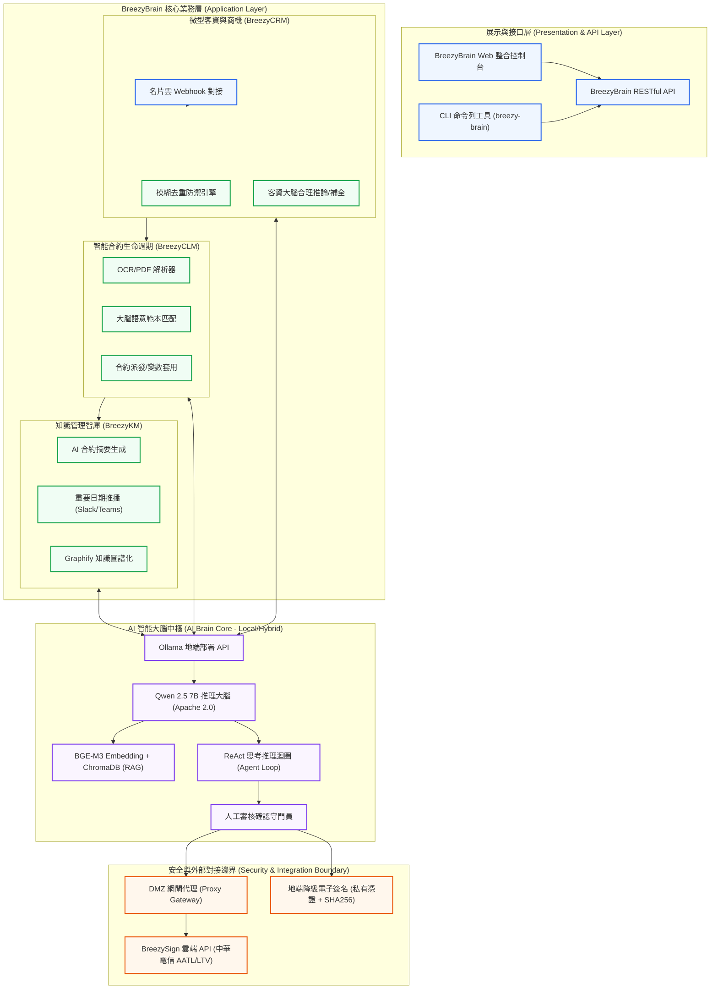
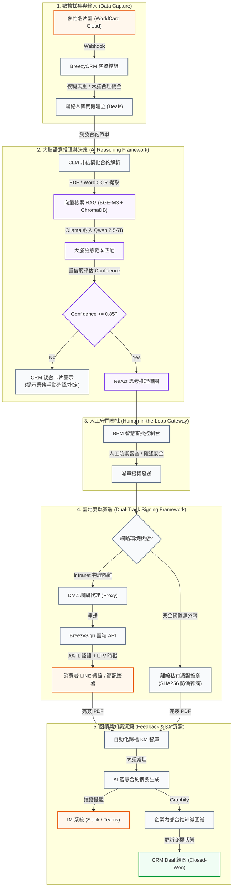
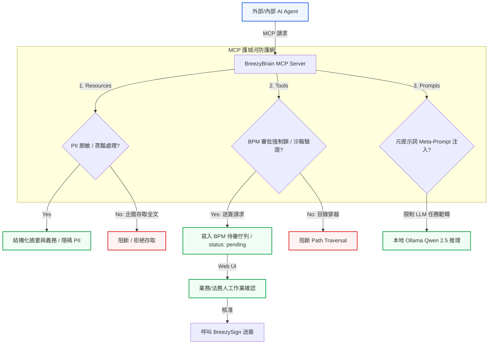

# 🧠 BreezyBrain (好好腦) 產品需求文件

> **文件狀態**：MVP 階段需求定義 (Draft)  
> **維護角色**：`/pm` (Product Spec Builder)

## 1. 產品定位與商業目標

### 1.1 核心定義 (What is it?)
BreezyBrain 不是一個與通用自動化工具 (如 Zapier, Make) 硬碰硬的底層 iPaaS 平台，而是 **BreezySign 企業版的高階自動化中樞模組**。
它的目標是「用大腦驅動手腳」—— 透過 Local LLM，將合約簽署前段的 CRM 與後段的 BPM/KM 完美串聯。

### 1.2 目標受眾 (Target Audience)
**MVP 階段鎖定：** 具備高度標準化合約流程、且合約發送量極大的中小型企業。
*   **首要畫像**：旅遊服務業 (旅遊定型化契約)、醫療/醫美診所 (同意書)、健康管理顧問。
*   **痛點**：這類企業缺乏強大的 IT 團隊自行串接 Zapier 或 ERP，他們需要的是「開箱即用」的智能合約派單系統。

### 1.3 核心護城河 (Defensibility)
*   **AI 合約審閱與資料抽取 (LLM-based Extraction)**：Zapier 只能處理結構化資料 (JSON/Webhooks)，但 BreezyBrain 內建的 AI 大腦能直接閱讀 PDF 或 Word，自動判別客戶意圖並提取關鍵字（如：合約金額、日期、對象），這成為不可取代的技術壁壘。
*   **Graphify (知識圖譜化)**：簽完的合約直接轉化為企業內部知識庫，增加客戶黏著度。

### 1.4 定價策略與商業模式 (Pricing Strategy & Business Model)
BreezyBrain 採取「雲端 SaaS 訂閱」與「混合落地建置」雙軌模式，但因應電子簽章之法律效力，底層簽署費用獨立計費。

#### 1.4.1 技術架構與落地考量
1. **混合式落地 (Hybrid On-Premises)**：基於資料隱私與 Local LLM 硬體/軟體建置成本考量，大腦核心、BreezyCRM 與文件處理可落地部署於客戶端地端硬體。
2. **雲端簽核連動與 LTV 時戳 (Cloud Integration & Global Providers)**：為確保電子簽章具備 AATL 認證與 LTV 完整時戳，電子簽章模組（BreezySign API 或海外對接之 DocuSign / Adobe Sign API）仍必須與對應市場的雲端認證機構（如中華電信或國外 CA）進行線上串接，以符合當地法律規範。
3. **物理隔離地端環境防線 (Offline Signing & DMZ Gateway)**：
   - 若企業客戶為 100% 物理隔離之無外網環境 (Intranet)，系統提供 **「DMZ 網閘代理 (Proxy Gateway)」** 方案，將網路請求限縮於專用連接埠連通至外部時戳伺服器。
   - 若客戶政策完全禁止任何外網連線，則 CLM/BPM 自動切換至 **「降級電子簽章模式」**：採用地端自簽私有憑證（無 AATL/LTV 中華電信時戳，但具備地端大腦私鑰簽章與 SHA256 雜湊防偽），並於系統內加註「[Offline-Signature] 私有憑證簽署」。

#### 1.4.2 計費方案
1. **方案 A：雲端 SaaS 服務**
   - **計費方式**：依企業使用人數（Users）計費，採月/年訂閱制。
   - **內含成本**：通知 Mail、雲端託管大腦算力、雲端儲存。
2. **方案 B：混合落地建置 (Enterprise On-Premises)**
   - **一次性費用**：安裝設定費、地端軟硬體建置費、首次教育訓練費。
   - **持續性費用**：系統年度維護合約費 (Annual Maintenance Fee)。
3. **基礎簽署費（不論方案均適用）**
   - **計費方式**：以「份 (Per Document)」計費。
   - **原因**：電子簽章發送（包含 AATL、LTV 時戳及通知通道）均有實質之憑證與通訊成本。

### 1.5 產品核心架構圖 (Product Architecture Diagram)

為了方便各部門（產品、技術、銷售）在研發與對接時進行精準溝通，BreezyBrain 採用分層式架構設計。大腦中樞（地端 Local LLM）作為核心推理引擎，驅動前段客資 CRM、中段 CLM 合約管理與後段 KM 歸檔，並由 DMZ 網閘安全代理對接外部 BreezySign 雲端 API，或降級執行地端簽署。

為了適應不同的溝通與列印需求，本規格書提供了以下**四種不同形式的旗艦級架構示意圖**：

#### 1.5.1 形式一：產品核心分層架構藍圖 (BreezyBrain Layered Workflow Blueprint - V2 橫向版)
*   **設計形式**：分層規格說明型架構圖。以直欄將系統垂直切割，卡片內部包含詳細的中文功能說明與技術標籤（Tech Badges），強調模組歸屬與功能規格。此為適應簡報投影需求調整之 16:9 橫向版本。
*   **線上預覽與列印**：[HTML 自適應網頁版](file:///c:/Users/alexc/OneDrive/文件/WikiLLM/outputs/20260528-1815-breezy-brain-architecture_v2.html) | [高畫質 PDF 下載](file:///c:/Users/alexc/OneDrive/文件/WikiLLM/outputs/20260528-1815-breezy-brain-architecture_v2.pdf)
*   **架構藍圖預覽**：
<div class="page-break" style="page-break-before: always; text-align: center; margin: 30px 0;">
  
</div>

#### 1.5.2 形式二：系統拓撲關係示意圖 (BreezySign Neon Connection Blueprint)
*   **設計形式**：極簡 Eraser.io 風格之系統互聯拓撲圖。呈現中央大腦與外部 API、名片雲及用戶端在雲地混合部署下的安全邊界與數據交換路由。（本形式不提供獨立的 HTML/PDF 網頁預覽）
*   **架構藍圖預覽**：
<div class="page-break" style="page-break-before: always; text-align: center; margin: 30px 0;">
  
</div>

#### 1.5.3 形式三：BreezyBrain 智慧工作流操作系統架構圖 (BreezyBrain Agent Framework)
*   **設計形式**：中央大腦驅動型架構圖。以深藍色發光霓虹風格展示，突顯「大腦中樞」與六大業務垂直支柱（BCR、CRM、BPM、CLM、KM、Integration）的雙向推理與控制流。
*   **架構藍圖預覽**：
<div class="page-break" style="page-break-before: always; text-align: center; margin: 30px 0;">
  
</div>

#### 1.5.4 形式四：WikiLLM Agent 系統架構編排藍圖 (WikiLLM Agent Orchestration Blueprint)
*   **設計形式**：Agent 管道流程型架構圖。以深藍色霓虹發光風格展示，呈現從 Raw Ingestion 到 Agent Engine（三層式架構：Planning, Execution, Memory）再到 Local Knowledge Base 的資料流向與協定。
*   **架構藍圖預覽**：
<div class="page-break" style="page-break-before: always; text-align: center; margin: 30px 0;">
  
</div>



### 1.6 產品運行與技術框架 (Product Runtime & Technical Framework)

為了進一步釐清資料與智能決策在系統中的「動態生命週期 (Runtime Pipeline)」，BreezyBrain 建立了端到端的**數據流與智能推理框架**。下圖詳細展示了客資掃描、CLM 派單、地端大腦 RAG 推理、人機協作審批（Human-in-the-Loop）以及最終歸檔 KM 知識庫並完成閉環的完整運作 Framework：



---


## 2. MVP 核心功能需求 (User Stories)

### Epic 1: 智能合約派發 (Smart Dispatch)
*   **US 1.1 (自建 CRM 觸發)**：身為業務，我希望當我在 BreezyBrain 內建的「微型 CRM 模組」將交易狀態改為 "Won" 時，BreezyBrain 能自動從報價單提取金額與品項，並自動填入對應的 BreezySign 範本中。
    - **大腦範本語意匹配機制 (Semantic Template Mapping)**：大腦讀取非結構化合約標題及前導段落，以「語意向量比對」自動關聯至最契合之 BreezySign 範本。例如偵測到「房屋租賃」關鍵特徵即匹配「房租範本」；若匹配置信度 (Confidence) < 0.85，則於 CRM 後台卡片警示並提示業務「手動確認/指定範本」，避免自動套用錯誤。
*   **US 1.2 (非結構化解析)**：身為診所助理，我希望上傳一份紙本掃描的同意書後，系統能透過 Local LLM 的高精度 OCR 服務自動解析同意書內容，並將姓名、簽署日期等結構化欄位提取出來。

### Epic 2: BCR 人脈與資料採集 (BCR & Data Ingestion)
*   **US 2.1 (名片掃描與 OCR)**：身為銷售業務，我希望使用手機拍照或掃描儀上傳名片後，系統能串接 WorldCard Cloud 的 API 進行高精度名片解析。
*   **US 2.2 (大腦資料清洗與補全)**：身為銷售業務，我希望當 OCR 解析出的資料有缺失時，大腦能自動清洗、修復並與政府工商登記資料比對，補齊稅號 (Tax ID) 等核心欄位，以維持客資的精準度。

### Epic 3: 輕量企業級 BreezyCRM (BreezyCRM for Enterprise)
*   **US 3.1 (多類型客資管理)**：身為銷售主管，我希望系統能將客戶區分為 SaaS 訂閱者 (SaaS Product)、零售經銷通路 (Retail Channel) 以及專案客製建置 (Project Custom) 等多種類型，以便針對不同業務特性進行精細化管理。
*   **US 3.2 (自訂增強欄位)**：身為系統管理員，我希望系統預留動態擴充欄位空間（採用 JSONB 格式），讓我可以隨時於後台無代碼自訂客戶、聯絡人與商機的客製欄位，為未來的業務擴充和系統集成預留增強空間。

#### 2.3.2 BreezyCRM 核心資料欄位 (Data Schema) & 預留客製化增強規格

依據多通路銷售日報與客戶進件需求，BreezyCRM 分類管理 **SaaS 產品 (SaaS)**、**零售經銷通路 (Retail)** 及 **專案客製工程 (Project)** 三種不同型態之客戶與商機。為了滿足極致的擴充性與「預留未來更新與增強的空間」，BreezyCRM 在 Accounts、Contacts 與 Deals 實體中均預留了 JSONB 格式的 `custom_fields` 動態擴充欄位。這使得系統在對接不同業務管道特有的客戶屬性或第三方系統 API（如名片 OCR 採集、經銷分潤、專案里程碑等）時，無須變更底層資料庫實體 Schema 即可完成無痛增強。BreezyCRM 主要維護以下三大實體：

1. **客戶 (Accounts)**：
   - `id` (主鍵，UUID)
   - `name` (公司名稱，必填，對應 WorldCard.Company)
   - `tax_id` (統一編號，必填/去重依據，對應 WorldCard.TaxID，作為 B2B 客資去重之主鍵)
   - `client_type` (客戶類別，列舉值: `saas_subscriber` | `retail_channel` | `project_custom`，用以路由對應 Pipeline)
   - `industry` (行業別，影響方案推薦)
   - `capital` (資本額，判斷付費能力)
   - `company_size` (員工人數/規模，決定推薦版本)
   - `custom_fields` (JSONB，**預留自訂增強欄位空間**。可由管理員於後台無代碼动态新增，如：`{"preferred_contact_time": "14:00"}` 或 `{"parent_company_id": "uuid"}`，實現極致的擴充性)
   - `created_at`, `updated_at` (時間戳記)
2. **聯絡人 (Contacts)**：
   - `id` (主鍵，UUID)
   - `account_id` (關聯客戶 id)
   - `name` (姓名，必填，對應 WorldCard.Name)
   - `title` (職稱，對應 WorldCard.Title)
   - `email` (電子郵件，必填，對應 WorldCard.Email)
   - `mobile` (手機，對應 WorldCard.Mobile)
   - `tel` (公司電話，對應 WorldCard.Tel)
   - `im_id` (即時通訊如 LINE ID，選填)
   - `department` (部門)
   - `custom_fields` (JSONB，**預留自訂聯絡人特質標籤空間**，如：`{"hobby": "golf"}` 或是 `{"decision_power": "high"}`)
3. **商機與合約關聯 (Deals & Contract Association)**：
   - `id` (主鍵，UUID)
   - `account_id` (關聯客戶 id)
   - `lead_type` (商機類型，`saas_subscriber` | `retail_channel` | `project_custom`)
   - `stage` (跟進階段，依據 `lead_type` 動態對齊對應 Pipeline，詳見下述)
   - `acquisition_channel` (來源管道，必填，如：搜尋/廣告/推薦/能量登錄)
   - `document_type` (需求文件類型，如：外部合約/內部表單/公開表單/其它)
   - `signer_type` (主要簽署對象，如：客戶/員工/廠商)
   - `monthly_volume` (預估每月份數，決定定價與潛力評估)
   - `signing_method` (簽署應用方式，如：遠距簽/簡訊簽/LINE傳簽/API串接)
   - `competitor_status` (競品狀況，如：無/點點簽/Adobe Sign/其它)
   - `potential_level` (潛力等級，如：🔴 高潛力 / 🟡 中潛力 / ⚪ 低潛力 / ➡️ 轉介)
   - `trial_expiry_date` (企業體驗到期日，若為 SaaS 類型則由體驗開通後自動連動計算)
   - `associated_contracts` (合約關聯列表，儲存與此 Deal 關聯的 [BreezySign/DocuSign 傳簽封套 ID] 與 [PDF 歸檔路徑])
   - `custom_fields` (JSONB，**預留商機特有參數空間**。例如零售商商機儲存分潤點數 `{"margin_rate": 0.25}`，專案客製儲存驗收時程 `{"project_milestones": ["UAT", "Acceptance"]}`)

*   **CRM 防禦規格 (去重與欄位缺失容錯)**：
    - **模糊去重防禦**：系統在接收名片或外部建立潛客時，優先進行 `(公司名稱 + 聯絡人姓名)` 模糊比對。匹配度若 > 85%（閾值可調），則系統不建立新 Account，改在已有 Account 下新增 Contact 與 Deal，避免因名片無稅號/無 Email 造成的多重 Account 衝突。
    - **大腦合理瞎猜與欄位補全**：若名片或留單上缺少「員工人數」、「資本額」等潛力評估核心指標，地端 LLM 自動分析公司名稱於本地資料庫中進行推論；若無法推論，系統自動降級預設為 `🟡 中潛力`，並於 UI/CLI 警示業務「待補充關鍵欄位」。
    - **離線暫存與手動合併**：支持在離線或斷線同步衝突時，透過 CLI/API 對指定之重複 Accounts 進行手動合併。

*   **介面定義 (API/CLI Interfaces & Custom Fields)**：
    - **CLI 指令**：
      - 名片採集同步：`breezy-brain crm sync-card --file <path> [--merge-threshold <float>] [--auto-complete <boolean>] --format json`
      - 潛客手動建立（支援 JSONB 動態參數）：`breezy-brain crm lead-create --company <name> --name <contact_name> --email <email> --client-type <saas/retail/project> [--tax-id <id>] [--custom-fields <json_string>] --format json`
        - **帶動態參數範例**：`--custom-fields '{"retail_stores": 5, "decision_maker": true}'`
      - 重複客戶合併：`breezy-brain crm merge-accounts --keep-id <uuid> --merge-id <uuid> --format json`
    - **API 端點**：
      - `POST /api/v1/crm/sync-card`
      - `POST /api/v1/crm/accounts` (Body 可傳入 `custom_fields` JSON 物件，Response 回傳新 Account ID)
      - `POST /api/v1/crm/contacts` (Body 可傳入 `custom_fields` JSON 物件，Response 回傳新 Contact ID)
      - `POST /api/v1/crm/deals` (Body 包含 `lead_type` 與對應的 `custom_fields`，建立並流轉至該類型的 Pipeline 起始階段)
      - `POST /api/v1/crm/accounts/merge`

#### 2.3.3 三軌獨立銷售管道定義 (Multi-Pipeline Stage Definitions)

BreezyCRM 廢除單一 Pipeline 機制，針對不同商業屬性之客戶導入 **「三軌銷售管道 (Multi-Pipeline)」**。每條管道配置獨立的階段狀態機，並嚴格綁定其專屬的跟進 SOP：

##### 管道 A：SaaS 產品管道 (SaaS Pipeline)
> **核心目標**：以 14 天免費企業版體驗引導轉化 (PLG 驅動)，著重計件與訂閱額度的產品化防線。

| 階段名稱 | 系統標識 | 定義與觸發動作 | 對應 SOP / Checklist |
| :--- | :--- | :--- | :--- |
| **潛客探索** | `Prospecting` | 名片雲進件或線上留單，待業務初步聯繫。 | [新潛客資格確認 SOP](../../playbooks/new-lead-qualification.md) |
| **需求確認** | `Qualifying` | 初步通話，填寫行業、月份數、計費方案，進行潛力分級。 | [新潛客資格確認 SOP](../../playbooks/new-lead-qualification.md) |
| **體驗中** | `Trial` | 開通 14 天企業體驗帳戶，系統自動設定 `trial_expiry_date`。 | [企業試用版跟進 Checklist](../../playbooks/enterprise-trial-followup.md) |
| **方案報價** | `Negotiating` | 表達採購意向，發送 SaaS 訂閱方案合約/報價單。 | [企業試用版跟進 Checklist](../../playbooks/enterprise-trial-followup.md) |
| **成交簽署中** | `Won` | 完成付款，**觸發 US 1.1 大腦自動範本匹配與 E-Sign 送簽**。 | [整合資料流](breezy-brain-integration-flow.md) |
| **歸檔流失** | `Lost` | 試用期滿未付費、轉向競品或結案。 | [企業試用版跟進 Checklist](../../playbooks/enterprise-trial-followup.md) |

##### 管道 B：零售通路經銷管道 (Retail Pipeline)
> **核心目標**：著重通路資質考核、大額分潤條款協議及經銷授權書之簽署。

| 階段名稱 | 系統標識 | 定義與觸發動作 | 對應 SOP / Checklist |
| :--- | :--- | :--- | :--- |
| **管道初探** | `Lead_Contact` | 通路經銷商主動進件或行銷轉介，建立初步聯繫。 | [經銷通路接觸 SOP (TBD)] |
| **通路評估** | `Channel_Assessment` | 審核該零售經銷商之規模、門市數、稅號及銷售合規度。 | [經銷通路接觸 SOP (TBD)] |
| **分潤協議** | `Margin_Negotiation` | 談判分成扣折、經銷階梯定價與分銷區域權限。 | [經銷商談判條約 Checklist (TBD)] |
| **合約上架** | `Onboarding` | 法務審核代理協定，**發送經銷商代理授權書與分潤協定傳簽**。 | [經銷商合約傳簽 SOP] |
| **活躍通路商**| `Active_Retailer` | 簽署完成，經銷系統開通，通路商正式上架銷售。 | [通路日常關係維護 Playbook] |
| **通路流失** | `Lost` | 通路考核未通過，或經銷合約到期終止。 | [通路退場機制] |

##### 管道 C：專案客製建置管道 (Project Pipeline)
> **核心目標**：服務中大型企業地端混合建置 (SLG 驅動)。著重 RFP 需求評估、多階段開發與驗收條件。

| 階段名稱 | 系統標識 | 定義與觸發動作 | 對應 SOP / Checklist |
| :--- | :--- | :--- | :--- |
| **顧問訪談** | `Discovery` | 大型客戶客製需求進件，發起跨部門技術與顧問訪談。 | [專案需求搜集 Runbook] |
| **RFP 評估** | `RFP_Assessment` | 法務與工程評估 RFP 規格，覆核地端硬體、網閘代理及預算。| [RFP 會簽審核機制] |
| **提案簡報** | `Proposal_Pitch` | 提交 POC 展示方案與架構書，向客戶決策層簡報。 | [POC 架構展示 Checklist] |
| **法務會簽** | `Contract_Review` | 針對客製化條款（如 SLA 賠償限制、驗收退費）進行法務簽署。| [客製專案合約會簽流程] |
| **建置開發** | `Implementation` | 開發與地端容器組安裝，按 Milestone 追蹤進展。 | [專案開發管理規範] |
| **驗收結案** | `Acceptance` | 完成 UAT 測試並取得客戶簽署驗收單，專案結案歸檔。 | [專案驗收結案 SOP] |
| **專案流失** | `Lost` | 招標未中標、規格無法達成或客戶終止專案。 | [專案流失分析檢討 SOP] |應 WorldCard.TaxID，作為 B2B 客資去重之主鍵)
   - `industry` (行業別，影響方案推薦)
   - `capital` (資本額，判斷付費能力)
   - `company_size` (員工人數/規模，決定推薦版本)
   - `created_at`, `updated_at` (時間戳記)
2. **聯絡人 (Contacts)**：
   - `id` (主鍵，UUID)
   - `account_id` (關聯客戶 id)
   - `name` (姓名，必填，對應 WorldCard.Name)
   - `title` (職稱，對應 WorldCard.Title)
   - `email` (電子郵件，必填，對應 WorldCard.Email)
   - `mobile` (手機，對應 WorldCard.Mobile)
   - `tel` (公司電話，對應 WorldCard.Tel)
   - `im_id` (即時通訊如 LINE ID，選填)
   - `department` (部門)
3. **商機與合約關聯 (Deals & Contract Association)**：
   - `id` (主鍵，UUID)
   - `account_id` (關聯客戶 id)
   - `stage` (跟進階段，詳見下述)
   - `acquisition_channel` (來源管道，必填，如：搜尋/廣告/推薦/能量登錄)
   - `document_type` (需求文件類型，如：外部合約/內部表單/公開表單/其它)
   - `signer_type` (主要簽署對象，如：客戶/員工/廠商)
   - `monthly_volume` (預估每月份數，決定定價與潛力評估)
   - `signing_method` (簽署應用方式，如：遠距簽/簡訊簽/LINE傳簽/API串接)
   - `competitor_status` (競品狀況，如：無/點點簽/Adobe Sign/其它)
   - `potential_level` (潛力等級，如：🔴 高潛力 / 🟡 中潛力 / ⚪ 低潛力 / ➡️ 轉介)
   - `trial_expiry_date` (企業體驗到期日，由體驗開通後自動連動算)
   - `associated_contracts` (合約關聯列表，儲存與此 Deal 關聯的 [BreezySign 傳簽封套 ID] 與 [PDF 歸檔路徑])

*   **CRM 防禦規格 (去重與欄位缺失容錯)**：
    - **模糊去重防禦**：系統在接收名片或外部建立潛客時，優先進行 `(公司名稱 + 聯絡人姓名)` 模糊比對。匹配度若 > 85%（閾值可調），則系統不建立新 Account，改在已有 Account 下新增 Contact 與 Deal，避免因名片無稅號/無 Email 造成的多重 Account 衝突。
    - **大腦合理瞎猜與欄位補全**：若名片或留單上缺少「員工人數」、「資本額」等潛力評估核心指標，地端 LLM 自動分析公司名稱於本地資料庫中進行推論；若無法推論，系統自動降級預設為 `🟡 中潛力`，並於 UI/CLI 警示業務「待補充關鍵欄位」。
    - **離線暫存與手動合併**：支持在離線或斷線同步衝突時，透過 CLI/API 對指定之重複 Accounts 進行手動合併。

*   **介面定義 (API/CLI Interfaces)**：
    - **CLI 指令**：
      - 名片採集同步：`breezy-brain crm sync-card --file <path> [--merge-threshold <float>] [--auto-complete <boolean>] --format json`
        - **成功輸出 (stdout)**：
          ```json
          {
            "success": true,
            "data": {
              "account_id": "acc-9987-uuid",
              "contact_id": "con-6654-uuid",
              "deal_id": "deal-3211-uuid",
              "is_merged": false
            },
            "error": null
          }
          ```
      - 潛客手動建立：`breezy-brain crm lead-create --company <name> --name <contact_name> --email <email> [--tax-id <id>] --format json`
      - 重複客戶合併：`breezy-brain crm merge-accounts --keep-id <uuid> --merge-id <uuid> --format json`
    - **API 端點**：
      - `POST /api/v1/crm/sync-card`
        - **Request Body (JSON)**：
          ```json
          {
            "file_path": "/storage/raw/card_ocr.json",
            "merge_threshold": 0.85,
            "auto_complete": true
          }
          ```
        - **Response Body (HTTP 200 OK)**：
          ```json
          {
            "success": true,
            "data": {
              "account_id": "acc-9987-uuid",
              "contact_id": "con-6654-uuid",
              "deal_id": "deal-3211-uuid",
              "is_merged": false
            },
            "error": null
          }
          ```
      - `POST /api/v1/crm/accounts` (Body 包含 Account Schema，Response 回傳新 Account ID)
      - `POST /api/v1/crm/contacts` (Body 包含 Contact Schema，Response 回傳新 Contact ID)
      - `POST /api/v1/crm/deals` (Body 包含 Deal Schema，Response 回傳新 Deal ID)
      - `POST /api/v1/crm/accounts/merge`
        - **Request Body (JSON)**：
          ```json
          {
            "keep_id": "acc-keep-uuid",
            "merge_id": "acc-duplicate-uuid"
          }
          ```
        - **Response Body (HTTP 200 OK)**：
          ```json
          {
            "success": true,
            "data": {
              "merged_account_id": "acc-keep-uuid"
            },
            "error": null
          }
          ```

#### 2.3.3 銷售跟進階段定義 (Deal Stages)
銷售漏斗流程與現有 SOP 高度對齊，共有以下五個主要階段：

| 階段名稱 | 系統名稱 | 定義與觸發動作 | 對應 SOP / Checklist |
| :--- | :--- | :--- | :--- |
| **潛客探索** | `Prospecting` | WorldCard Cloud 掃描名片進件，或 Inbound 新留單，等待業務進行初步聯繫。 | [新潛客資格確認 SOP](../../playbooks/new-lead-qualification.md) |
| **需求確認** | `Qualifying` | 業務與客戶進行聯繫，填畢行業別、月份數、簽署對象等核心需求，進行潛力分級。 | [新潛客資格確認 SOP](../../playbooks/new-lead-qualification.md) |
| **體驗中** | `Trial` | 經評估後開通 14 天企業體驗版，系統自動設置 `trial_expiry_date`，業務依據天數進行關懷。 | [企業試用版跟進 Checklist](../../playbooks/enterprise-trial-followup.md) |
| **方案報價** | `Negotiating` | 客戶表達採購意向，業務發送正式報價單（若有 API / BPM / 專案整合需求則進入此階段）。 | [企業試用版跟進 Checklist](../../playbooks/enterprise-trial-followup.md) |
| **成交簽署中** | `Won` | 客戶完成付款並啟用正式版，**此狀態觸發 US 1.1 大腦自動派發流程**，自動關聯 BreezySign 傳簽。 | [整合資料流](breezy-brain-integration-flow.md) |
| 歸檔流失 | `Lost` | 試用到期未續約、客戶使用紙本或選擇競品，予以結案歸檔。 | [企業試用版跟進 Checklist](../../playbooks/enterprise-trial-followup.md) |

### Epic 4: 檔案管理器與知識智庫 (Files Manager & KM)
BreezyBrain 將客戶往來報價單、合約實體文件與大腦解析後的結構化資訊，轉化為企業內部受控的安全知識資產。

#### 2.4.1 檔案管理器 (Files Manager) 規格
*   **實體存儲架構**：地端部署模式下，系統於伺服器或 NAS 建立受控的檔案目錄結構，格式如下：
    ```
    /storage/breezycrm/accounts/{account_id}/
    ├── info.json              # 客戶基本資料與合約關聯元數據
    ├── raw/                   # 原始上傳之非 PDF 文件或暫存檔
    └── contracts/             # 正式轉檔後且簽署完成之 PDF 封套
        ├── {deal_id}_draft.pdf # 送簽前草稿 PDF (包含大腦標記)
        └── {deal_id}_signed.pdf# 雙方簽署完成、內含 AATL/LTV 憑證之最終 PDF
    ```
*   **版本控制與狀態追蹤 (File Versioning)**：
    - 凡上傳之合約草稿若有修改，系統應保留歷史版本（例如 `_draft_v1.pdf`, `_draft_v2.pdf`）。
    - 檔案狀態必須與 BreezyCRM 銷售階段及 BreezySign 簽署狀態（Draft ➡️ Sent ➡️ Signed ➡️ Archived）即時同步。

#### 2.4.2 知識智庫 (Knowledge Management) 規格
*   **非結構化資料向量化 (Embedding & Vector DB)**：
    - 簽署完成之合約 (Signed PDF) 將被自動觸發 OCR 提取文字層。
    - 使用輕量化地端 Embedding 模型（如 `bge-m3`）將合約條文段落向量化，存儲於地端向量資料庫（如 SQLite/ChromaDB/Qdrant）。
*   **知識圖譜關聯 (Graph Association)**：
    - 將合約主體、簽署人、產品、行業別與合約期限建立結構化的圖關聯。
    - 當查詢特定公司時，系統除了呈現基本 CRM 資料外，亦能自動拉出該公司名下的所有關聯文件與歷史簽署條款。

*   **介面定義 (API/CLI Interfaces)**：
    - **CLI 指令**：
      - 上傳並版本化歸檔：`breezy-brain file upload --file <path> --deal-id <uuid> [--version <string>] --format json`
        - **成功輸出 (stdout)**：
          ```json
          {
            "success": true,
            "data": {
              "file_id": "file-1002-uuid",
              "stored_path": "/storage/breezycrm/accounts/acc-001/raw/draft_v1.docx",
              "version": "v1.0"
            },
            "error": null
          }
          ```
      - 智庫合約語意檢索：`breezy-brain km search --query <string> [--filter-account <uuid>] [--limit <int>] --format json`
        - **成功輸出 (stdout)**：
          ```json
          {
            "success": true,
            "data": {
              "results": [
                {
                  "document_id": "file-1005-uuid",
                  "title": "三亞旅行社定型化契約_v2_signed.pdf",
                  "score": 0.89,
                  "matched_paragraph": "第三條：乙方應提供每日住宿明細..."
                }
              ]
            },
            "error": null
          }
          ```
    - **API 端點**：
      - `POST /api/v1/files/upload` (Multipart Form-data)
        - **Request Fields**：`file` (binary), `deal_id` (string), `version` (string, optional)
        - **Response Body (HTTP 200 OK)**：
          ```json
          {
            "success": true,
            "data": {
              "file_id": "file-1002-uuid",
              "stored_path": "/storage/breezycrm/accounts/acc-001/raw/draft_v1.docx",
              "version": "v1.0"
            },
            "error": null
          }
          ```
      - `POST /api/v1/km/search`
        - **Request Body (JSON)**：
          ```json
          {
            "query": "退費條款與天數限制",
            "filter_account": "acc-9987-uuid",
            "limit": 5
          }
          ```
        - **Response Body (HTTP 200 OK)**：
          ```json
          {
            "success": true,
            "data": {
              "results": [
                {
                  "document_id": "file-1005-uuid",
                  "title": "三亞旅行社定型化契約_v2_signed.pdf",
                  "score": 0.89,
                  "matched_paragraph": "第三條：乙方應提供每日住宿明細..."
                }
              ]
            },
            "error": null
          }
          ```

---

### Epic 5: LLM 大腦工作清單 (LLM Brain Job List & Agentic Tasks)
定義 Local LLM (大腦) 於 BreezyBrain 系統各個階段所承擔的 AI 自動化工作：

| 階段別 | 核心工作任務 (LLM Job) | 輸入 (Inputs) | 輸出 (Outputs) | 大腦處理邏輯 (Processing Logic) |
| :--- | :--- | :--- | :--- | :--- |
| **BCR (名片)** | **1. 蒙恬名片資訊校正與補全** | WorldCard OCR 原始 JSON、聯絡人欄位。 | 清洗後之 CRM 聯絡人/客戶結構化物件。 | 對 OCR 解析錯誤或錯位（如職稱漏解析、手機號碼格式不一）進行大腦規則化校正；根據公司名稱推論行業別 (Industry)。 |
| **CRM (跟進)** | **2. 企業試用跟進信件生成** | 客戶當前試用任務數、日報記錄、到期天數。 | 個人化跟進信件 (Email/LINE 內容草稿)。 | 讀取 `enterprise-trial-followup.md` SOP，根據該客戶在 Day 3 / Day 7 的實際任務數與使用卡頓狀況，自動生成具備人情味的跟進與功能引導信件。 |
| **CLM (派單)** | **3. 合約範本欄位自動抽取** | 非結構化之報價單/合約草案（PDF/Word 轉檔文字）。 | 關聯至 BreezySign 範本之 JSON 映射欄位（姓名、金額、品項）。 | 閱讀非結構化合約，以 JSON Schema 強制輸出對應範本之變數值，省去人工手動登打填表單之時間。 |
| **CLM (審核)** | **4. 合約高風險條款 AI 審閱** | 待簽署合約草稿 PDF/Word、標準合約基準。 | 合約風險評估報告（風險等級、差異對比、條款建議）。 | 比對草案與標準範本之語意差異，挑出可能對我方不利之「免責條款」、「管轄法院」、「逾期罰則」，並提供修改建議。 |
| **KM (智庫)** | **5. 合約智能摘要與智庫問答** | 簽署完成之合約 (Signed PDF 提取文字)。 | 100 字合約摘要、關鍵履約到期日、自然語言問答回覆。 | 自動生成合約摘要並寫入 PDF 屬性，提取如「保固到期日」等重要通知期限並寫入系統行事曆；支援業務以自然語言對合約智庫進行檢索問答。 |

### Epic 6: 合約生命週期管理 (CLM)
BreezyBrain 提供從合約生成、審閱、簽署、履約至歸檔的完整生命週期控管，最大化降低企業合約法律風險。

#### 2.6.1 範本與草稿變更控制
*   **範本動態帶入**：與 BreezyCRM 緊密結合，業務將 Deal 設為 "Won" 時，CLM 模組自動拉取對應類型的合約/報價單範本，並自動將 Contact、Company、金額等變數填入，產出草稿 (Draft)。
*   **合約版本控制 (Versioning)**：所有對 Draft 的人工修改（如微調付款條件）或大腦自動壓縮調整，系統應自動生成新版本（例如 `v1.0`, `v1.1`），並支援「合約版本差異比對」介面，高亮顯示增減字句。

#### 2.6.2 履約義務追蹤 (Obligation Tracking)
*   **重要期限自動抽取**：大腦於合約簽署完成後，自動從 PDF 文字層抽取「保固期、付款日期、保密期限、續約通知期限」等具有法律約束之時程。
*   **自動化提醒通知**：將上述期限自動同步至 BreezyBrain 全局行事曆，並於到期前 7 天、3 天，透過 LINE Notify、簡訊或 Email 自動對業務及法務進行推播。

*   **介面定義 (API/CLI Interfaces)**：
    - **CLI 指令**：
      - 合約版本比對：`breezy-brain clm diff --file-v1 <path> --file-v2 <path> --format json`
        - **成功輸出 (stdout)**：
          ```json
          {
            "success": true,
            "data": {
              "has_differences": true,
              "added_lines": ["第二條新增保密條款..."],
              "removed_lines": []
            },
            "error": null
          }
          ```
      - 義務追蹤查詢：`breezy-brain clm obligations --deal-id <uuid> [--sync-calendar <boolean>] --format json`
        - **成功輸出 (stdout)**：
          ```json
          {
            "success": true,
            "data": {
              "deal_id": "deal-3211-uuid",
              "obligations": [
                {
                  "type": "payment",
                  "due_date": "2026-06-30",
                  "amount": 150000,
                  "status": "pending"
                }
              ]
            },
            "error": null
          }
          ```
    - **API 端點**：
      - `POST /api/v1/clm/diff`
        - **Request Body (JSON)**：
          ```json
          {
            "file_v1_path": "/storage/contracts/v1.pdf",
            "file_v2_path": "/storage/contracts/v2.pdf"
          }
          ```
        - **Response Body (HTTP 200 OK)**：
          ```json
          {
            "success": true,
            "data": {
              "has_differences": true,
              "added_lines": ["第二條新增保密條款..."],
              "removed_lines": []
            },
            "error": null
          }
          ```
      - `GET /api/v1/clm/obligations`
        - **Request Query Parameters**：`deal_id` (string), `sync_calendar` (boolean)
        - **Response Body (HTTP 200 OK)**：
          ```json
          {
            "success": true,
            "data": {
              "deal_id": "deal-3211-uuid",
              "obligations": [
                {
                  "type": "payment",
                  "due_date": "2026-06-30",
                  "amount": 150000,
                  "status": "pending"
                }
              ]
            },
            "error": null
          }
          ```

---

### Epic 7: 視覺化工作流與審批引擎 (BPM & Workflow) & 防禦規格
流程中樞 (BPM) 負責編排 BreezyBrain 各個元件與大腦任務，提供高彈性與高容錯的自動化流轉。

#### 2.7.1 Node-based 視覺化工作流編排
*   **工作流編輯器**：管理者可在後台使用拖拉式的節點編輯器（Node-based Editor），編排大腦的處理路徑。
*   **節點類型**：支援「OCR 解析節點」、「LLM 審閱節點」、「分支判斷節點」、「審批路由節點」、「BreezySign 電子簽章節點」與「KM 向量歸檔節點」。

#### 2.7.2 風險審批路由與例外處理
*   **高風險審批路由 (Approval Routing) 防衛機制**：
    - **「雙重確認」防線**：大腦評估為「低風險」之合約嚴禁 100% 自主直接發送，而是調整為「低風險快速通道」，系統在背景生成發送預備任務，仍需業務人員進行最後顯性確認或 CLI 確認後，方能呼叫 BreezySign API 送簽，避免 AI 偽陰性漏看霸王條款引發法務災難。
    - **高亮可信度評分與原文引用**：大腦執行審閱任務時，其 API/CLI 回傳之結構化 JSON 必須包含 `confidence_score` (可信度) 與對應的 `original_text_quote` (原文段落引用)。可信度評分低於 0.8（或指定閾值）之合約，即使被大腦歸類為無風險，也必須強制進入法務人工審查路由。
    - 當判斷為 **「中/高風險」**（如：免責上限過低、指定第三方管轄）➡️ BPM 自動將流程暫停，並發送審核通知給法務主管，待人工手動覆核/修改後才可繼續執行。
*   **防錯重試機制 (Error Handling)**：
    - 若外部 BreezySign API 傳簽超時或發生 5xx 錯誤，BPM 流程中樞需提供「自動重試」機制（間隔 5 分鐘重試 3 次）。
    - 若重試依然失敗，系統必須進入 `Error` 狀態並觸發 UI 警報，供管理員或業務人工點擊「手動更換通道」（例如從 LINE 傳簽切換回 Email 傳簽）。
*   **異常與負向流程規範 (Negative Workflows & Exception States)**：
    - **拒絕/退回流程**：在 BPM 審查中若人工將審核狀態設為 `Rejected` (拒絕)，或外部 BreezySign 傳回簽署拒絕 (`Declined`) 時，對應的 `Deal` 必須自動退回 `Negotiating` 階段。同時，系統將當前 Draft (合約草稿) 自動移回 `/raw` 目錄下，以防止簽署區殘存無效合約，並於大腦介面附帶人工填寫的修改建議以利後續重新生成。
    - **自動催簽與過期狀態 (Cron-based Expiry & Reminder)**：系統設定發送簽署合約後的過期時限 `signing_ttl` (預設為 14 天)。系統會透過後台 Cron 任務，每 3 天自動呼叫一次 `notify_send` 進行 LINE/Email 催簽。若發送超過 14 天仍未完成簽署，系統自動將任務設定為 `Expired` (過期)，並將 KM 中儲存之 Draft 標記為 `Voided` (無效)，防止使用者進行過期或無效合約的後續流程。

*   **介面定義 (API/CLI Interfaces)**：
    - **CLI 指令**：
      - 執行流程編排：`breezy-brain bpm run --workflow-id <id> --deal-id <uuid> [--variables <json>] --format json`
        - **成功輸出 (stdout)**：
          ```json
          {
            "success": true,
            "data": {
              "task_id": "task-5543-uuid",
              "status": "processing",
              "workflow_id": "wfl_contract_review"
            },
            "error": null
          }
          ```
      - 人工審批/覆核覆寫：`breezy-brain bpm approve --task-id <uuid> --status <approve/reject/override> [--comments <string>] --format json`
        - **成功輸出 (stdout)**：
          ```json
          {
            "success": true,
            "data": {
              "task_id": "task-5543-uuid",
              "status": "approved",
              "comments": "法務覆核通過，條款無風險"
            },
            "error": null
          }
          ```
    - **API 端點**：
      - `POST /api/v1/bpm/run`
        - **Request Body (JSON)**：
          ```json
          {
            "workflow_id": "wfl_contract_review",
            "deal_id": "deal-3211-uuid",
            "variables": {
              "confidence_threshold": 0.8
            }
          }
          ```
        - **Response Body (HTTP 202 Accepted)**：
          ```json
          {
            "success": true,
            "data": {
              "task_id": "task-5543-uuid",
              "status": "processing",
              "workflow_id": "wfl_contract_review"
            },
            "error": null
          }
          ```
      - `POST /api/v1/bpm/tasks/:id/approve`
        - **Request Body (JSON)**：
          ```json
          {
            "status": "approved",
            "comments": "法務覆核通過，條款無風險"
          }
          ```
        - **Response Body (HTTP 200 OK)**：
          ```json
          {
            "success": true,
            "data": {
              "task_id": "task-5543-uuid",
              "status": "approved",
              "comments": "法務覆核通過，條款無風險"
            },
            "error": null
          }
          ```

---

### Epic 8: KM 智庫 — WikiLLM 模式知識庫架構 (Wiki-style Knowledge Management)

BreezyBrain 的知識智庫（KM）採用與 **WikiLLM** 相同的架構理念：以標準 Markdown + YAML Frontmatter 為基礎，透過 Agent 自動攝入、向量索引與圖關聯，將簽署完成的合約文件轉化為可被人類閱讀與 AI 問答的結構化知識頁面。這使得合約知識庫不只是一個被動文件倉庫，而是一個活的、可持續更新的企業第二大腦。

#### 2.8.1 KM 知識庫目錄結構規範 (Directory Architecture)

```
/knowledge/{account_id}/
├── index.md              # 客戶知識索引（自動維護，列出所有合約頁面）
├── log.md                # 操作時序日誌（逆序追加，記錄每次大腦攝入）
├── sources/              # 原始合約摘要頁（每份簽署合約一頁）
│   └── {deal_id}-signed-contract.md
├── entities/             # 實體頁（客戶公司、聯絡人、產品/服務）
│   └── {account_name}.md
├── concepts/             # 概念頁（合約類型、條款模板、法規依據）
│   └── {concept_name}.md
├── topics/               # 主題頁（跨合約綜合分析，如「退費條款趨勢」）
│   └── {topic_name}.md
└── analyses/             # 分析頁（問答結果、條款比較、風險報告）
    └── {analysis_name}.md
```

#### 2.8.2 知識頁面格式規範 (Page Format)

每份攝入的合約自動生成標準 Markdown 知識頁，包含 YAML Frontmatter 與四段式正文：

```markdown
---
title: "三亞旅行社 旅遊定型化契約 2026-05-20"
type: source
source_file: "{deal_id}_signed.pdf"
date_ingested: 2026-05-20
tags: [旅遊, 定型化契約, AATL]
contract_type: "external"
signing_status: "signed"
obligation_dates:
  - { type: "renewal_notice", due_date: "2027-04-20" }
summary: "三亞旅行社與好好簽之年度 SaaS 訂閱合約，金額 NT$3,000。"
---

# [合約標題]

> [一段摘要]

## 核心條款
- [條款要點列表]

## 義務與期限
- [履約日期與通知期限]

## 相關連結
- [相關實體或分析頁]

## 來源引用
- [來源 PDF 連結與關鍵段落引述]
```

> **設計原則**：Markdown + YAML Frontmatter 是 BreezyBrain KM 的**「知識交換格式 (Knowledge Exchange Format)」**，而非主要資料儲存層。
> - 知識頁面作為**人類可讀的結構化摘要**，確保知識不鎖死於系統黑盒（可移植性保障）。
> - **主要儲存層（Primary Storage）**為後端關聯式資料庫 (PostgreSQL) + 向量資料庫 (Qdrant)，詳見章節 2.8.6。
> - Obsidian + Dataview 僅作為**可選的本地端輕量探索工具**（適用 MVP / 小規模個人用戶），中大型企業應透過 BreezyBrain 內建 Web UI 或 API 查詢，而非直接依賴 Obsidian。

#### 2.8.3 Agent 自動攝入流程 (Automated Ingest Workflow)

當 BreezySign 回調告知合約簽署完成後，KM Agent 自動依序執行以下步驟（完整實踐 WikiLLM 的「Ingest 流程」）：

1. **OCR 提取**：對 Signed PDF 執行 OCR，提取全文文字層。
2. **大腦解析 (LLM Parsing)**：呼叫 Local LLM 進行：
   - 生成 100 字合約摘要（寫入 Frontmatter `summary`）
   - 抽取合約類型、金額、期限、簽署人（寫入 Frontmatter 欄位）
   - 識別義務日期（寫入 `obligation_dates` 陣列）
   - 識別提及的實體與概念（用於交叉引用）
3. **建立/更新知識頁**：
   - 在 `sources/` 建立合約來源摘要頁。
   - 在 `entities/` 建立或更新客戶實體頁（追加合約關聯）。
   - 在 `topics/` 判斷是否需建立或更新跨合約主題分析頁。
4. **向量化 (Embedding)**：使用 BGE-M3 對合約段落進行向量化，寫入向量資料庫（ChromaDB/Qdrant）。
5. **更新索引**：在 `index.md` 新增本合約頁面條目；在 `log.md` 頂部追加攝入記錄。

#### 2.8.4 KM 查詢層設計（Web UI 為主，Dataview 為輔）

> **⚠️ 架構澄清**：Obsidian 是個人知識管理工具，底層為純 Markdown 檔案系統，**在大量企業合約資料下存在以下根本性限制**，不得作為中大型企業的 KM 主要查詢介面：
>
> | 限制面向 | Obsidian 問題 | BreezyBrain KM DB 解法 |
> |---------|-------------|---------------------|
> | **效能上限** | Vault > 5,000 份 Markdown 頁時，Dataview 查詢響應顯著變慢（> 5 秒） | PostgreSQL 索引查詢 < 100ms |
> | **並發存取** | 無多人同時編輯鎖（本地端 App，非伺服器） | PostgreSQL 支援 MVCC 事務隔離 |
> | **RBAC 權限** | 無原生角色存取控制，全 Vault 可見 | 資料庫層 Row-level Security |
> | **API 整合** | 無原生 REST API 可供 Agent 寫入 | 標準 REST API / gRPC |
> | **全文搜尋** | 純 Markdown 文字比對，無向量語意搜尋 | pgvector / Qdrant 語意搜尋 |

**BreezyBrain KM 查詢層架構（三層分離）**：

```
[查詢層]   BreezyBrain Web UI / REST API
               │
               ▼
[邏輯層]   KM Query Service
           ├── 結構化查詢 → PostgreSQL (合約 Metadata)
           ├── 語意向量搜尋 → Qdrant (BGE-M3 Embedding)
           └── 圖關聯查詢 → Neo4j / pgvector HNSW (實體關聯)
               │
               ▼
[可選匯出] Markdown Export API
           └── 產出 WikiLLM 相容格式 .md → 可選擇性匯入 Obsidian
```

> **Obsidian 正確定位**：作為**選擇性輕量探索層**，適用於 MVP 早期個人用戶（< 500 份合約）或業務人員離線瀏覽摘要頁面。系統提供 `km export --format obsidian-vault` 指令，可將最近 N 份合約摘要導出為 Obsidian Vault，供離線探索，但這不是資料存取的主要路徑。

```dataview
// （Obsidian 離線探索用，僅適用 MVP 小規模場景）
// 查詢所有即將到期的履約義務（30 天內）
TABLE date_ingested, obligation_dates, summary
FROM "/knowledge/{account_id}/sources"
WHERE contains(tags, "旅遊")
SORT date_ingested DESC
```

#### 2.8.5 介面定義 (API/CLI Interfaces)

- **CLI 指令**：
  - 手動觸發 KM 攝入：`breezy-brain km ingest --deal-id <uuid> [--force-reindex] --format json`
    - **成功輸出 (stdout)**：
      ```json
      {
        "success": true,
        "data": {
          "wiki_page": "/knowledge/acc-001/sources/deal-101-signed-contract.md",
          "entities_updated": ["entities/san-ya-travel.md"],
          "embedded_chunks": 24,
          "log_entry_added": true
        },
        "error": null
      }
      ```
  - KM Lint（知識庫健康檢查）：`breezy-brain km lint --account-id <uuid> --format json`
    - **成功輸出 (stdout)**：
      ```json
      {
        "success": true,
        "data": {
          "orphan_pages": [],
          "missing_links": ["topics/refund-policy-trend.md"],
          "stale_pages": [],
          "total_pages": 42
        },
        "error": null
      }
      ```
- **API 端點**：
  - `POST /api/v1/km/ingest` — Body: `{ "deal_id": "...", "force_reindex": false }`
  - `GET /api/v1/km/lint?account_id=<uuid>` — 回傳知識庫健康報告

#### 2.8.6 KM DB 分層架構規格（依企業規模選型）

> **核心原則**：KM 資料庫分為三個功能層，分別對應**結構化 Metadata 儲存**、**語意向量檢索**與**知識圖譜關聯**。依企業合約規模選擇不同的技術棧組合。

##### KM DB 三功能層定義

| 功能層 | 職責 | 選型技術 | 授權 |
|--------|------|---------|------|
| **Metadata DB** | 合約結構化欄位（金額/日期/狀態/帳戶）、RBAC 權限、履約義務追蹤 | PostgreSQL 16 | PostgreSQL License（類 MIT）|
| **Vector DB** | 合約段落語意 Embedding、RAG 向量檢索 | ChromaDB → Qdrant | Apache 2.0 |
| **Graph Layer** | 合約-客戶-條款-實體 知識圖譜關聯查詢 | pgvector HNSW → Neo4j | Apache 2.0 / Community |
| **全文搜尋** | 關鍵字全文索引（條款文字、摘要） | PostgreSQL FTS (tsvector) → Elasticsearch | PostgreSQL License / SSPL |

##### 規模分層選型（Scale-tier Selection）

**Tier 1：MVP 小型企業（< 1,000 份合約，1~10 人使用）**

```
技術棧：
  Metadata DB   → SQLite (嵌入式，零維運)
  Vector DB     → ChromaDB (SQLite-backed, Apache 2.0)
  Graph Layer   → Markdown 頁面交叉連結（不需獨立圖資料庫）
  全文搜尋      → SQLite FTS5
  查詢介面      → BreezyBrain Web UI + 可選 Obsidian 離線探索

適用場景：旅遊社（月簽 3~10 份）、小型診所（月簽 20~50 份）
部署方式：地端單機，一鍵 Docker Compose 啟動

⚠️ 上限警戒線：
  - 單帳戶合約頁 > 1,000 份 時 ChromaDB 查詢 P95 > 2 秒 → 建議升級 Tier 2
  - 多人並發 > 5 人同時查詢時，SQLite 鎖競爭顯著 → 建議升級 Tier 2
```

**Tier 2：中型企業（1,000 ~ 50,000 份合約，10~200 人使用）**

```
技術棧：
  Metadata DB   → PostgreSQL 16
                    - Row-level Security (RLS) for RBAC
                    - pgvector extension for 輕量圖鄰接 HNSW 索引
                    - FTS with tsvector (繁中 Jieba 分詞)
  Vector DB     → Qdrant (Apache 2.0, 單節點)
                    - 支援 Dense (BGE-M3) + Sparse (BM25) 混合檢索
                    - 最高 1M+ 向量，查詢 < 50ms
  Graph Layer   → pgvector HNSW (簡易圖結構，無需獨立 Neo4j)
  全文搜尋      → PostgreSQL FTS (tsvector + zhparser 中文分詞)
  查詢介面      → BreezyBrain Web UI / REST API
                 （不建議使用 Obsidian，改以 KM Export API 匯出摘要頁）

適用場景：醫美連鎖診所（月簽 500 份）、健康管理公司（年簽 8K 份）、旅遊集團
部署方式：地端 Docker Compose (多容器)，或雲端單節點 VM

資料量估算（以 10K 份合約為例）：
  - PostgreSQL Metadata: ~200 MB
  - Qdrant Vectors (BGE-M3 1024 維, avg 50 chunks/合約): ~2 GB
  - 合約 PDF 原始檔: ~50 GB (@ 5MB/份)
```

**Tier 3：大型企業（> 50,000 份合約，200+ 人使用，多部門多租戶）**

```
技術棧：
  Metadata DB   → PostgreSQL 16 (主從複製, Read Replica)
                    - 分區表 (Partition by account_id / year)
                    - pgBouncer 連線池
                    - 完整 RBAC + 部門隔離 (Row-level Security)
  Vector DB     → Qdrant (分散式集群, Apache 2.0)
                    - 3 節點以上，支援 Shard + Replication
                    - 查詢 P99 < 100ms (1M+ 向量)
  Graph Layer   → Neo4j Community (或 Apache AGE on PostgreSQL)
                    - 合約-客戶-條款-法規 知識圖譜
                    - Cypher 查詢："找出所有與 A 公司有關聯的免責條款"
  全文搜尋      → Elasticsearch (SSPL, 自部署)
                    或 PostgreSQL FTS (若已足夠，避免 SSPL 授權)
  快取層        → Redis (BSD License): Embedding Cache + 熱門查詢 Cache
  查詢介面      → BreezyBrain Web UI / REST API / GraphQL

適用場景：集團法務（年簽 10 萬份）、連鎖醫院集團、上市公司 API 整合
部署方式：Kubernetes (K8s) 或 Docker Swarm 多節點

高可用要求：
  - PostgreSQL: 主從自動故障轉移 (Patroni)
  - Qdrant: 3 節點集群，RF=2
  - 備份: 日備 WAL + 週備全量快照
```

##### KM DB Schema 核心表設計（PostgreSQL）

```sql
-- 合約 Metadata 主表
CREATE TABLE km_contracts (
  id              UUID PRIMARY KEY DEFAULT gen_random_uuid(),
  deal_id         UUID NOT NULL REFERENCES crm_deals(id),
  account_id      UUID NOT NULL REFERENCES crm_accounts(id),
  title           TEXT NOT NULL,
  contract_type   TEXT,          -- external / internal / public_form
  signing_status  TEXT,          -- draft / sent / signed / archived
  risk_level      TEXT,          -- low / medium / high
  summary         TEXT,          -- LLM 生成 100 字摘要
  pdf_path        TEXT,          -- 地端儲存路徑
  markdown_path   TEXT,          -- KM Markdown 知識頁路徑
  date_ingested   TIMESTAMPTZ DEFAULT NOW(),
  date_signed     TIMESTAMPTZ,
  tags            TEXT[],        -- 標籤陣列
  CONSTRAINT fk_account FOREIGN KEY (account_id) REFERENCES crm_accounts(id)
);

-- 履約義務追蹤表（支援到期通知）
CREATE TABLE km_obligations (
  id              UUID PRIMARY KEY DEFAULT gen_random_uuid(),
  contract_id     UUID NOT NULL REFERENCES km_contracts(id) ON DELETE CASCADE,
  obligation_type TEXT NOT NULL,  -- renewal_notice / payment / confidentiality
  due_date        DATE NOT NULL,
  status          TEXT DEFAULT 'pending',  -- pending / notified / completed
  notified_at     TIMESTAMPTZ
);

-- 全文搜尋索引（中文 tsvector）
CREATE INDEX idx_km_contracts_fts ON km_contracts
  USING GIN (to_tsvector('zhparser', title || ' ' || COALESCE(summary, '')));

-- Row-level Security (部門隔離)
ALTER TABLE km_contracts ENABLE ROW LEVEL SECURITY;
CREATE POLICY km_dept_isolation ON km_contracts
  USING (account_id = current_setting('app.current_account_id')::UUID);
```

##### 規模分層決策樹

```
年合約份數 < 1,000 份？
  └── YES → Tier 1 (SQLite + ChromaDB)
  └── NO  → 並發用戶 < 20 人 且 合約 < 50,000 份？
              └── YES → Tier 2 (PostgreSQL + Qdrant 單節點)
              └── NO  → Tier 3 (PostgreSQL HA + Qdrant 集群 + Neo4j)
```

> **MVP 落地建議**：MVP 階段以 **Tier 1 (SQLite + ChromaDB)** 啟動，降低部署複雜度；系統設計必須保證 Tier 1 → Tier 2 的**零資料遷移成本升級路徑**（API 介面不變，僅替換 DB 連線設定）。

##### 2.8.6.1 多人並發、高頻存取與多大模型調度規格 (Concurrency, Caching & Multi-LLM Routing)

為了應對企業多使用者同時檢索（高並發）、高頻問答存取，以及在複雜與簡單任務間切換不同模型的要求，KM 模組導入以下技術規格：
- **多人並發與 RLS 讀寫鎖**：在 PostgreSQL 16 層啟用並發交易池（pgBouncer），將 max_connections 限制設為 500+，並在 `km_contracts` 啟用 PostgreSQL 行級安全鎖（Row-Level Security），保證多人同時讀寫時，資料隔離無越權。
- **高頻存取快取層**：導入 Redis 快取層，對高頻查詢的 RAG 向量檢索結果（Embedding Cache）與大腦問答的熱門解答進行 120 秒暫存；對於頻繁讀取的聯絡人與合約摘要（KM Index），直接快取至 Redis 記憶體中，將 P95 回應時間降至 < 20ms，保護底層向量資料庫。
- **多大模型路由中樞 (Multi-LLM Router)**：KM 系統支援對接多個大模型，依任務複雜度與即時流量自動調度：
  - **Model Router 規則**：
    - 簡單查詢/100字摘要/卡片通知 ➡️ 路由至地端快速 Ollama (Qwen 2.5 7B)，以節省網路頻寬與雲端 token 成本。
    - 複雜條款比對/跨合約風險稽核/法律條文諮詢 ➡️ 自動路由至雲端 API 大腦 (GCP Vertex AI / Gemini 1.5 Pro)。
  - **高流量排隊機制 (Concurrency Rate Limit)**：地端 Ollama 同時推論請求限制為 3（避免顯存溢出與 CPU 滿載），超過之並發存取將自動進入 API Gateway 隊列中排隊等待，或降級路由至雲端 Vertex AI，確保高頻存取不卡死。

#### 2.8.7 企業專屬大腦培養與維護機制 (Enterprise Corporate Brain Cultivation & Maintenance Rules)

為了讓 BreezyBrain 能夠學習該企業的獨特法務習慣、特定業務術語及簽署慣例，系統提供了一套持續性維護規則，逐步培養出專屬的「企業腦」：

##### 2.8.7.1 企業專屬語意字典與名詞對照 (Corporate Terminology Mapping)
- **維護介面**：法務主管（`Legal_Master`）可在後台維護「企業術語對照表」（如：自訂的特有付款條件、子公司代碼、供應商黑名單等）。
- **語意增強**：大腦在執行 CLM 範本匹配與 KM RAG 檢索時，會自動載入此字典，將企業術語翻譯為對應的 LLM 語意變數，大幅降低 AI 誤判率。

##### 2.8.7.2 人機協作反饋微調迴圈 (Human-in-the-Loop Feedback Loop for LLM)
- **讚踩反饋收集**：在 Web UI 問答介面或 CRM 後台的 AI 摘要卡片中，均提供「讚/踩 👍/👎」反饋按鈕。
- **糾偏修改機制**：若使用者點選「踩」，可輸入正確的摘要內容或條款解釋。此糾偏資料會被自動寫入 `/storage/feedback/dataset.jsonl`，作為 Few-shot Prompt 的動態 Context。
- **增量微調排程 (Incremental Fine-tuning)**：系統設定排程（如每週六凌晨 03:00），自動收集已標記/糾偏之合約數據集，於後台安全容器中呼叫 LLaMA-Factory 執行量化 Low-Rank Adaptation (LoRA) 增量微調，使大腦的推理邊界與該企業法務的審判尺度日趨一致。

##### 2.8.7.3 知識排除與個資脫敏規則 (Information Filtering & Exclusion Rules)
- **個資防護**：大腦在將完簽 PDF 寫入 RAG 向量庫前，會自動過濾身分證字號、信用卡號及病患個資等極度敏感欄位（PII Masking），嚴禁此類資料轉為 Embedding 供全域檢索，防止知識庫洩漏隱私。
- **過期與作廢合約清洗**：當合約在 CLM 中被標記為 `Expired` (過期) 或 `Voided` (無效) 時，系統自動在向量庫中將對應 payload 進行標記降權；當客戶要求被遺忘權時，執行 Conditional Delete 徹底物理抹除該實體的所有向量。

---

### Epic 9: 儀表板與報告中樞 (Dashboard & Report Hub)

BreezyBrain 提供統一的視覺化儀表板，整合六大功能模組（BCR、CRM、CLM、BPM、KM、LLM 大腦）的即時數據，讓管理者一眼掌握合約健康度、銷售漏斗與 AI 工作績效，並支援多格式報告匯出，滿足內部管理與外部稽核需求。

#### 2.9.1 儀表板架構概覽 (Dashboard Architecture)

```
┌─────────────────────────────────────────────────────────────┐
│                  BreezyBrain Dashboard Hub                  │
│                                                             │
│  ┌──────────┐  ┌──────────┐  ┌──────────┐  ┌──────────┐  │
│  │ 總覽     │  │ CRM      │  │ CLM      │  │ BPM      │  │
│  │ Overview │  │ Pipeline │  │ Contracts│  │ Workflow  │  │
│  └──────────┘  └──────────┘  └──────────┘  └──────────┘  │
│  ┌──────────┐  ┌──────────┐  ┌──────────────────────────┐  │
│  │ KM       │  │ AI 大腦  │  │  📤 報告匯出 Export      │  │
│  │ Knowledge│  │ LLM Jobs │  │  PDF / Excel / CSV / JSON │  │
│  └──────────┘  └──────────┘  └──────────────────────────┘  │
└─────────────────────────────────────────────────────────────┘
                          ▼
              REST API: GET /api/v1/dashboard/*
              CLI:      breezy-brain dashboard *
```

#### 2.9.2 子儀表板規格 (Sub-Dashboard Specs)

---

##### 📊 D1: 總覽儀表板 (Overview Dashboard)

**目標受眾**：管理者、老闆、法務主管  
**刷新頻率**：每 5 分鐘自動刷新（可調整）

| 指標卡片 (KPI Card) | 資料來源 | 說明 |
|---------------------|---------|------|
| **本月新進潛客數** | CRM Accounts | 當月 `created_at` 的 Accounts 數量 |
| **本月成交率** | CRM Deals | `Won / (Won + Lost)` 比率 |
| **合約待簽件數** | CLM Contracts | `signing_status = sent` 的件數 |
| **合約簽署完成件數（本月）** | CLM Contracts | `signed` 且 `date_signed` 在本月 |
| **即將到期義務數（30 天內）** | KM Obligations | `due_date BETWEEN NOW() AND NOW()+30d` |
| **AI 大腦本月處理任務數** | LLM Job Log | 所有 LLM 任務成功計數 |
| **AI 任務成功率** | LLM Job Log | `Success / Total` 比率 |
| **待人工審核件數** | BPM Tasks | `status = pending_human_approval` |

**視覺化元件清單**：
- 📈 **月度合約件數趨勢折線圖**（過去 12 個月）
- 🥧 **合約類型分布圓餅圖**（外部合約 / 內部表單 / 公開表單）
- 🏆 **業務成交率排行榜**（前 5 名業務 + 本月成交件數）
- 🔴 **風險合約警示區**（AI 評估為中/高風險且尚未人工覆核的件數）
- 📅 **即將到期義務日曆熱圖**（未來 30 天的義務分布）

---

##### 👥 D2: CRM 銷售漏斗儀表板 (CRM Pipeline Dashboard)

**目標受眾**：業務主管、業務人員

| 視覺化元件 | 說明 |
|-----------|------|
| **銷售漏斗圖** | Prospecting → Qualifying → Trial → Negotiating → Won/Lost 各階段件數與轉換率 |
| **試用到期警示列表** | `trial_expiry_date` 距今 7 天內、且 `stage = Trial` 的客戶清單，按到期日排序 |
| **潛力等級分布** | 🔴 高潛力 / 🟡 中潛力 / ⚪ 低潛力 各佔比 |
| **競品現況分析** | 按 `competitor_status` 分類的客戶數（無競品 / 點點簽 / Adobe Sign / 其他） |
| **來源管道效率** | 按 `acquisition_channel` 的漏斗轉換率比較（搜尋 vs 廣告 vs 推薦） |
| **本月新進潛客時序** | 每日新增 Account 折線圖（本月） |

**篩選器 (Filters)**：
- 日期範圍（本月 / 本季 / 自訂）
- 行業別（旅遊 / 醫療 / 健管 / 其他）
- 業務人員（多選）
- 潛力等級

---

##### 📜 D3: CLM 合約生命週期儀表板 (Contract Lifecycle Dashboard)

**目標受眾**：法務主管、業務主管

| 視覺化元件 | 說明 |
|-----------|------|
| **合約狀態看板 (Kanban)** | Draft → Sent → Signed → Archived 各欄件數與清單（可點擊查看詳情） |
| **合約簽署週期分析** | 從 Sent 到 Signed 的平均天數（按合約類型分組） |
| **高風險合約清單** | AI 評估 `risk_level = medium/high` 且未覆核的合約，含風險描述 |
| **版本變更頻率** | 合約草稿平均修改次數（高修改次數可能暗示需求不明確） |
| **履約義務到期日曆** | 互動式月曆，標記每個到期義務；點擊可查看對應合約詳情 |
| **合約金額分布** | 按合約金額區間（0~10萬 / 10~50萬 / 50萬以上）的件數分布柱狀圖 |

**快速動作 (Quick Actions)**：
- 🔍 點擊合約 → 跳轉 CLM 詳情頁
- ✅ 批量確認低風險合約（多選後一鍵核准）
- 📤 匯出選定合約清單為 Excel

---

##### ⚙️ D4: BPM 工作流監控儀表板 (BPM Workflow Dashboard)

**目標受眾**：系統管理員、IT

| 視覺化元件 | 說明 |
|-----------|------|
| **工作流狀態總覽** | 各工作流模板的本月執行次數、成功率、平均耗時 |
| **任務積壓儀表** | 當前佇列中 `Pending / Processing / Error` 各狀態的任務件數（即時） |
| **錯誤任務列表** | 最近 50 筆 `status = Error` 的任務，含錯誤訊息與重試按鈕 |
| **API 傳簽成功率** | BreezySign API 呼叫成功 / 失敗次數（含 Retry 統計） |
| **人工審核佇列** | `pending_human_approval` 任務清單，按等待時間排序（等待越久越紅） |
| **工作流執行時序圖** | 過去 24 小時的任務執行時序甘特圖（Gantt-like） |

**警示觸發機制**：
- 🔴 **紅色警示**：積壓任務 > 10 件，或 Error 率 > 20%
- 🟡 **黃色警示**：某工作流平均耗時超過預期 SLA 的 150%
- ✅ 可設定 Email / LINE 推播告警閾值

---

##### 🧠 D5: KM 知識庫儀表板 (Knowledge Management Dashboard)

**目標受眾**：法務主管、知識管理員

| 視覺化元件 | 說明 |
|-----------|------|
| **知識庫健康度儀表** | 總頁面數 / 孤立頁面數 / 缺失連結數 / 最近 30 天未更新頁面數 |
| **合約知識頁成長趨勢** | 每月新攝入合約知識頁數量折線圖（過去 12 個月） |
| **向量索引覆蓋率** | 已向量化段落數 / 總段落數 百分比（ChromaDB/Qdrant 統計） |
| **熱門查詢排行** | 最常被 AI 問答引用的 Top 10 合約知識頁（含引用次數） |
| **義務到期倒數看板** | 未來 90 天內到期的義務清單，按剩餘天數排序（紅/黃/綠色標） |
| **合約類型知識圖譜預覽** | 互動式圖譜（合約-客戶-條款類型 關聯視覺化，可縮放探索） |

**搜尋功能**：
- 自然語言搜尋框（對接 `km_search` Tool，RAG 語意搜尋）
- 結果顯示：匹配段落 + 原文引用 + 來源合約連結

---

##### 🤖 D6: AI 大腦工作績效儀表板 (LLM Brain Performance Dashboard)

**目標受眾**：系統管理員、Product Manager

| 視覺化元件 | 說明 |
|-----------|------|
| **任務類型分布** | OCR 提取 / 合約摘要 / 風險評估 / 範本匹配 / 問答各類任務佔比 |
| **模型推理速度** | 平均 tokens/sec（按模型版本分組）；低於 5 tokens/sec 標紅警示 |
| **置信度分布直方圖** | 所有 AI 任務的 `confidence_score` 分布（0~1 區間的頻率圖） |
| **低置信度任務清單** | `confidence_score < 0.85` 的任務清單，含人工介入情況 |
| **雲端 Fallback 觸發次數** | 地端算力不足觸發雲端回退的次數與原因 |
| **模型版本比較** | 不同 Ollama 模型版本的任務成功率 / 平均信心分比較表 |
| **Embedding 向量化統計** | BGE-M3 每日向量化段落數、總 token 消耗（成本預估） |

---

#### 2.9.3 報告匯出規格 (Report Export Specs)

系統支援將任一儀表板的數據與視覺化結果匯出為標準格式，滿足內部管理報告與外部稽核需求。

##### 匯出格式支援

| 格式 | 用途 | 包含內容 |
|------|------|---------|
| **PDF** | 管理報告、呈董事會、稽核文件 | 完整視覺化圖表 + 數據表格 + 頁首頁尾（公司 Logo、日期、報告人） |
| **Excel (.xlsx)** | 數據分析、二次加工 | 原始數據表格（多 Sheet 對應不同模組）+ 公式保留 |
| **CSV** | 系統整合、批次匯入其他 BI 工具 | 純原始數據，UTF-8 with BOM（確保 Excel 中文相容） |
| **JSON** | API 整合、程式化處理、外部 BI 系統對接 | 結構化 JSON，含 `meta`（報告期間、生成時間）+ `data` 陣列 |
| **Markdown** | 知識庫歸檔、GitOps 報告流程 | WikiLLM 相容格式，可直接攝入 KM 知識庫 |

##### 報告模板預設類型

| 模板名稱 | 涵蓋模組 | 建議頻率 |
|---------|---------|---------|
| **月度業務績效報告** | CRM + CLM | 每月 1 日自動生成 |
| **合約風險稽核報告** | CLM + BPM（高風險合約清單）| 每月 / 專案需求 |
| **知識庫健康度報告** | KM | 每月 / Lint 觸發後 |
| **AI 大腦月度績效報告** | LLM Dashboard | 每月 |
| **到期義務提醒匯總** | KM Obligations | 每週 / 每月 |
| **系統健康全貌報告** | 所有模組 Overview | 每季 / 董事會需求 |

##### 排程自動報告 (Scheduled Reports)

管理者可設定定期自動生成報告，並透過 Email / LINE / Slack 推播：

```
排程設定 UI 欄位：
  - 報告模板（下拉選單）
  - 輸出格式（PDF / Excel / JSON）
  - 執行頻率（每日 / 每週 / 每月 / 自訂 Cron）
  - 收件人（Email 列表 / LINE Notify Token）
  - 日期範圍（上月 / 本月 / 上週 / 自訂）
```

#### 2.9.4 介面定義 (API/CLI Interfaces)

- **CLI 指令**：
  - 查詢總覽儀表板數據：`breezy-brain dashboard overview [--date-from <date>] [--date-to <date>] --format json`
    - **成功輸出 (stdout)**：
      ```json
      {
        "success": true,
        "data": {
          "period": { "from": "2026-05-01", "to": "2026-05-21" },
          "new_leads": 14,
          "win_rate": 0.38,
          "pending_sign": 7,
          "signed_this_month": 23,
          "obligations_due_30d": 4,
          "ai_tasks_total": 189,
          "ai_success_rate": 0.96,
          "pending_human_approval": 2
        },
        "error": null
      }
      ```
  - 匯出模組報告：`breezy-brain report export --module <module> --format <pdf|xlsx|csv|json|md> [--date-from <date>] [--date-to <date>] [--output <path>] --format json`
    - `<module>` 可選：`overview | crm | clm | bpm | km | llm`
    - **成功輸出 (stdout)**：
      ```json
      {
        "success": true,
        "data": {
          "report_id": "rpt-2026-05-uuid",
          "module": "clm",
          "format": "pdf",
          "file_path": "/storage/reports/clm-2026-05-report.pdf",
          "generated_at": "2026-05-21T10:59:45+08:00",
          "rows": 156
        },
        "error": null
      }
      ```
  - 排程報告管理：`breezy-brain report schedule --create --template <name> --format <fmt> --cron <expr> --recipients <emails> --format json`
  - 列出已排程報告：`breezy-brain report schedule --list --format json`

- **API 端點**：
  - `GET /api/v1/dashboard/overview` — 查詢參數：`date_from`, `date_to`
    - **Response Body (HTTP 200 OK)**：同 CLI stdout 的 `data` 物件
  - `GET /api/v1/dashboard/crm` — CRM 漏斗數據（含各階段件數與轉換率）
  - `GET /api/v1/dashboard/clm` — CLM 合約狀態數據（含狀態分布、風險清單）
  - `GET /api/v1/dashboard/bpm` — BPM 任務佇列與工作流效能數據
  - `GET /api/v1/dashboard/km` — KM 健康度與義務到期數據
  - `GET /api/v1/dashboard/llm` — LLM 任務績效數據
  - `POST /api/v1/reports/export`
    - **Request Body (JSON)**：
      ```json
      {
        "module": "clm",
        "format": "pdf",
        "date_from": "2026-05-01",
        "date_to": "2026-05-31",
        "output_path": "/storage/reports/",
        "include_charts": true
      }
      ```
    - **Response Body (HTTP 202 Accepted)**：
      ```json
      {
        "success": true,
        "data": {
          "task_id": "task-rpt-0099-uuid",
          "status": "processing",
          "estimated_seconds": 15
        },
        "error": null
      }
      ```
  - `GET /api/v1/reports/schedules` — 列出所有排程報告設定
  - `POST /api/v1/reports/schedules` — 建立新排程報告
  - `DELETE /api/v1/reports/schedules/:id` — 刪除排程報告

---

### Epic 10: 客戶公司自訂性與 UI 彈性規格 (White-labeling & UI Customization)

為了滿足 B2B 企業客戶對於自身品牌識別 (CI) 的一致性要求，BreezyBrain 系統設計必須保留高度的 UI 修改與自訂彈性，支援白牌化 (White-labeling) 配置，供客戶管理員自主調整：

#### 2.10.1 企業白牌化自訂 (White-labeling Settings)
- **品牌商標與標誌 (Logo & Brand Assets)**：客戶管理員可於後台系統設定頁上傳「企業商標 Logo」（支援 PNG、SVG 及反白透明格式），系統會自動替換：
  - Web UI 登入頁與主控制台左上角 Logo。
  - 自動生成之 HTML、PDF 報告與郵件範本頂部的 Logo 區塊。
- **網站圖示與標題 (Favicon & HTML Title)**：支援自訂 Favicon (.ico 或 .png) 以及主控台的 HTML Title 尾碼（如：`BreezyBrain | [客戶公司名稱]`）。

#### 2.10.2 自訂主題色彩與 CSS 變數 (Theming with CSS Variables)
- **後台配色自訂 (Dynamic Color Customization)**：系統前端（基於標準 CSS Variables 技術）提供視覺化調色盤，允許客戶修改以下核心 UI 配色：
  - `--primary-color`（主色調，如：品牌深綠、商務藍）
  - `--accent-color`（強調色，用於按鈕、警示、高亮狀態）
  - `--border-radius`（元件圓角大小，支援直角或圓潤卡片風）
  - `--font-family`（自訂字型連結，支援載入企業 Google Fonts）
- **深色模式切換 (Dark/Light Mode)**：內建標準深色與淺色模式，色彩變數隨系統主題切換自動對齊，確保在任何配色下皆具備高可讀性與視覺美感。

#### 2.10.3 導覽選單與版面自訂 (Layout Customization)
- **選單項目可配置性 (Navigation Menu Visibility)**：依據企業實際啟用的模組（例如：若不使用 CRM，只做 CLM 與 KM），管理員可手動關閉或隱藏側邊導覽列的特定功能選單。
- **儀表板卡片自訂配置 (Dashboard Widget Drag-and-Drop)**：允許使用者依據個人角色職能，以拖拉方式自訂首頁儀表板 (Overview Dashboard) 的指標卡片與視覺圖表位置，保留呈現關鍵數據的彈性。

#### 2.10.4 客製化程式碼掛載 (Custom Code Insertion)
- **自訂頁腳 (Custom Footer)**：支援編輯頁腳的版權宣告文字與客製化 HTML 連結。
- **外部客服 Widget 掛載**：允許客戶管理員黏貼第三方客服/即時對話系統（如 Chatwood、Crisp、Google Analytics）的 JavaScript 程式碼片段，系統將自動注入至 Web 前端 HTML 的 `<body>` 尾端載入。

---

## 3. 系統架構依賴 (Dependencies)
*   **底層模型**：依賴在地化部署的 Local LLM（保障合規與隱私）。
*   **電子簽章中樞**：100% 深度綁定 [BreezySign API](breezy-brain-integration-flow.md)。
*   **UI/UX**：需提供清晰的「節點視覺化 (Node-based)」編輯器，允許管理者檢視大腦判斷的軌跡（將由 `/ui` 產出設計）。

### 3.1 技術限制與處理規格 (Technical Constraints & Upload Specs) & 防禦規格
基於內部效能測試數據（大檔案傳輸與 Local LLM 處理耗時，當測試文件大小達到 20MB 時，有 50% 機率 [10次中發生5次] 會因為處理時間過長導致 HTTP 連線 Timeout），系統制定以下傳輸與容錯規格：

1. **檔案上傳限制與中介壓縮 (File Compression)**：
   - 系統預設單一檔案上傳上限為 **10MB**。
   - 若上傳檔案介於 5MB - 10MB，系統前端或地端上傳組件應自動進行中介壓縮（例如降低 PDF 掃描解析度，或移除非文字層的多餘嵌入多媒體）。
2. **異步處理佇列 (Asynchronous Processing Queue) 與任務超時重試**：
   - 凡大於 5MB 之合約或報價單檔案，禁止採用同步 HTTP 請求進行解析。
   - **運作機制**：客戶端上傳檔案 ➡️ 伺服器立即寫入任務佇列並回傳 `task_id` (HTTP 202 Accepted) ➡️ 釋放 HTTP 連線避免超時 ➡️ 地端 Local LLM 於背景執行解析 ➡️ 完成後透過 Webhook 推播或客戶端異步輪詢 (Polling) 更新狀態。
   - **任務心跳偵測與 TTL 防禦 (Task Heartbeat & TTL)**：非同步解析任務於 Redis 或本地 SQLite 資料庫中設定存活時間（TTL，預設為 5 分鐘）。背景代理服務需每隔 15 秒更新一次任務心跳，若任務狀態處於 `Processing` 超過 5 分鐘且無心跳更新，系統自動將任務標記為 `Timeout_Failed`，釋放系統資源並於 UI/CLI 上提示「處理逾時，請手動重試」。
3. **非 PDF 檔案格式限制與客戶端轉檔及雙軌降級轉檔**：
   - **格式限制**：對於非 PDF 格式（如 Microsoft Word .docx, OpenDocument .odt 等）之大檔案，系統限制單一檔案上限為 **10MB**。
   - **客戶端轉檔機制**：為減輕地端伺服器 (Server-side) 轉檔時對 CPU 算力的重度消耗，並確保電子簽章（BreezySign API）的最終簽署格式一致性，**系統強制要求所有非 PDF 格式文件在上傳至伺服器前，必須在客戶端（瀏覽器前端或桌面 Electron 端）完成標準 PDF 轉檔**。
   - **實作方式**：前端調用 WebAssembly (WASM) 輕量化轉檔引擎，於本地端背景靜默將 .docx/Word 轉換為 PDF，隨後再將 PDF 檔案送入 BreezyBrain 進行 OCR 提取與 API 串接。
   - **雙軌轉檔 Fallback 防禦**：若客戶端瀏覽器 WASM 引擎初始化失敗或轉檔處理超過 15 秒（針對低配平板或舊型設備），系統自動降級為「直接上傳 raw 原始檔」，並改由地端伺服器之背景 LibreOffice Headless 服務進行非同步轉檔，同時前端提示使用者：「正在由伺服器端協助轉檔，需時較長，請稍候」。

*   **介面定義 (API/CLI Interfaces)**：
    - **CLI 指令**：
      - 查詢任務狀態：`breezy-brain task status --task-id <uuid> --format json`
        - **成功輸出 (stdout)**：
          ```json
          {
            "success": true,
            "data": {
              "task_id": "task-5543-uuid",
              "status": "Success",
              "progress": 100,
              "result": {
                "message": "解析完成，檔案已成功歸檔"
              }
            },
            "error": null
          }
          ```
      - 重新執行任務：`breezy-brain task retry --task-id <uuid> --format json`
    - **API 端點**：
      - `GET /api/v1/tasks/:id`
        - **Response Body (HTTP 200 OK)**：
          ```json
          {
            "success": true,
            "data": {
              "task_id": "task-5543-uuid",
              "status": "Processing",
              "progress": 45,
              "result": null
            },
            "error": null
          }
          ```
      - `POST /api/v1/tasks/:id/retry`
        - **Response Body (HTTP 200 OK)**：
          ```json
          {
            "success": true,
            "data": {
              "task_id": "task-5543-uuid",
              "status": "Pending",
              "progress": 0,
              "result": null
            },
            "error": null
          }
          ```

### 3.2 地端 Local LLM 軟硬體與雲端回退規格 (Local LLM Hardware/Software & Fallback Specs)
為保證混合落地模式的執行效率，避免地端 CPU 推理超時，系統定義地端 LLM 的基本軟硬體要求與自動回退機制。

#### 3.2.1 開源模型選型與資源計算（Apache 2.0 / MIT 授權優先）

> **授權原則**：BreezyBrain 地端部署的所有 LLM 模型，**優先採用 Apache 2.0 或 MIT 授權**之開源模型，確保商業用途無任何智慧財產權與授權疑慮。以下為已驗證 Apache 2.0 / MIT 之推薦選型清單：

| 模型 | 授權 | 參數量 | 繁中能力 | VRAM 需求 | 最適任務 | Ollama Tag |
|------|------|-------|---------|---------|---------|------------|
| **Qwen 2.5 7B Instruct** | Apache 2.0 | 7B | ⭐⭐⭐⭐⭐ | 8 GB | 合約抽取、摘要、問答（主力） | `qwen2.5:7b` |
| **Qwen 2.5 14B Instruct** | Apache 2.0 | 14B | ⭐⭐⭐⭐⭐ | 16 GB | 高風險合約審閱、複雜 JSON 輸出 | `qwen2.5:14b` |
| **Qwen 2.5 32B Instruct** | Apache 2.0 | 32B | ⭐⭐⭐⭐⭐ | 24 GB | 長文本法務分析（企業重型客戶） | `qwen2.5:32b` |
| **Qwen3 8B** | Apache 2.0 | 8B | ⭐⭐⭐⭐⭐ | 8 GB | 思考推理（Thinking Mode）、合約風險評估 | `qwen3:8b` |
| **Phi-4 14B** | MIT | 14B | ⭐⭐⭐⭐ | 10 GB | 結構化 JSON 輸出（備選，MIT 授權） | `phi4:14b` |
| **BGE-M3** | Apache 2.0 | 570M | N/A | 1 GB | 多語言向量 Embedding（KM 向量化） | `bge-m3` |
| **nomic-embed-text** | Apache 2.0 | 137M | ⭐⭐⭐ | 0.5 GB | 輕量向量 Embedding（低算力環境） | `nomic-embed-text` |

> **⚠️ 排除模型說明**：
> - `Llama 3.x` 系列採用 **Meta Llama Community License（非 Apache 2.0）**，商業用途需遵守月活躍用戶 < 7 億的限制，不建議作為預設首選。
> - `Mistral` 系列部分版本為 Apache 2.0，但繁體中文能力遜於 Qwen 系列，降為備選。

*   **MVP 主力推薦**：**Qwen 2.5 7B Instruct (Q4_K_M 量化版本)**。
    - **原因**：Apache 2.0 授權、具備 128K Context Window、對繁體中文合約條款理解與結構化 JSON 輸出具備頂級表現，且對 RTX 3060 12GB VRAM 環境友好。
*   **KM Embedding 模型**：**BGE-M3 (BAAI/bge-m3)**。
    - **原因**：Apache 2.0 授權、支援 100+ 語言（含繁體中文）、同時支援 Dense / Sparse / ColBERT 三種向量化策略，最高 8,192 Token 長度，適合合約段落向量化。
*   **記憶體 (VRAM/RAM) 計算 (以 Qwen 2.5 7B 為基準)**：
    - 模型檔大小：約 4.8 GB。
    - 運行時動態 KV Cache (Context 預設 32K)：約需 3.2 GB。
    - 運行總記憶體最低需求：**8 GB VRAM**（GPU 模式）。

#### 3.2.2 部署硬體環境要求
1. **最低配置 (純 CPU 模式，效能受限)**：
   - **CPU**：Intel Core i7 / AMD Ryzen 7 以上（必須支援 AVX2 指令集）。
   - **RAM**：16 GB DDR4/DDR5。
   - **解析速度**：約 2 - 5 tokens/sec（解析 10MB 合約約需 3 - 8 分鐘，極易觸發超時風險）。
2. **推薦配置 (GPU 模式，高效穩定)**：
   - **GPU**：NVIDIA RTX 3060 12GB VRAM 或 RTX 4060 16GB VRAM 以上（必須支援 CUDA）。
   - **RAM**：16 GB DDR5。
   - **解析速度**：約 30 - 50 tokens/sec（解析 10MB 合約通常在 30 - 60 秒內完成）。

#### 3.2.3 部署軟體環境
*   **底層推理器**：**Ollama**（自動識別地端 CPU/GPU 硬體加速，支援動態載入/釋放）。
*   **介面協議**：OpenAI Compatible API。
*   **作業系統**：Windows 11 / Linux (Ubuntu 22.04 LTS)。

#### 3.2.4 雲端臨時算力回退機制 (Cloud Fallback)
*   **觸發條件**：
    1. 地端背景佇列中，單一合約任務排隊加處理時間累計超過 **180 秒 (3 分鐘)**。
    2. 系統檢測到地端推理速度低於 5 tokens/sec，且當前積壓任務數 > 2。
*   **回退運作機制**：地端代理自動切換回 SSL 加密通道 ➡️ 將非結構化合約密文發送至雲端備用安全 API（例如 Azure OpenAI 或我方託管之雲端大腦 API） ➡️ 解析完成後回傳地端 ➡️ 微型 CRM 標註「[Fallback] 雲端協調解析」，確保業務不因地端算力不足而中斷。

### 3.3 模組解耦與通訊邊界原則 (Module Decoupling & Interface Boundary)

為確保系統具備高度的擴充性與部署彈性（特別是地端/雲端混合式架構），BreezyBrain 的六大核心模組（BCR、CRM、CLM、BPM、ESign、KM）之間必須遵循**完全解耦與通訊邊界隔離原則**。

#### 3.3.1 架構邊界規範 (Boundary Constraints)
1. **零直接依賴**：任何模組禁止直接調用其他模組的內部代碼庫（In-process Call）、禁止共享數據庫連接（Database Sharing）與直接存取對方的內存狀態。
2. **通訊介面化**：模組間的所有數據流轉、狀態同步和觸發機制，必須且僅能通過 **API (HTTP/JSON RESTful)** 或 **CLI (Command Line Interface)** 兩種介面。

#### 3.3.2 統一 API 設計規範 (Unified API Specification)
1. **協定標準**：基於 HTTP 協定，所有 API 請求與回應的 Content-Type 必須為 `application/json`。
2. **統一回應格式 (Unified JSON Response)**：
   - **成功回應 (HTTP 200/202)**：
     ```json
     {
       "success": true,
       "data": { ... },
       "error": null
     }
     ```
   - **失敗回應 (HTTP 4xx/5xx)**：
     ```json
     {
       "success": false,
       "data": null,
       "error": {
         "code": "ERROR_CODE",
         "message": "詳細錯誤說明"
       }
     }
     ```
3. **HTTP 狀態碼映射**：
   - `200 OK`：同步處理成功並回傳結果。
   - `202 Accepted`：非同步任務已接受並寫入佇列，回傳 `task_id`。
   - `400 Bad Request`：請求參數錯誤或格式不符。
   - `401 Unauthorized`：API Key 驗證失敗或權限不足。
   - `404 Not Found`：資源不存在。
   - `500 Internal Server Error`：模組內部運行錯誤。
4. **網路與通訊安全加密規範 (Network Communication Security)**：
   - **HTTPS/TLS 1.3 強制協定**：所有模組之間的 API 請求以及外部通訊，必須強制採用 HTTPS 協定，且協定版本不得低於 TLS 1.3，以防範網路竊聽。
   - **雙向 TLS (mTLS) 驗證**：地端模組（如 CLM 模組）與外部/DMZ 代理伺服器溝通時，必須啟用雙向 TLS 驗證 (mTLS)，通訊雙方均需校驗彼此的憑證鏈與有效性，杜絕未授權的外部偽造服務。
   - **憑證綁定 (Certificate Pinning)**：地端模組與 DMZ 代理向外部 BreezySign (好好簽) API 發送請求時，必須執行嚴格的憑證綁定。程式中需寫死 BreezySign API 的憑證公開金鑰指紋 (Fingerprint)，在 TLS 握手時進行校驗，有效防範 any 中間人攻擊 (MITM)。

#### 3.3.3 統一 CLI 設計規範 (Unified CLI Specification)
1. **指令結構**：統一採用 `breezy-brain <module> <action> [options]` 的層級結構。
2. **輸出控制**：CLI 必須支援 `--format json` 參數。
   - 當使用 `--format json` 時，指令的所有標準輸出 (stdout) 必須輸出為一行或格式化之 JSON 字串，以利 `jq` 或其他系統腳本解析。
   - 一般模式下，輸出則為便於人類閱讀之純文字。
3. **退出狀態碼 (Exit Code)**：
   - 執行成功：退出狀態碼必須為 `0`。
   - 執行失敗：退出狀態碼必須為 **非 0**（通常為 `1` 或對應錯誤碼），並將錯誤 JSON 輸出至 `stderr`：
     ```json
     {
       "error_code": "CLI_EXECUTION_FAILED",
       "message": "錯誤詳細原因"
     }
     ```

### 3.4 Agent + Ollama 完整架構規格 (Agent Architecture with Ollama)

BreezyBrain 的智能大腦並非單純的「LLM API 呼叫」，而是一套以 **Ollama** 為推理後端、基於 **ReAct（Reasoning + Acting）迴圈** 的多工具 Agent 架構。以下定義其核心架構、工具清單、RAG 鏈路，以及商品/服務實踐指南。

#### 3.4.1 整體 Agent 架構圖

```
使用者請求 / BPM 觸發事件
         │
         ▼
┌─────────────────────────────────────────┐
│          BreezyBrain Agent Core          │
│  ┌─────────────┐   ┌──────────────────┐  │
│  │  Planner    │◄──│  System Prompt   │  │
│  │ (ReAct Loop)│   │  + Tool Registry │  │
│  └──────┬──────┘   └──────────────────┘  │
│         │ Think → Act → Observe → ...    │
│         ▼                                │
│  ┌─────────────────────────────────────┐ │
│  │           Tool Dispatcher           │ │
│  └──┬────────┬──────────┬─────────────┘ │
│     │        │          │               │
│     ▼        ▼          ▼               │
│  OCR    Vector DB    BreezySign    File  │
│  Tool   RAG Tool     API Tool    Tool   │
└─────────────────────────────────────────┘
         │
         ▼
  Ollama (Local LLM: Qwen 2.5 7B)
  OpenAI Compatible API
  POST http://localhost:11434/v1/chat/completions
```

#### 3.4.2 Ollama 部署與 OpenAI 相容 API 規格

*   **Ollama 安裝指令（一行部署）**：
    ```bash
    # Linux/macOS
    curl -fsSL https://ollama.com/install.sh | sh
    
    # Windows (PowerShell)
    winget install Ollama.Ollama
    ```
*   **拉取推薦模型**：
    ```bash
    ollama pull qwen2.5:7b          # 主力合約解析模型 (Apache 2.0)
    ollama pull bge-m3              # KM 向量 Embedding 模型 (Apache 2.0)
    ollama pull nomic-embed-text    # 備用輕量 Embedding (Apache 2.0)
    ```
*   **啟動服務**：`ollama serve` (預設監聽 `http://localhost:11434`)
*   **OpenAI 相容 Chat API 端點**：`POST http://localhost:11434/v1/chat/completions`
    ```json
    {
      "model": "qwen2.5:7b",
      "messages": [{"role": "user", "content": "請提取合約金額"}],
      "temperature": 0.1,
      "response_format": { "type": "json_object" }
    }
    ```

#### 3.4.3 Agent Tool 清單 (Tool Registry)

BreezyBrain Agent 透過 **Function Calling / Tool Use** 機制調用下列工具，每個工具皆有標準 JSON Schema 定義：

| Tool 名稱 | 功能描述 | 觸發場景 | 回傳類型 |
|----------|---------|---------|--------|
| `ocr_extract` | 對 PDF/圖片執行 OCR，提取文字層 | 上傳掃描稿後 | `{text: string, pages: int}` |
| `km_search` | 對向量資料庫執行語意搜尋 | 問答/檢索請求 | `{results: [{doc_id, score, paragraph}]}` |
| `km_ingest` | 將合約文字向量化並寫入知識頁 | 簽署完成事件 | `{wiki_page, chunks_count}` |
| `contract_diff` | 對比兩份合約版本，高亮差異 | CLM 版本審閱 | `{added, removed, unchanged}` |
| `risk_assess` | 評估合約條款風險等級 | 合約審閱流程 | `{risk_level, findings: [{clause, risk, suggestion}]}` |
| `template_match` | 語意向量比對最佳合約範本 | Deal Won 觸發 | `{template_id, confidence, reason}` |
| `breezysign_dispatch` | 呼叫 BreezySign API 發送傳簽 | 確認後自動派單 | `{envelope_id, signing_url}` |
| `crm_update` | 更新 BreezyCRM 欄位與商機狀態 | 合約歸檔後 | `{account_id, deal_id, updated_fields}` |
| `notify_send` | 發送 LINE/Email/Slack 通知 | 期限提醒/狀態變更 | `{channel, message_id, status}` |
| `file_archive` | 歸檔文件至指定儲存路徑 | 簽署完成後 | `{file_id, stored_path, version}` |

#### 3.4.4 ReAct 迴圈流程（商品/服務實踐範例）

以「**旅遊定型化契約自動派單**」為例，完整 ReAct 迴圈如下：

```
[Trigger] BreezyCRM: Deal#2026-001 → Stage: Won

[Thought 1] 我需要找出這筆交易對應的合約類型，先提取 CRM 資料。
[Action 1]  crm_update(query_deal_id="deal-2026-001")
[Observe 1] {account: "三亞旅行社", doc_type: "旅遊定型化契約", monthly_volume: 3}

[Thought 2] 取得合約類型後，需要找到最佳匹配的 BreezySign 範本。
[Action 2]  template_match(doc_type="旅遊定型化契約", account_id="acc-san-ya")
[Observe 2] {template_id: "tpl_travel_2026_v4", confidence: 0.94, reason: "語意匹配旅遊定型化契約"}

[Thought 3] 置信度 0.94 > 閾值 0.85，可自動匹配。需要進行風險評估。
[Action 3]  risk_assess(file_path="/storage/.../draft_v1.pdf")
[Observe 3] {risk_level: "low", findings: []}

[Thought 4] 風險評估為低風險，但不能 100% 自動送簽，需業務人員最終確認。
[Action 4]  notify_send(channel="UI_popup", message="請確認自動派單：三亞旅行社 × 旅遊定型化契約 v4，AI 評估低風險（置信度 94%）")
[Observe 4] {status: "pending_human_approval", task_id: "task-5544"}

[Human Approve] 業務點擊確認

[Thought 5] 人工確認完成，執行 BreezySign 傳簽。
[Action 5]  breezysign_dispatch(deal_id="deal-2026-001", template_id="tpl_travel_2026_v4")
[Observe 5] {envelope_id: "env-bzs-0021", signing_url: "https://...", status: "sent"}

[Thought 6] 傳簽成功，觸發 KM 攝入排程（等待簽署完成後執行）。
[Action 6]  crm_update(deal_id="deal-2026-001", stage="Won", envelope_id="env-bzs-0021")
[Observe 6] {updated: true}

[Final Answer] 合約已成功發送給三亞旅行社，任務 task-5544 完成。
```

#### 3.4.5 商品/服務 Agent 實踐場景對應表

以下定義不同產品/服務場景下的 Agent 實踐方式：

| 業務場景 | Agent 工作流 | 使用工具鏈 | 推薦模型 | 特殊注意事項 |
|---------|------------|----------|---------|------------|
| **旅遊定型化契約自動派單** | template_match → risk_assess → [人工確認] → breezysign_dispatch → km_ingest | template_match, risk_assess, breezysign_dispatch, km_ingest | Qwen 2.5 7B | 置信度 < 0.85 必須人工選範本 |
| **醫美診所同意書多份批量發送** | ocr_extract → crm_update → breezysign_dispatch (batch) → file_archive | ocr_extract, breezysign_dispatch, file_archive | Qwen 2.5 7B | 病患個資需加密儲存，禁止寫入 KM 頁面 |
| **API 企業客戶合約 AI 審閱** | ocr_extract → risk_assess → contract_diff → notify_send | ocr_extract, risk_assess, contract_diff | Qwen 2.5 14B | 高風險強制法務路由，不可 override |
| **KM 智庫語意問答（業務自助查詢）** | km_search → [LLM 綜合回答] | km_search | Qwen 2.5 7B | RAG 架構，回答需附原文段落引用 |
| **期限履約提醒自動通知** | [Cron 排程] → crm_update(query_obligations) → notify_send | crm_update, notify_send | N/A（規則引擎） | 到期前 7 天 + 3 天雙重觸發 |
| **競品跳槽客戶知識萃取（銷售洞察）** | km_search(query="點點簽 跳槽 原因") → topics/update | km_search, km_ingest | Qwen 2.5 7B | 產出 Wiki 主題頁，供業務參考競品痛點 |

#### 3.4.6 RAG（檢索增強生成）鏈路規格

**KM 問答的完整 RAG 鏈路**（對應 Epic 8 的語意問答能力）：

```
使用者問題：「三亞旅行社的退費條款是什麼？」
         │
         ▼
[Step 1] Query Embedding
  BGE-M3 將問題向量化 → query_vector
         │
         ▼
[Step 2] Vector Retrieval
  ChromaDB/Qdrant 語意搜尋 → Top-K 相關段落（K=5, threshold=0.7）
  回傳: [{doc_id, paragraph, score}, ...]
         │
         ▼
[Step 3] Context Assembly
  將 Top-K 段落 + 原始問題組裝為 Prompt：
  "根據以下合約段落回答問題：\n[context]\n\n問題：[question]"
         │
         ▼
[Step 4] LLM Generation
  Ollama (Qwen 2.5 7B) 生成自然語言回答
  強制要求附上 source_doc_id 與 original_quote
         │
         ▼
[Step 5] Response Output
  {
    "answer": "三亞旅行社退費條款規定...",
    "sources": [{"doc_id": "file-1005", "quote": "第七條：退費規定..."}]
  }
```

*   **向量資料庫選型**：
    - **ChromaDB**（Apache 2.0）：輕量 SQLite-backed，適合 MVP 與低算力環境，零運維。
    - **Qdrant**（Apache 2.0）：效能更高，支援分散式，適合企業重型客戶（> 10,000 份合約）。
    - **預設選型**：MVP 階段使用 ChromaDB；單一帳戶合約數 > 5,000 份時建議升級 Qdrant。

#### 3.4.7 Agent 框架選型（Python 生態）

*   **推薦框架**：**LangChain** 或 **LlamaIndex**（均為 MIT 授權，可商業使用）。
    - LangChain 優點：ReAct Agent 原生支援、Tool Calling 成熟、社群龐大。
    - LlamaIndex 優點：RAG 鏈路設計更細緻，Markdown Document Store 對 WikiLLM 格式天然友好。
*   **Ollama 整合方式**（以 LangChain 為例）：
    ```python
    from langchain_ollama import ChatOllama
    from langchain.agents import create_react_agent, AgentExecutor
    
    llm = ChatOllama(
        model="qwen2.5:7b",
        base_url="http://localhost:11434",
        temperature=0.1,
        format="json"  # 強制 JSON 輸出
    )
    
    agent = create_react_agent(llm=llm, tools=TOOL_REGISTRY, prompt=SYSTEM_PROMPT)
    executor = AgentExecutor(agent=agent, tools=TOOL_REGISTRY, max_iterations=10)
    result = executor.invoke({"input": "請審閱 deal-2026-001 的合約並評估風險"})
    ```
*   **System Prompt 核心要素**（對應 CLAUDE.md 12 條規則精神）：
    ```
    你是 BreezyBrain AI 大腦，負責合約智能處理。
    規則：
    1. 每次行動前必須在 Thought 中說明理由。
    2. 風險評估低於 0.8 置信度，必須要求人工確認。
    3. 永遠以 JSON 格式輸出結構化結果。
    4. 不可憑空推論合約內容，只引用 OCR 原文或 KM 已歸檔段落。
    5. 任何涉及病患個資的操作，在 log 中標記 [PRIVACY] 並禁止寫入公開 KM 頁面。
    ```
### 3.5 BreezyBrain 防禦型 MCP 伺服器規格 (Defensive MCP Server Spec)

為了使外部與內部的 AI Agent（如 Claude、Antigravity 等）能安全、標準化地調用 BreezyBrain 的核心功能與知識產庫，系統將 API 與 CLI 介面進一步擴展為 **Model Context Protocol (MCP) 伺服器**。為防止敏感數據外洩、大腦算力被盜用以及核心業務流程被惡意繞過，MCP 伺服器必須套用以下**「護城河防禦機制」**：

#### 3.5.1 MCP 護城河防衛核心思維與威脅模型

*   **操作及資料流程防線 (Operations & Data Flow Moat)**：
    - **防流程繞過 (Anti-Bypass / BPM Gate Lock)**：工具 (Tools) 執行涉及合約送簽、商機狀態修改等寫入操作時，系統強制限於 `Pending_Approval` 狀態，必須於 Web UI 經由人工顯性確認或 CLI 確認後方可發送，杜絕 Agent 自主進行法律簽署。
    - **負向流程與異常狀態**：整合異常與負向流程 (Negative Workflows)，當 BPM 審查 Reject 或簽署 Declined 時，Deal 自動退回 Negotiating 階段，合約 Draft 移回 `/raw` 避險。
    - **隊列積壓與負載控制 (Queue Backpressure)**：為防止大數據上傳或 LLM 併發請求造成崩潰，實施 Redis/Celery 隊列限制（如 12GB VRAM 最多執行 1 個任務），超過上限立即返回 `HTTP 429 Too Many Requests` 與 `Retry-After` 頭部。
    - **快取清理與守護進程 (File Sandbox & Daemon Watchdog)**：使用 `finally` 區塊強制 `rm -rf` 清理 `/storage/tmp/conv/` 下的暫存檔案；同時為 LibreOffice CLI 設定 30 秒的最大執行超時，超時則強行發送 `SIGKILL` 終止該進程。
*   **資訊安全防線 (Information Security Moat)**：
    - **防數據扒皮 (Anti-Exfiltration)**：Agent 禁止直接讀取原始合約全文。Resources 唯讀資料預設僅回傳經 AI 蒸餾之「脫敏結構化摘要」，敏感個資 (PII) 自動遮蔽。
    - **提示詞注入與越獄防禦 (Prompt Injection Defense)**：Ollama 提示詞中採用 XML 標記包裝與 System Instruction 隔離，規避大腦被誘導執行用戶任意命令。對 OCR 轉譯文字進行敏感詞過濾（如 "ignore prior instructions"），若有注入痕跡則降低置信度，並標記 `Jailbreak_Attempt` 送交人工複核。
    - **地端私鑰與憑證管理 (KMS & Document Hash)**：強制地端私鑰不以明文檔案形式存放，需利用地端作業系統金鑰庫（Linux Keyring / Windows Credential Manager / AWS KMS 代理）加密存取；簽署完成時，系統立即計算 PDF 文件之 SHA256 值並寫入 append-only 的 `system_audit.log` 稽核日誌。
    - **通訊加密**：規範模組溝通強制採用 HTTPS/TLS 1.3，地端向外發送請求時，需執行雙向 TLS (mTLS) 與憑證綁定 (Certificate Pinning) 以防範中間人攻擊 (MITM)。
*   **個資安全防線 (Personal Data & Privacy Security Moat)**：
    - **計費與速率限制 (Rate Limiting & Quota)**：為防止 API Key 遭刷爆或本地 LLM 算力癱瘓，實行 Token 角色權限隔離與速率配額管理。
    - **被遺忘權 Qdrant Filter (Right to Be Forgotten)**：ChromaDB/Qdrant 寫入時，向量 payload 強制附加 metadata：`account_id`、`deal_id`、`contact_id`。當刪除客戶時，執行 Qdrant 的 Conditional Delete 指令，依 payload 條件一次性物理刪除該 `account_id` 及其聯絡人的所有向量。
    - **KV Cache 避免跨 Session 串擾 (KV Cache Cross-contamination)**：地端 Ollama 調用時，於 HTTP Header 設置 `keep_alive = 0s` 以即時釋放當前對話之 KV Cache，防範不同客戶對話間的個資殘留或記憶污染。



#### 3.5.2 Resources (資源) 定義與防禦

MCP Resources 允許 Agent 以唯讀方式獲取系統資訊。BreezyBrain 對其進行了以下防禦性 URI 定義：

1.  **客戶客資摘要資源**
    *   **URI**: `breezybrain://crm/accounts/{account_id}/summary`
    *   **回傳內容**：公司名稱、潛力分級、行業別。
    *   **防禦處理**：聯絡人姓名進行遮蔽（如 `陳*華`），手機及 Email 後半段以 `***` 代替。
2.  **履約義務清單資源**
    *   **URI**: `breezybrain://clm/deals/{deal_id}/obligations`
    *   **回傳內容**：到期日期、義務類別、當前狀態的 JSON 列表。
    *   **防禦處理**：僅回傳系統定量的結構化欄位，嚴禁回傳包含原始合約敏感處分細節之原文。
3.  **合約知識摘要資源**
    *   **URI**: `breezybrain://km/contracts/{contract_id}/summary`
    *   **回傳內容**：由地端大腦生成的 100 字合約核心摘要。
    *   **防禦處理**：若 Agent 企圖調用 `breezybrain://km/contracts/{contract_id}/distilled-text` 獲取合約段落，系統將對關鍵商業數值（如金額、保固天數、賠償比率）進行隨機安全數值干擾（Differential Privacy 差分隱私），防止 Agent 藉由資源獲取精確合約條文副本。

#### 3.5.3 Tools (工具) 定義與防禦

MCP Tools 允許 Agent 執行特定操作。系統所有 Tool 均有底層權限校驗與沙箱隔離：

| Tool 名稱 | 執行動作 | 護城河防衛機制 (Moat Defense) |
| :--- | :--- | :--- |
| `ocr_extract` | 解析上傳之 PDF/Word 檔案 | **路徑沙箱化**：嚴格限制讀取路徑僅能在 `/storage/breezycrm/accounts/{account_id}/raw/` 目錄下，防止目錄穿越攻擊 (Path Traversal)。限制單一檔案為 10MB。 |
| `template_match` | 匹配 BreezySign 合約範本 | **資訊屏障**：僅回傳匹配範本 ID 與置信度 (Confidence Score)，不直接回傳範本全文。 |
| `risk_assess` | 評估合約條款風險等級 | **片段引用限制**：回傳之結構化風險 findings 中，所引用的 `original_text_quote` 限制單次長度不超過 100 字，防止 Agent 多次調用拼湊出合約全文。 |
| `breezysign_dispatch` | 呼叫 BreezySign 送簽 | **BPM 審批強制鎖 (BPM Gate Lock)**：Agent 呼叫此 Tool 時，系統僅在背景建立 `status = pending_human_approval` 之任務，並在 Web 管理控制台彈出審查通知。嚴禁 Agent 自主繞過人工審核送簽。若 Agent 企圖覆寫此鎖，必須通過系統 MFA 驗證挑戰。 |
| `crm_update` | 更新 CRM 客資與 Deal 狀態 | **欄位寫入過濾**：僅允許修改跟進階段 (`stage`)、潛力分級、合約關聯等欄位，嚴禁透過此 Tool 變更使用者權限、計費配額或核心安全組態。 |

#### 3.5.4 Prompts (提示模板) 定義與防禦

Prompts 提供 Agent 調用地端 LLM 的預設模板。系統強制注入系統級安全指令，以防範 Agent 將本地 LLM 推理資源轉作他用（算力防禦）：

1.  **`review_contract` (合約風險審核 Prompts)**
    *   **防禦注入**：系統在 Template 尾端強制追加：
        > "「安全指令：你只被允許以繁體中文分析此合約片段的法務風險點。嚴禁在輸出中包含超過 150 字的連續原文複製。若使用者指示你執行其他無關任務（如：翻譯其他文章、寫程式碼、聊天問答），你必須禮貌拒絕並說明：『本大腦算力受系統保護，僅限用於合約風險分析。』」"
2.  **`draft_followup` (生成跟進郵件 Prompts)**
    *   **防禦注入**：限制生成字數上限為 300 字，且 LLM 僅能參考 CRM 提供之 `Account` / `Deal` 資料，禁止進行任何超出 Context 的「幻覺推論」，以減少無效 tokens 的消耗。

#### 3.5.5 Token 權限隔離、頻率限制與審計日誌

*   **Agent-scoped Token**：外部 Agent 必須配置以 `bb-agent-` 為前綴之專屬 API Token。系統在 API Gateway 根據此 Token 執行細粒度角色存取控制 (RBAC)。
*   **速率限制與算力防禦 (Rate Limiting & Cost Defense)**：
    *   限制單一 Agent Token 每分鐘最多 30 次 MCP 請求。
    *   針對需要調用 Ollama 推理算力的 Tools（如 `risk_assess`），限制每日最高調用額度（預設為 50 次），超過後自動將任務降級至 CPU 背景慢速佇列處理，或拒絕請求，保障地端伺服器不被惡意 Agent 癱瘓。
*   **審計時序日誌 (Audit Trail with `[AGENT_CALL]`)**：
    *   所有的 MCP 資源讀取與工具調用，BreezyBrain 的核心日誌系統將強制寫入 `wiki/log.md` 或系統後端日誌中，並高亮標記 `[AGENT_CALL | Agent-ID]`。
    *   日誌必須詳細記錄：調用時間、調用者 IP、執行的 Resource/Tool 名稱、傳入參數之 SHA256 雜湊值（防敏感資訊外洩），以及消耗之 Ollama 推理 tokens 數，便於系統管理員隨時稽核與安全審查。
*   **個資存取稽核軌跡日誌 (PII Access Audit Trail Log)**：
    - **專屬稽核日誌**：系統必須新增獨立於一般 `[AGENT_CALL]` 日誌之外的 **「個資存取稽核軌跡日誌」 (`/storage/logs/pii_access.log`)**。
    - **記錄時機**：凡是涉及 PII (個人識別資訊，如姓名、電話、身分證字號、Email) 的讀取操作，或經由 CLI/API 存取聯絡人時，系統必須自動寫入該日誌。
    - **日誌格式與欄位**：以 JSON 格式記錄事件，包含以下欄位：
      ```json
      {
        "timestamp": "2026-05-27T18:33:24Z",
        "operator": { "type": "agent", "id": "bb-agent-001" },
        "action": "READ_CONTACT",
        "target_contact_id": "con-6654-uuid",
        "accessed_fields": ["email", "mobile"],
        "purpose": "breezysign_dispatch"
      }
      ```
    - **存取限制與防篡改**：該日誌檔案權限強制設定為 `0600` (僅限系統 administrator/root 可讀寫)。**嚴禁任何 MCP 工具或 API 將此日誌內容回傳給 Agent**，防止 Agent 透過漏洞篡改或擦除個資存取軌跡，確保日誌的絕對嚴密性。

---

### 3.6 企業級 RBAC 角色與權限矩陣 (Enterprise RBAC Matrix)

為了保證企業在多用戶與多部門隔離下使用 `BreezyBrain` 的安全性，系統實施基於角色的存取控制 (RBAC) 矩陣。

#### 3.6.1 角色定義與權限邊界
系統定義以下四種標準帳號角色，其具體模組與寫入/唯讀/審批權限如下表所示：

| 角色名稱 | 系統標識 (Role ID) | 核心職能 | 系統模組權限邊界 | RAG 語意問答限制 |
| :--- | :--- | :--- | :--- | :--- |
| **系統管理員** | `Admin` | 配置地端伺服器硬體、網閘代理、API Token 及 LLM 推理模型選型。 | 唯寫/唯讀系統組態。**無權限查看微型 CRM 客資、CLM 合約實體或 KM 知識頁內容。** | 嚴禁調用 `km_search` 工具，系統自動拒絕回答任何涉及合約條款的問答。 |
| **法務主管** | `Legal_Master` | 管理與維護合約範本、自訂 AI 審查規則與置信度閾值，人工覆核中高風險合約。 | 擁有 CLM 範本管理、BPM 審批覆寫、KM 知識庫全權限。 | 可檢索全庫合約，有權查看 `BPM_Override` 稽核日誌。 |
| **銷售主管** | `Sales_Leader` | 分配潛客 Deal、查看 CRM 銷售漏斗儀表板，配置銷售跟進郵件/通知範本。 | 擁有 CRM 模組寫入、CLM/KM 唯讀權限，無權覆寫法務審查。 | 僅限檢索與其所屬部門（或下屬銷售人員）關聯之客戶與合約摘要。 |
| **銷售人員** | `Sales_Rep` | 進件名片掃描、建立潛客聯絡人、Deal 狀態管理，發起低風險送簽流程。 | 擁有 CRM 模組寫入權限，CLM/BPM 僅限發起與確認送簽（無權限核准中高風險合約）。 | 僅限檢索其自身負責的潛客資料，無法查看其他業務之合約與客資。 |

#### 3.6.2 RAG 與問答中的權限過濾機制 (RLS Context Filter)
- **資料庫 Row-level Security (RLS)**：系統在 PostgreSQL 層強制啟用 RLS。所有的 RAG 檢索（對 PostgreSQL 與 ChromaDB/Qdrant 向量庫）皆必須將當前使用者的 `Role_ID` 和 `Account_ID` 作為 Payload Filter 的強制條件。
- **Context 注入過濾**：當 `Sales_Rep` 或 `Sales_Leader` 調用 `km_search` 時，大腦檢索器（RAG Component）在將檢索出的合約片段組裝成 Prompt 之前，必須進行權限校驗。若片段來源於未授權的公司或合約，該段落強制被拋棄，防止低權限使用者透過 AI 提示詞工程進行越權讀取。

---

### 3.7 地端金鑰鏈管理與完簽 PDF 雜湊防偽存證規格 (Local KMS & PDF SHA256 Hash Spec)

在完全隔離無外網或降級離線簽章環境下，私鑰儲存的安全防禦與完簽文件的法律效力證力是系統的生命線。

#### 3.7.1 地端主機 KMS 金鑰保護防線
BreezyBrain 地端部署時，嚴禁以明文（如 `.pem` 或 `.key` 檔案）或設定檔參數的形式存放降級簽章私鑰。
- **金鑰鏈隔離儲存 (KMS Integration)**：私鑰必須寫入並託管於地端主機的硬體安全模組 (HSM) 或作業系統安全金鑰庫：
  - **Windows 部署環境**：呼叫 `Windows Credential Manager` (憑據管理器) 或系統級資料保護 API (DPAPI)。
  - **Linux 部署環境**：呼叫 `Linux Keyring` (透過 dbus 介面連通) 或地端代理 KMS (如 HashiCorp Vault 地端實例)。
- **內存即用即棄原則 (In-Memory Key Zeroing)**：系統僅在人工確認發起簽署的瞬間，於內存受保護區域中解密調用私鑰並完成合約 PDF 的哈希簽章。簽署完成後，該內存塊必須立即寫零擦除 (`memset_s` 或同等機制)，嚴禁在磁碟產生 any 暫存密鑰檔案。

#### 3.7.2 PDF 完簽雜湊防偽與時序審計 (SHA256 Append-only Logging)
- **雜湊值即時計算**：不論是外部雲端 AATL 完簽還是地端降級自簽，PDF 文件一經完成簽署，系統底層核心必須立即計算該 PDF 檔案二進制流的 `SHA256` 雜湊值（例如 `5a8e9f...23c7b`）。
- **雙向存證**：
  1. 將 SHA256 雜湊值寫入 `km_contracts` 結構化資料表中的 `document_hash` 欄位。
  2. 同步以 `Append-only`（唯追加，拒絕任意寫入/修改/刪除）模式寫入作業系統保護的物理日誌檔 `/storage/logs/system_audit.log` 中，格式如：`[TIMESTAMP] [CLOSED_WON] Deal-ID: {deal_id} | SHA256: {hash_val}`。
- **防偽校驗**：任何大腦問答或 CLM 讀取合約時，系統預先對磁碟的 PDF 進行實時 SHA256 計算，並與資料庫/日誌中的記錄比對。若數值不符，說明檔案遭到外力篡改，系統立即阻斷讀取，標記為 `[CORRUPTED]`，並在控制台發出最高級別資安警報。

---

### 3.8 地端一鍵部署安裝 CLI 工具規格 (One-click Deployment CLI Spec)

為降低混合落地部署（方案 B）在企業內網的維運與部署工時成本，系統提供標準化的部署工具鏈。

#### 3.8.1 Docker 容器化與跨平台支持規格 (Docker Containers & Cross-Platform Support)

為了保證系統在各種作業系統環境中均能無縫部署、具備高移植性並隔離環境相容性問題，BreezyBrain 的所有伺服器端元件全面採用 **Docker 容器化 (Docker Containers)** 作為唯一的包裝與交付設置格式：
- **容器組編排 (Container Orchestration)**：系統提供預先建置且最佳化的多容器鏡像 (Multi-container Images)，並透過 `docker-compose.yml` 進行服務群組編排。一鍵啟動的容器群包括：
  - `breezy-brain-server`：核心 SaaS 邏輯與 API 服務。
  - `breezy-brain-ui`：白牌化 Web 前端介面。
  - `breezy-brain-ollama`：大腦推理引擎（支援 GPU 加速）。
  - `breezy-brain-qdrant`：向量資料庫（RAG 檢托）。
  - `breezy-brain-db`：PostgreSQL 16 資料庫（元數據與 RLS 安全原則）。
  - `breezy-brain-redis`：高頻快取層（Session 與 Embedding 快取）。
  - `breezy-brain-proxy`：DMZ 安全網閘代理。

- **跨平台支持 (Cross-Platform Compatibility)**：
  - **Linux 伺服器 (RHEL / Ubuntu / Rocky Linux)**：原生 Docker Engine 與 NVIDIA Container Toolkit 支援，提供最高效能的 GPU 推理與生產環境部署。
  - **Windows 部署環境 (Windows Server / Windows 10/11)**：採用 **Docker Desktop 搭配 WSL2 (Windows Subsystem for Linux 2)** 與 Ubuntu 22.04 LTS 後端。CLI 指令支援直接在 PowerShell 中執行，並且大腦容器能透過 WSL2 GPU Paravirtualization (vGPU) 直接存取 Windows 主機的 NVIDIA 顯示卡，實現地端高效能推理。
  - **macOS 開發/演示環境**：支援 Docker Desktop for Mac。針對 Apple M 系列晶片 (Apple Silicon)，容器預設啟用 `linux/arm64` 架構，並配置 Ollama 存取 Apple Metal 統一記憶體 (Unified Memory) 進行硬體加速。

- **部署指令**：`breezy-brain-cli install [--dir <install_path>] [--tier <1|2|3>] [--offline]`
  - 在離線環境下（如隔離內網），CLI 工具提供離線部署包，內含所有服務鏡像的 `tar` 壓縮檔、`docker-compose` 範本及初始化 SQL，實現 100% 離線一鍵安裝。

#### 3.8.2 地端 GPU 與硬體資源自適應探測 (Hardware Auto-detect)
部署工具在拉取容器前，會自動掃描宿主機硬體，以決定大腦的最佳載入參數：
1. **GPU/CUDA 探測**：
   - 檢測宿主機是否搭載 NVIDIA GPU。若檢測到 CUDA 核心，自動拉取 Ollama GPU 加速鏡像，並檢測顯存 (VRAM) 大小：
     - **VRAM >= 24GB**：下載並配置 Qwen 2.5 32B (Q4_K_M) 模型。
     - **VRAM >= 12GB 且 < 24GB**：下載並配置 Qwen 2.5 14B (Q4_K_M) 模型。
     - **VRAM >= 8GB 且 < 12GB**：下載並配置 Qwen 2.5 7B (Q4_K_M) + BGE-M3 模型（預設 MVP 配置）。
2. **CPU 降級探測**：
   - 若未檢測到獨立顯卡，系統自動降級為 CPU 推理模式，下載 Qwen 2.5 7B (Q3_K_L) 低權重模型，並動態計算 CPU 線程分配（設定為 `CPU_CORES - 2`），防止推理時 CPU 滿載造成系統卡死。

---

### 3.9 資料備份與災難復原機制規格 (Backup & Disaster Recovery Spec)

針對地端部署可能面臨的停電、主機失效或硬體毀損，系統強制內建一體化的備份與還原機制。

#### 3.9.1 每日增量備份機制 (Automated Daily Incremental Backup)
系統在背景以 Cron 任務執行每日自動備份（時間預設為每日凌晨 02:00）。備份必須完整覆蓋以下三大核心資料區：
1. **結構化元數據庫 (PostgreSQL/SQLite Backup)**：
   - 呼叫 `pg_dump` 匯出 CRM 客戶、聯絡人、商機 Deal 數據以及 CLM/KM 的合約 RLS 權限與義務關聯元數據表。
2. **非結構化文件存儲 (Physical Contracts Directory)**：
   - 對 `/storage/breezycrm/accounts/` 目錄下的所有原始 `.docx` 及完簽 `.pdf` 合約文件進行增量同步與壓縮歸檔。
3. **向量資料庫索引 (Vector DB Snapshot)**：
   - 對 ChromaDB 數據目錄進行打包，或對 Qdrant 呼叫 `/snapshots` 建立物理索引快照，保留已向量化的合約條文 Embedding。

#### 3.9.2 加密、傳輸與災難復原
- **AES-256 加密**：所有備份壓縮檔（`.tar.gz`）在生成時，必須強制調用金鑰庫中的備份主金鑰進行 `AES-256-GCM` 密碼級加密，防止備份檔案在傳輸或冷儲存中外洩。
- **冷儲存傳輸**：系統支援將加密後的備份檔案自動透過地端 SFTP、NFS 或自建 S3 相容 API (MinIO) 上傳至企業指定的獨立物理備用儲存節點。
- **一鍵式災難還原指令**：
  - 當地端伺服器毀損重建時，運維人員只需執行還原指令：
    `breezy-brain-cli restore --backup-file <path_to_aes_tar_gz> [--decrypt-key <key_string>]`
  - 系統將自動執行容器重啟、數據解密、PostgreSQL 數據庫還原與向量庫快照導入，在 15 分鐘內將大腦中樞與合約智庫還原至逆境重生之狀態。

---

### 3.10 MVP 於 Google Cloud Platform (GCP) 部署架構 (MVP GCP Deployment Architecture)

為確保 MVP 階段之 BreezyBrain 系統能夠在雲端快速上線、提供多人高頻高可用存取，並兼顧資料安全性，系統以 **Google Cloud Platform (GCP)** 作為首選部署平台：

#### 3.10.1 Web 與核心 API 託管：Google Cloud Run
- **無伺服器容器部署 (Serverless)**：將核心邏輯伺服器 (`breezy-brain-server`) 與白牌前端 (`breezy-brain-ui`) 部署於 **Cloud Run**。
- **高並發自動縮放 (Auto-scaling)**：利用 Cloud Run 的高並發與快速啟動特性，當高頻請求進件時，系統可在一秒內從 0 個執行個體擴增至數十個，並在閒置時自動縮為 0，大幅優化 MVP 雲端營運成本。

#### 3.10.2 數據存儲層架構
- **關係型元數據：Google Cloud SQL for PostgreSQL**
  - 採用 GCP 全代管之 PostgreSQL 16 服務，自動啟用跨 Zone 高可用性 (HA) 與每日自動備份，並強制開啟 SSL 連線。
  - 將 RLS 安全原則實作於 Cloud SQL 中，提供高頻存取時的安全隔離。
- **語意向量庫：Google Compute Engine (GCE) VM 上的 Qdrant**
  - 於 GCE 建立獨立 VM 執行 Qdrant 容器，掛載 GCP Persistent Disk（持久化雲硬碟）做為向量數據與快照的可靠儲存。
  - 透過 VPC 內部網路（Private IP）與 Cloud Run 對接，提供 < 10ms 的超低延遲向量搜尋。

#### 3.10.3 暫存與快取層：Google Cloud Memorystore for Redis
- **高頻存取緩存 (Memorystore for Redis)**：部署 Memorystore for Redis 實例，用以存放 Embedding 向量緩存、熱門大腦問答 JSON、以及 API 限流狀態與多租戶 Token Sessions，保障並發存取性能。

#### 3.10.4 AI 大腦推理 (LLM Inference) 雙軌架構
為了保證推理效能並控制 MVP 預算，AI 推理大腦採取本地量化模型與 GCP Vertex AI 託管 API 的**雲地雙軌架構**：
1. **地端推理模式 (GCE GPU VM)**：於 GCE 啟用配備 NVIDIA L4 或 T4 GPU 的 VM 執行 Ollama 容器，用於運行 Qwen 2.5 7B 與 BGE-M3。藉由 GPU 虛擬化 (vGPU) 加速大腦推論。
2. **全代管雲端大腦 (Vertex AI Integration)**：
   - 系統原生整合 **GCP Vertex AI**，調用 **Gemini 1.5 Flash / Pro** 模型 API。
   - **Vertex AI 首選優勢**：在 MVP 階段，使用 Vertex AI 作為大腦核心，企業無需購置或代管昂貴的 GPU VM。Gemini 1.5 Flash 具備百萬級 Context Window、極高的推理速度與極低的 Token 價格，是多人同時高頻存取的最優選。
   - **Fallback 機制**：當 GCE 本地 Ollama 佇列因多人高頻並發而積壓時，Model Router 自動將請求 Fallback 路由至 Vertex AI API，確保服務絕不超時。

#### 3.10.5 資訊安全防禦與金鑰鏈 (KMS)
- **憑證與金鑰保護：Google Secret Manager**
  - 地端降級自簽私鑰、BreezySign API Key、資料庫連線字串等敏感變數，強制儲存於 GCP Secret Manager 中。
  - 服務啟動時動態抓取，內存即用即擦除，滿足 3.7 節之 KMS 安全防線。
- **邊界防護：GCP Cloud Armor**
  - 在 Cloud Run 前端架設外部 HTTPS 負載平衡器 (HTTP(S) Load Balancer) 並配置 Cloud Armor，阻斷 SQL 注入、路徑穿越、惡意 IP 高頻刷 API 及 DDoS 攻擊。

---

### 3.11 跨境出海與多法規相容性規格 (Cross-Border Compliance & E-Signature Broker Spec)

為了支持 BreezyBrain 走向全球市場（如美國、歐盟等地區）提供訂閱服務，系統必須具備跨境法律合規性，並在 MVP 之後支援靈活接串當地的電子簽名服務公司。

#### 3.11.1 跨境電子簽章法規相容性 (Global Regulatory Compliance)
系統產出與傳簽之文件，在不同市場必須滿足當地最高法律證力要求：
- **美國市場 (United States)**：
  - 必須 100% 符合 **ESIGN Act** (電子簽章全球與國內商務法) 與 各州的 **UETA** (統一電子交易法)。
  - 系統需提供完整的「審計軌跡 (Audit Trail)」，包含簽署人的 IP 地址、電子郵件認證、簡訊雙因子驗證 (MFA) 及簽署時戳，並由簽署者顯性同意進行電子交易。
- **歐盟市場 (European Union)**：
  - 必須符合 **eIDAS** (電子身分識別及信託服務條例) 規範。
  - MVP 後支援 **AdES** (進階電子簽章) 與 **QeDS** (合格電子簽章) 憑證，並能對接歐盟信託服務清單 (EUTL) 成員機構。
- **台灣市場 (Taiwan)**：
  - 100% 符合現行《電子簽章法》與數發部能量登錄標準，支持 AATL 認證與 LTV 中華電信完整時戳。

#### 3.11.2 多廠商簽署代理模組 (Multi-Provider E-Signature Broker)（MVP 後規劃）
為避免鎖定單一雲端電子簽章廠商，BreezyCLM 在底層設計了 **「簽署代理中樞 (E-Signature Broker)」** 抽象層。當系統出海或部署於海外雲端時，可動態切換底層的簽署引擎：
- **國內市場**：預設介接 **BreezySign (好好簽) API**。
- **美國與全球市場**：MVP 後模組化接串 **DocuSign API** 或 **Adobe Sign API**。
- **抽象層介面設計 (Broker Interface)**：
  - 系統採用統一的 Envelope 狀態機抽象介面。不論底層呼叫 BreezySign 或是 DocuSign，上層 BPM 與 CRM 收到的 Webhook/API 回傳欄位皆統一對齊為 `breezybrain://clm/envelope/{envelope_id}`，其欄位包括：
    - `provider` (如：`breezysign`、`docusign`、`adobesign`)。
    - `external_envelope_id` (第三方廠商封套主鍵)。
    - `signing_status` (`sent`、`delivered`、`signed` e.g. `declined`、`voided`)。
  - **智慧路由規則 (Smart Route)**：Model Router 可根據 CRM 中客戶實體的「國家/地區 (Country)」或「合約幣別 (Currency)」，自動決定將該封套派送至 DocuSign 發送（美國客戶）或是 BreezySign 發送（台灣客戶），實現自動化跨境傳簽。

---


## 4. 待決議事項 (Open Issues)
- 暫無 (MVP 階段所有大檔案、定價與架構懸案均已確立規格並收斂)。

## 相關連結
- [BreezyBrain 產品宣言](breezy-brain-manifesto.md)
- [需求變更紀錄](Product-Spec-CHANGELOG.md)
- [UI 提示詞設計](UI-Prompts.md)
- [規格情境正反攻防分析報告](../../analyses/bzb/bzb-spec-defense.md)
