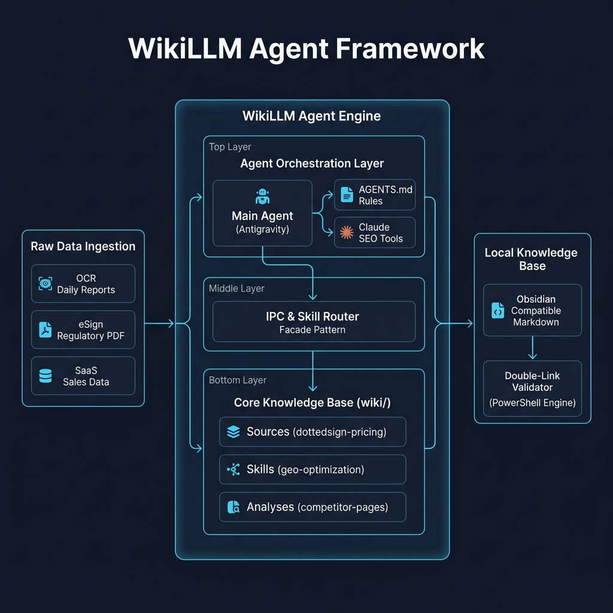

# 🧠 BreezyBrain 好好腦：下一代 AI 企業工作流操作系統宣言

> **產品願景**：  
> 「讓企業沒有孤立的資訊孤島，沒有重複的手動打字，讓每一個合規簽署與業務決策都由大腦自動編排。」  
> **BreezyBrain (好好腦)** 是與 **BreezySign (好好簽)** 交相輝映的下一代企業級 AI 工作流操作系統。它以 **Local LLM (大模型中央大腦)** 為底座，穿透 BCR、CRM、CLM、BPM、ESign 與 KM 六大模組，實現數據採集到自動化簽核、知識沈澱的完美數字閉環。

---

## 🎨 一、 系統邊界與核心架構圖

BreezyBrain 採用與 Tauri 邊界同級的「高內聚、安全隔離」三層架構。以下為系統的核心編排與數據流向圖：



---

## 📊 二、 產品五大核心資訊系統支柱 (Core IT Pillars)

BreezyBrain 將企業內碎片化的軟體（SaaS）無縫融合成一個有機生命體：

```
+------------------------------------------------------------------------------------------------+
|                                    BreezyBrain (中央 Local LLM 大腦)                           |
+-------------+-------------+------------------+------------------+---------------+--------------+
|     BCR     |     CRM     |       CLM        |       BPM        |     ESign     |      KM      |
|  (人脈採集)  | (BreezyCRM) |  (Word/Doc協作)  | (Workflow/版控)  | (BreezySign)  |  (WikiLLM)   |
+-------------+-------------+------------------+------------------+---------------+--------------+
```

### 1. 📇 BCR (Business Card OCR) ── 流量與人脈採集器
* **核心功能**：透過高精度手機拍照或掃描儀 OCR，自動解析名片實體。
* **數據解析實體**：公司名稱、聯絡人姓名、職稱、Tel/Email/IM。
* **AI 賦能點**：由大腦自動清洗、修復並補全解析後的髒數據。

### 2. 📈 CRM (Customer Relationship Management) ── 客戶與銷售管理中樞
* **自建系統**：**BreezyCRM (微型 CRM)**。
* **數據解析實體**：Active Management (主動跟進)、Project (專案項目)、SaaS Product (軟體方案)。
* **AI 賦能點**：避免依賴外部第三方 SaaS。大腦直接於系統內聚流轉中，根據客戶行為數據自動劃分跟進優先級，觸發 followup 工作流。

### 3. 📝 CLM (Contract Lifecycle Management) ── 合約共同協作系統
* **協作方式**：**doc-cowork** ── 基於 MS-WORD、Google-DOC 線上共同編輯。
* **核心功能**：線上協同審查、條款變更追蹤。
* **AI 賦能點**：**AI-review** ── 大模型自動審約，識別合約漏洞與合規風險。

### 4. ⚙️ BPM (Business Process Management) ── 企業內部工作流與版控
* **覆蓋對象**：ALL (跨部門) ── 包含 Sales、Admin、RD、PM、MKT。
* **核心功能**：文件流審批、版控（版本控制）、權限共通配置。
* **AI 賦能點**：大模型根據審批歷史，自動識別流程瓶頸並加速合規決策。

### 5. 🔏 ESign (電子簽章) ── 交易結算與法律防禦模組
* **指定系統**：**BreezySign (好好簽我方產品！)**。
* **核心功能**：Sales / Admin 簽署通知與發送、軌跡紀錄、IP安全限制。
* **AI 賦能點**：結合「LINE傳簽」與「聲明錄影防賴」，產出具備推定效力的數位簽核證據。

### 6. 🗃️ KM (Knowledge Management) ── 企業終極記憶庫
* **系統結構**：Files Manager ➡️ RAW原始 ➡️ AI-整理 ➡️ **KM (公司Wiki) graphify 知識圖譜**。
* **核心功能**：沉澱企業 Rule (技能規則)、沉澱公司與個人 Info。
* **AI 賦能點**：大腦自動將 RAW 非結構化合約與日誌轉化為雙鏈知識網絡，實現**知識圖譜化 (Graphify)**。

---

## 🔗 三、 雙向連結與項目關聯

- **市場可行性研析**：[[analyses/bzb/bzb-concept-market-analysis|BreezyBrain 產品概念與市場可行性極致研析報告]]
- **自動化數據流定義**：[[breezy-brain-integration-flow|BreezyBrain 跨系統自動化數據流與 API 規格]]
- **研發落地路線圖**：[[breezy-brain-roadmap|BreezyBrain 四階段產品落地路線圖]]
- **ESign 底座核心**：[[analyses/esign/esign-pricing-feature-comparison|國內三大電子簽章官網方案與功能極致對比表]]
- **CRM 跟進範本**：[[enterprise-trial-followup|企業試用期與 BreezyCRM 階段追蹤 SOP]]

---

## 📂 四、 AIPM 專案目錄關聯

依據 AIPM 規範，本宣言為高階概念指引，具體的實作與變更請參閱以下核心文件：
- **產品需求定義**：[[Product-Spec|BreezyBrain 產品需求文件 (MVP)]]
- **需求變更紀錄**：[[Product-Spec-CHANGELOG|BreezyBrain 需求變更紀錄]]
- **UI/UX 介面設計**：[[UI-Prompts|BreezyBrain UI 提示詞清單]]
