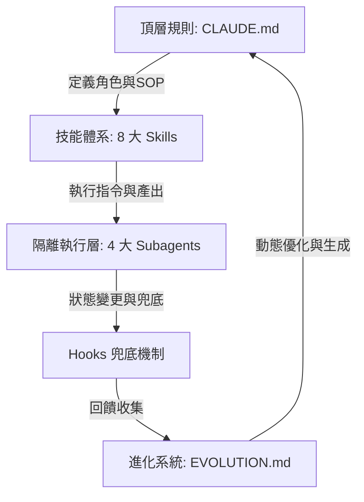

# Product Manager 4.0 (AIPM 4.0) 系統架構升級指南

> **摘要**：本文件整理自廢才俱樂部的 AI 開發實踐分享，詳述了 AI 時代下產品經理的全新開發範式——**Product Manager 4.0 (AIPM 4.0)** 框架。該框架採用「頂層規則 + 技能體系 + 進化系統」的三層架構，引進 Subagent 隔離、Hooks 兜底與自動進化，實現了 100% 的 Vibe Coding 自主開發與持續成長。

---

## 01. 🚀 AIPM 4.0 三層核心架構

AIPM 4.0 突破了傳統 AI 協作零散、失控的侷限，將軟體工程實踐封裝為三大層次：

### 1. 頂層規則 (CLAUDE.md)
* **定位**：整個專案的「團隊行為契約」與「工作流程指南」。
* **職責**：定義整個 Agent 團隊的角色，規定 8 大開發任務的進入門檻與對應 Skills，並定義標準的文件與目錄結構，確保所有操作均在確定的語意軌道上執行。

### 2. 技能體系 (8 大 Skills)
* **定位**：覆蓋產品開發完整鏈路的標準操作程序（SOP）包。
* **Skills 組成**：
  1. **Product Spec Builder**：需求收集與面向 AI 的產品需求文檔（PRD）生成。
  2. **Design Brief Builder**：設計規範文檔生成，定義視覺方向、配色、灰階與交互調性。
  3. **Design Maker**：藉由設計工具（如 Pencil, Figma 的 MCP 連接）繪製並輸出標準設計原型圖。
  4. **Dev Planner**：深入閱讀所有文檔，調研開源技術，生成詳細的開發排期計畫 `DEV-PLAN.md`。
  5. **Dev Builder**：執行程式碼編寫，採用增量開發模式。
  6. **Bug Fixer**：修復程式 Bug（採用嚴謹的四階段調試法，詳見下文）。
  7. **Code Reviewer**：進行程式碼品質審查、功能性測試與對照 PRD 的「需求漂移檢測」。
  8. **Release Builder**：負責最終的軟體編譯、構建與發布。

### 3. 進化系統 (EVOLUTION.md)
* **定位**：確保系統越用越好、持續自我迭代的成長模組。
* **運作機制**：在後台靜默掃描使用者回饋，將高頻出現的修正轉化為正式規則，持續優化現有技能或提議新建技能。

---

## 02. ⚙️ 隔離執行層與 Hooks 兜底

### 1. 隔離執行層 (Subagent 隔離原則)
AIPM 4.0 在底層部署了 4 大專業的 Subagents：
* **Implementer**：負責具體代碼的編寫。
* **Code Reviewer**：負責代碼審查與測試。
* **Feedback Observer**：負責半自動化記錄用戶的反饋。
* **Evolution Runner**：負責在後台掃描反饋並提議進化方案。

> [!IMPORTANT]
> **Subagent 隔離原則**：每個子任務（Task）都必須使用一個全新啟動的實例，**絕對不復用或繼承之前的上下文**。
> * **原因**：若讓 Agent 帶著上一個任務的上下文記憶去執行下一個任務，前期的錯誤假設或被淘汰的代碼細節會悄悄污染後續的判斷。隔離，才能保證每一次執行都是 100% 乾淨與精確的。

### 2. Hooks 兜底機制 (雙層安全機制)
僅靠自然語言要求 AI 決定什麼時候做什麼事是不穩定的，AIPM 4.0 引進了系統級的 Hooks 兜底：
* **Pre-commit Check**：在執行 git commit 前自動觸發，編譯不通過就直接阻止 commit。
* **Auto Push**：commit 成功後自動推送到遠端倉庫。
* **Stop Gate (關鍵約束)**：當 AI Agent 準備停下來並宣告任務完成時，檢測代碼是否已修改但未通過 `Code Reviewer` 審查，若未審查則強制阻止 Agent 停止，確保審查不漏失。
* **Detect Feedback Signal**：自動檢測用戶消息中的「不滿意」、「修正」等負面關鍵詞，半自動記錄到 `feedback/` 目錄中，並加載至 `feedback-index.md`。

---

## 03. 🛠️ Bug Fixer 四階段調試法

AIPM 4.0 嚴厲拒絕「看到 Error Log 就憑直覺修改程式碼」的碰運氣式 Bug 修復。它強制 Bug Fixer 技能執行以下四個階段：

1. **收集證據 (Evidence Gathering)**：
   * 收集完整的錯誤堆棧、變數狀態、日誌輸出與直接呼叫者環境。沒有充足證據時絕不往下做任何結論。
2. **分析模式 (Pattern Analysis)**：
   * 分析錯誤發生的模式，對比歷史 Bug 記錄，排除偶發性干擾，找出病灶所在的具體程式區塊。
3. **提出假設並驗證 (Hypothesis & Verification)**：
   * 提出「為什麼會出錯」的具體理論假設，並設計一個極小的單一測試或印出語句來驗證該假設是否成立。
4. **實施修復與回歸 (Implementation & Regression)**：
   * 一次只修改一個地方。修復完成後，**必須**啟動回歸測試，確保修復 Bug A 時沒有破壞功能 B。

---

## 04. 🌀 4 層自動進化系統

系統在執行過程中會源源不絕地積累使用者反饋，並透過以下四個層級進行自我進化：

* **第一層：回饋記錄**：用戶給出意見時，系統透過 `Feedback Observer` 自動或提示性記錄在後台。
* **第二層：畢業升級 (Graduation)**：當同一個反饋意見（如「改動 UI 時必須同步更新設計稿」）在後台**出現 3 次以上**，`Evolution Runner` 會提議將其「畢業」，直接寫入對應的 Skill 檔案中成為正式規則。
* **第三層：Skill 優化**：如果某個 Skill 的任務評分持續偏低，系統會主動在重啟會話時提議優化該 Skill 的 Prompts。
* **第四層：全新 Skill 創生**：當某個特定的開發/協作場景反覆出現，但現有 8 大 Skills 無一覆蓋時，系統會自動在後台生成一個全新的 Skill Prompts 模板，提議創建全新 Skill。

---

## 05. 💡 Vibe Coding 3 大產品思考

廢才俱樂部在實踐中總結了 AI 代理時代極具決策含金量的三大思考：

### 1. 先編排，再開發 (Orchestrate First)
* 不要一上來就寫程式碼。應該先用最簡單的 Markdown 文件定義 Skill、工作流與 Agent 約束，把整個邏輯（Logic）跑通。
* **原因**：編排的成本幾乎為零。一個 Markdown 就能驗證您的產品邏輯是否成立。跑通了再轉譯為代碼，方向不會錯；跑不通幾分鐘就能推翻重來。

### 2. AI 是第一受眾，而非人類 (AI-First Interface)
* 在設計工具或服務時，第一個問題不是「用戶好不好點」，而是「AI 能不能用」。
* **影響**：這導致工具類產品開始 **CLI (命令列) 化** 與 **API 優先**。AI 不需要花哨的按鈕，它需要的是清晰的接口、結構化的 JSON 與明確的指令。
* **UI 觀點**：界面不是一開始就設計好的，而是當 Agent 在跑工作流時，發現某個環節確實需要人類的決策介入，為了方便人類操作，才把這個界面的按鈕「推導」出來。

### 3. 容器化動態界面 (Containerized Interface)
* 傳統的軟體界面是死的，按鈕和流程都是固定的，擴展一個題材就得重新開發一套程式。
* **升級**：在 AIPM 4.0 中，**界面只是技能的容器**。軟體的殼是固定的，具體的流程怎麼跑、什麼時候出現什麼按鈕，完全由對話框中的 Skill 技能包動態控制。
* **好處**：加載一套新的技能包（如從寫現代言情小說切換為寫科幻小說，或切換至程式碼開發），就是一個全新的產品。同一個殼，跨多個行當，零二次開發成本。

---

**關聯文獻**：
- [[claude-rules-12-commandments|CLAUDE.md 12條黃金行為指令規範]]
- [[vibe-coding-paradigm|Vibe Coding 編程範式革命]]
- [[harness-engineering|Harness Engineering 系統防護機制]]
- [[analyses/bzb/bzb-antigravity-aipm-framework|Antigravity AIPM 框架分析報告]]
