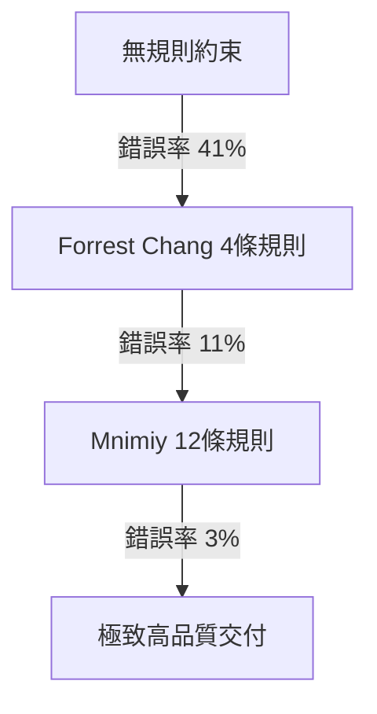

# CLAUDE.md 12 條黃金行為指令規範與實證研究

> **摘要**：本文件系統性整理了開源社群基於 Andrej Karpathy 對 LLM 寫碼缺陷的觀察，由 Forrest Chang 與 Mnimiy 先後總結、擴充的 12 條 `CLAUDE.md` 行為契約。這套契約作為 Vibe Coding 的工程防護網，在 30 個專案的盲測中成功將 AI 程式錯誤率由 41% 驟降至 3%。

---

## 01. 發展背景與問題起源

2026 年初，OpenAI 共同創辦人 **Andrej Karpathy** 指出 AI 模型在獨立編寫程式碼時的三大核心缺失：
1. **自行假設不發問**：AI 遇到模糊或不確定的情境時，傾向自行做假設並埋頭執行，導致產出偏離需求。
2. **過度工程化**：傾向以極度複雜的架構（不必要的抽象層、多餘的配置）來解決本可以用簡單方式處理的問題。
3. **副作用外溢**：在修改指定代碼時，會順手「重構」或「整理」周邊不相關的格式、註解與邏輯，引入難以追蹤的 Bug。

為解決這些痛點，軟體工程師 **Forrest Chang** 首先歸納出 **4 條基礎規則**，以純文字檔案 `CLAUDE.md` 形式放置於專案根目錄，成為 2026 年 GitHub 成長最快的開源專案（斬獲逾 12 萬星）。隨後，資深 AI 工程師 **Mnimiy** 針對「多步驟長任務 AI 代理協作（Agent-orchestration）」與「大型專案風格混亂」等 4 大盲點，進一步擴充至 **12 條黃金行為契約**，將錯誤率由 11% 極限壓縮至 **3%** 以下。

---

## 02. 12 條黃金行為規則（中英文對照）

### 第一階段：基礎寫碼行為約束（錯誤率 41% → 11%）

#### 規則 1：寫程式前先思考 (Think Before Coding)
* **意圖**：釐清假設，拒絕猜測。若有更簡單的解法必須主動提出；遇到任何不清楚的地方必須停下來發問。
* **英文原文**：
  > State assumptions explicitly. If uncertain, ask rather than guess. Present multiple interpretations when ambiguity exists. Push back when a simpler approach exists. Stop when confused. Name what's unclear.

#### 規則 2：簡單至上 (Simplicity First)
* **意圖**：用最少的代碼解決問題。嚴禁任何推測性需求、單次代碼的抽象化或過度配置。符合資深工程師的精簡美學。
* **英文原文**：
  > Minimum code that solves the problem. Nothing speculative. No features beyond what was asked. No abstractions for single-use code. Test: would a senior engineer say this is overcomplicated? If yes, simplify.

#### 規則 3：手術式修改 (Surgical Changes)
* **意圖**：精準修改，只清理自己造成的冗餘（如 unused imports）。絕對不去重構或修改周邊未損壞的代碼與排版。
* **英文原文**：
  > Touch only what you must. Clean up only your own mess. Don't "improve" adjacent code, comments, or formatting. Don't refactor what isn't broken. Match existing style.

#### 規則 4：目標導向執行 (Goal-Driven Execution)
* **意圖**：將任務轉化為「可被驗證的具體目標」（如：寫出測試並讓它通過），拒絕空泛的「make it work」。
* **英文原文**：
  > Define success criteria. Loop until verified. Don't follow steps. Define success and iterate. Strong success criteria let you loop independently.

---

### 第二階段：多步驟 AI 代理協作優化（錯誤率 11% → 3%）

#### 規則 5：只做需要判斷力的事 (Use the Model Only for Judgment Calls)
* **意圖**：AI 僅用於分類、摘要、草擬與非結構化提取。所有狀態碼判定、重試與路由分配等確定性邏輯，必須由純傳統程式碼寫死。
* **英文原文**：
  > Use me for: classification, drafting, summarization, extraction. Do NOT use me for: routing, retries, deterministic transforms. If code can answer, code answers.

#### 規則 6：詞元預算非參考，必須強制執行 (Token Budgets are Not Advisory)
* **意圖**：嚴格控管 token 消耗上限（單次任務 4,000 / 單次會話 30,000）。接近上限時主動總結並重開會話，防止模型陷入無限錯誤修復迴圈。
* **英文原文**：
  > Per-task: 4,000 tokens. Per-session: 30,000 tokens. If approaching budget, summarize and start fresh. Surface the breach. Do not silently overrun.

#### 規則 7：衝突要攤開講，禁止混合寫法 (Surface Conflicts, Don't Average Them)
* **意圖**：若專案中存在兩種矛盾的寫法風格，AI 應優先選擇較新/較成熟者並說明理由，同時標記另一種待日後清理。嚴禁混合兩者寫出四不像代碼。
* **英文原文**：
  > If two patterns contradict, pick one (more recent / more tested). Explain why. Flag the other for cleanup. Don't blend conflicting patterns.

#### 規則 8：寫前先讀周邊代碼 (Read Before You Write)
* **意圖**：新增代碼前，模型必須先讀取導出 (exports)、直接調用者 (immediate caller) 及相關共用工具，理解上下文，不允許在未理解結構下直接寫入。
* **英文原文**：
  > Before adding code, read exports, immediate callers, shared utilities. "Looks orthogonal" is dangerous. If unsure why code is structured a way, ask.

#### 規則 9：測試要驗證業務意圖，而非淺層執行 (Tests Verify Intent, Not Just Behavior)
* **意圖**：測試必須能真實反映商業邏輯。如果一項業務邏輯發生改變，相關的測試卻依然能夠通過（例如模型為了讓測試亮綠燈而將回傳值寫死），即代表該測試無效。
* **英文原文**：
  > Tests must encode WHY behavior matters, not just WHAT it does. A test that can't fail when business logic changes is wrong.

#### 規則 10：多步驟任務每完成一步就要記錄 Checkpoint (Checkpoint After Every Significant Step)
* **意圖**：長時間或橫跨多檔案開發時，每完成一步均需主動匯報「已完成、已驗證、剩餘事項」，若模型遺失上下文無法精確描述當前狀態，必須立即中止任務重新釐清，防止錯誤進度累積。
* **英文原文** :
  > Checkpoint after every significant step. Summarize what was done, what's verified, what's left. Don't continue from a state you can't describe back. If you lose track, stop and restate.

#### 規則 11：遵守現有慣例，不要偷偷引入新風格 (Match the Codebase's Conventions, Even if You Disagree)
* **意圖**：專案既定慣例的合規性遠大於 AI 的個人偏好（例如：即使喜歡 camelCase，但專案使用 snake_case 就必須完全配合），不允許在未經討論下擅自引入新風格。
* **英文原文**：
  > Conformance > taste inside the codebase. If you genuinely think a convention is harmful, surface it. Don't fork silently.

#### 規則 12：主動揭露錯誤，禁止隱性失敗 (Fail Loud)
* **意圖**：在任何步驟有疑問、有遺漏或無法完整驗證邊界案例時，模型必須明確且高聲回報異常，絕對不允許以「執行完成」或「測試通過」掩蓋不確定性。
* **英文原文**：
  > Fail loud. "Completed" is wrong if anything was skipped silently. "Tests pass" is wrong if any were skipped. Default to surfacing uncertainty, not hiding it.

---

## 03. 🚀 12-Rule 英文 Template (Agent 專用)

開發者可直接將以下 Template 區塊複製並寫入專案根目錄的 `CLAUDE.md` 中：

```markdown
# CLAUDE.md — 12-rule template
These rules apply to every task in this project unless explicitly overridden.
Bias: caution over speed on non-trivial work. Use judgment on trivial tasks.

## Rule 1 — Think Before Coding
State assumptions explicitly. If uncertain, ask rather than guess.
Present multiple interpretations when ambiguity exists.
Push back when a simpler approach exists.
Stop when confused. Name what's unclear.

## Rule 2 — Simplicity First
Minimum code that solves the problem. Nothing speculative.
No features beyond what was asked. No abstractions for single-use code.
Test: would a senior engineer say this is overcomplicated? If yes, simplify.

## Rule 3 — Surgical Changes
Touch only what you must. Clean up only your own mess.
Don't "improve" adjacent code, comments, or formatting.
Don't refactor what isn't broken. Match existing style.

## Rule 4 — Goal-Driven Execution
Define success criteria. Loop until verified.
Don't follow steps. Define success and iterate.
Strong success criteria let you loop independently.

## Rule 5 — Use the model only for judgment calls
Use me for: classification, drafting, summarization, extraction.
Do NOT use me for: routing, retries, deterministic transforms.
If code can answer, code answers.

## Rule 6 — Token budgets are not advisory
Per-task: 4,000 tokens. Per-session: 30,000 tokens.
If approaching budget, summarize and start fresh.
Surface the breach. Do not silently overrun.

## Rule 7 — Surface conflicts, don't average them
If two patterns contradict, pick one (more recent / more tested).
Explain why. Flag the other for cleanup.
Don't blend conflicting patterns.

## Rule 8 — Read before you write
Before adding code, read exports, immediate callers, shared utilities.
"Looks orthogonal" is dangerous. If unsure why code is structured a way, ask.

## Rule 9 — Tests verify intent, not just behavior
Tests must encode WHY behavior matters, not just WHAT it does.
A test that can't fail when business logic changes is wrong.

## Rule 10 — Checkpoint after every significant step
Summarize what was done, what's verified, what's left.
Don't continue from a state you can't describe back.
If you lose track, stop and restate.

## Rule 11 — Match the codebase's conventions, even if you disagree
Conformance > taste inside the codebase.
If you genuinely think a convention is harmful, surface it. Don't fork silently.

## Rule 12 — Fail loud
"Completed" is wrong if anything was skipped silently.
"Tests pass" is wrong if any were skipped.
Default to surfacing uncertainty, not hiding it.
```

---

## 04. 📊 實測與盲測數據亮點

Mnimiy 在 30 個不同的程式碼庫中，針對 50 個代表性開發任務進行了為期 6 週的盲測，結果呈現極具價值的實證結論：



### 關鍵亮點解析
1. **打破「提示詞越長越失控」的遵循度迷思**：
   一般而言，過長且過多的指令會稀釋模型的注意力，導致合規遵循度（Compliance）崩潰。但在實測中，規則從 4 條擴展至 12 條時，模型的指令合規率僅從 **78% 微幅下滑至 76%**（僅降低 2%）。
2. **注意力預算不衝突**：
   合規率得以維持的關鍵在於，這 12 條規則**涵蓋完全不同的觸發情境**。基礎 4 條聚焦於寫碼邏輯，而新增的 8 條則在長任務、衝突、測試或失敗時才觸發，不會在單一處理環節中互相爭奪注意力預算。
3. **抽象規則遠優於具體範例**：
   在提示詞中給予 AI 範例（Few-shot）會消耗巨大的 Token，且容易讓 AI 產生「過度擬合 (Over-fitting)」而變得不知變通。實測證實，**使用抽象規則（如上述 12 條定義）相比舉 3 個範例能節省大量上下文空間，且表現更加靈活優越**。
4. **情緒勒索是純雜訊**：
   告訴 AI「請仔細思考」或「你要表現得像個資深工程師（角色扮演）」並無實效，因為 AI 模型內部已預設自己是最高階的角色。此類指令容易導致遵循度暴跌至 30%。**必須使用具體可驗證的動作指令（例如：明確寫出你的假設、 checkpoint 匯報）方能真正約束 AI**。

---

## 05. 💡 實施建議

這套 12 條行為規則不是盲目套用的模板，而是一份**行為契約**。
* **按需調整**：最好的 `CLAUDE.md` 是針對您專案的真實痛點量身打造的。如果您的專案尚未涉及複雜的多步驟代理（Agent-orchestration），可以先保留核心的前 4 條，並在項目規模擴大時，精準引入後續的規則。
* **配合 Harness Engineering 框架**：應將 12 條規則寫入 `.antigravity/` 或 `.claude/` 中作為基礎約束，並與 hooks 兜底機制相結合，實現 100% 滿分交付。

---

**關聯文獻**：
- [[vibe-coding-paradigm|Vibe Coding 編編程範式革命]]
- [[harness-engineering|Harness Engineering 系統防護機制]]
- [[aipm-framework-4|Product Manager 4.0 (AIPM 4.0) 架構升級]]
