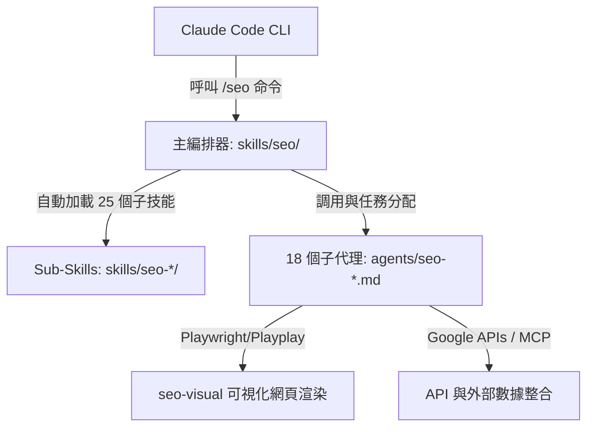

# Claude SEO Universal Skill 系統架構與實施指南

> **摘要**：本文件詳述了為 Claude Code 量身打造的 **Claude SEO (Universal Skill)** 插件工具。該工具內建 **25 個子技能 (Sub-skills)** 與 **18 個平行子代理 (Sub-agents)**，覆蓋了從技術性 SEO 審計、E-E-A-T 內容品質審查、結構化 Schema 標記、到生成式引擎優化 (GEO) 及程式化 SEO 門控等核心領域，是 Vibe Coding 時代行銷自動化的頂級工程實踐。

---

## 01. 🌀 系統核心架構

Claude SEO 採用高密度的「主編排器 + 子技能自動加載 + 子代理協同」之三層架構，完美對齊了 [[analyses/bzb/bzb-antigravity-aipm-framework|AIPM 4.0]] 的 Orchestrate First（先編排，再開發）哲學：



### 1. 目錄骨幹與自動發現 (Auto-discovery)
插件在本地的標準部署路徑如下，所有子技能與代理均採用**靜默自動發現**機制：
* `~/.claude/plugins/.../skills/seo/`：主編排器（Orchestrator）。
* `~/.claude/plugins/.../skills/seo-*/`：25 個子技能（Sub-skills）。
* `~/.claude/plugins/.../agents/seo-*.md`：18 個子代理（Sub-agents），完全使用 Markdown 進行行為契約定義，實踐 Subagent 隔離原則。

---

## 02. 🛠️ 25 個子技能與核心命令

### 1. 站點與單頁審計
* `/seo audit <url>`：執行全站平行式技術與內容大審核，由主代理調度 15 個核心子代理並行運算。
* `/seo page <url>`：針對指定 URL 進行單頁 SEO 與 DOM 層級深度剖析。

### 2. 生成式引擎優化 (GEO / AEO) 專項
* `/seo geo <url>`：**生成式引擎優化**！針對 Google AI Overviews、ChatGPT Web Search、Perplexity 進行 AEO (答案引擎優化) 內容可摘要性、定義框段落與實體引用比對，產出優化建議。
* `/seo hreflang <url>`：進行 hreflang 與 i18n 國際化 SEO 聲明（支援 HTML, HTTP headers, XML sitemap 格式），提供 ISO 639-1 / 3166-1 語言地區代碼嚴格校驗，防範多語言語意漂移。

### 3. 技術性與 Schema 優化
* `/seo technical <url>`：檢測 404 錯誤、HTTPS、Sitemap、robots.txt 以及 Core Web Vitals (LCP, INP, CLS)。註：INP (互動至下一畫面時間) 已於 2024 年正式取代 FID。
* `/seo schema <url>`：驗證與生成結構化 JSON-LD 資料。內建 **Google Schema 廢棄警告機制**（HowTo 於 2023 廢棄、FAQ 於 2023 被限制僅政府/醫療可用、SpecialAnnouncement 於 2025 廢棄）。
* `/seo images <url>`：自動審計網頁圖像之 Alt 標籤、格式、壓縮率與 DOM 佔位寬高。

### 4. 戰略與商業優化
* `/seo competitor-pages [url|generate]`：**競品比較頁面生成器**。自動產生轉換率優化的 "X vs Y" 與 "alternatives to X" 頁面，包括 Feature Matrices、CTA 佈局，以及內建 `Product` 與 `AggregateRating` 結構化資料，完美截擊競品流量。
* `/seo programmatic [url|plan]`：**程式化 SEO 分析與計畫**。
  > [!IMPORTANT]
  > **程式化 SEO 品質閘門 (Quality Gates)**：為防範大規模數據頁面造成 Index Bloat (索引膨脹) 與 Thin Content (薄內容) 處罰，插件強制執行 Harness Engineering 安全門控：
  > - 超過 **100 頁** 自動發出 **WARNING** 警告。
  > - 超過 **500 頁** 自動執行 **HARD STOP** 強制阻斷，未通過技術與內容審計禁止生成。
* `/seo local <url>` / `/seo maps [command]`：地圖情報與 Google Business Profile (GBP) NAP 一致性審查。
* `/seo cluster <seed-keyword>`：**語意主題聚類**。基於種子詞自動輸出樹狀語意聚類，協助網站建立主題權威 (Topical Authority)。
* `/seo sxo <url>`：搜尋體驗優化 (Search Experience Optimization)！
* `/seo drift [baseline|compare|history]`：**SEO 狀態漂移監控**。定期將當前頁面與 baseline 進行對比，即時警報任何代碼迭代引發的 SEO 衰退。

---

## 03. 🔌 外部數據與 4 階層憑證系統

這款工具支援與外部 Ahrefs (`@ahrefs/mcp`)、Semrush 及 DataForSEO 的 MCP 伺服器深度整合，並具備 4 階層憑證授權體系：

| 階層 (Tier) | 授權級別 | 啟用功能與 API 模組 |
| :---: | :--- | :--- |
| **Tier 1** | **無憑證 (Zero-Creds)** | 基礎爬取、DOM 解析、HTML 結構與 schema 提取。 |
| **Tier 2** | **免費 API (Free APIs)** | Google Indexing API（即時提交 URL）、Google PageSpeed Insights API (Core Web Vitals)。 |
| **Tier 3** | **OAuth 授權** | Google Search Console API（獲取 top queries、點擊率與索引覆蓋）、GA4 API。 |
| **Tier 4** | **付費 MCP 擴充** | Ahrefs, Semrush, Firecrawl (全站 Crawl) 與 DataForSEO（關鍵字推薦、反鏈監控、LLM Mention 與 AI 搜尋提及抓取）。 |

---

## 04. 🌀 SEO-FLOW 工作流實踐

該生態系統提供了行銷自動化開發的黃金五步工作流，可供 BreezySign 未來直接套用：

```
1. [/seo audit <url>] ──> 2. [/seo backlinks <url>] ──> 3. [/blog write <keyword>] ──> 4. [/seo image-gen hero] ──> 5. [/seo geo <url>]
   (審計網站與找出Gap)         (分析外鏈與競品差距)         (自動化撰寫SEO優化文章)        (使用Banana生成部落格 banner)     (將新文章進行 AI 搜尋引用優化)
```

1. **/seo audit https://example.com**：執行技術與內容大審查，鎖定內容缺口與 Core Web Vitals 效能瓶頸。
2. **/seo backlinks https://example.com**：調用反鏈子代理，挖掘競品的外鏈優勢與我們的未覆蓋區塊。
3. **/blog write "target keyword"**：調用生態系中的 `claude-blog` 技能，全自動撰寫架構完整、字數達標、符合主題權威的 SEO 優化文章。
4. **/seo image-gen hero "blog topic"**：調用創意導演 `banana` 擴充插件，自動繪製美輪美奐的 blog hero banner 並自動補上 WebP 壓縮與 alt 標籤。
5. **/seo geo https://example.com/blog/post**：執行 GEO 優化命令，針對 Google AI Overviews、Perplexity 等 AEO 引擎寫入易於 AI 引用的 FAQ 微格式與定義框段落，實現生成式搜尋的完美包抄。

---

## 05. 對 WikiLLM 的重要價值

引進 Claude SEO 的實踐，將大幅升級 WikiLLM 的行銷技能庫：
* **工程防護落地**：其程式化 SEO 的 100 頁與 500 頁 Hard Stop 安全門控，能直接做為我們 [[harness-engineering|Harness Engineering]] 行銷部分的控制標準。
* **雙鏈閉環優化**：利用語意聚類技能 `/seo cluster` 來規劃 Wiki 頁面之間的雙向 Obsidian 雙鏈連結，能夠大幅強化 WikiLLM 整體的主題權重構建。

---

**關聯文獻**：
- [[geo-optimization|GEO 生成式引擎優化技能]]
- [[seo-optimization|SEO 搜尋引擎優化技能]]
- [[vibe-coding-paradigm|Vibe Coding 編程範式革命]]
- [[analyses/bzb/bzb-antigravity-aipm-framework|Antigravity AIPM 框架分析報告]]
- [[aipm-framework-4|Product Manager 4.0 系統架構]]
