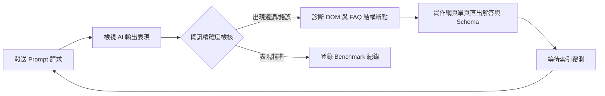

# 實際 AI 搜尋測試與 GEO 實證方法

> 透過主動發起生成式檢索請求，實證並追蹤品牌在主流大語言模型（如 ChatGPT Search、Gemini、Perplexity）底層知識空間與即時 RAG 抓取中的能見度與表現。

---

## 一、 測試環境與先決條件設定

在執行 AI 搜尋能見度普查前，為確保檢索排序不受歷史互動偏誤干擾，需嚴格遵照以下設定原則：

1. **清除狀態殘留**：暫時關閉 AI 帳號層級的「長期記憶（Memory）」設定，或建立全新且無前後文關聯的獨立對話視窗。
2. **多引擎覆蓋矩陣**：
   - **OpenAI SearchGPT / ChatGPT (GPT-4o)**：追蹤通用型問答與內嵌網頁瀏覽工具的即時資訊整合度。
   - **Google Gemini Advanced / AI Overviews (SGE)**：追蹤原生 Google 檢索圖譜與 AI 摘要區塊的融合邏輯。
   - **Perplexity AI (Pro 模式)**：具備高頻率引文溯源特性，作為網站結構與文字易取度（Extractability）的核心指標器。
   - **Claude 3.5 Sonnet**：檢驗靜態權重與訓練快照中的長效品牌認知。

---

## 二、 搜尋意圖覆蓋矩陣（Prompting Strategy）

基於目標受眾的決策漏斗，將測試提示詞劃分為四大核心類型：

### 1. 廣泛探索型請求（Top of Funnel - 類別能見度）
> **目標**：測試未指定品牌時，自然生成的 Share of Voice。
- `請推薦台灣市場上合法合規、具備政府立案認可的電子簽章系統，並比較其主要優勢。`
- `支援 Adobe AATL 國際數位憑證的簽約軟體有哪些？請列出前三名。`

### 2. 深度評估型請求（Middle of Funnel - 比較與公信力）
> **目標**：測試 AI 是否能正確帶入品牌的獨特權威信號與技術壁壘。
- `請幫我詳細對比「點點簽」、「律果簽」與「好好簽」的方案計費方式、憑證支援度及法規效力，並以表格呈現。`
- `在台灣導入電子簽約系統，點點簽和好好簽哪一家比較具備政府公信力與資安認證？`

### 3. 精準轉換型請求（Bottom of Funnel - 價格與限制）
> **目標**：檢驗官網是否存在阻斷大模型理解的**資訊黑洞**（如 FAQ 空白或未靜態呈現報價數字）。
- `好好簽（BreezySign）的標準付費方案具體費用是多少？免費試用版有哪些限制？`
- `律果簽各級距方案支援的人數與簽署任務數上限為何？`

### 4. 實體收束型請求（Entity Resolution Audit）
> **目標**：確認大模型是否將多種別名正確收束至單一品牌識別。
- `「蒙恬好好簽」與「BreezySign」是指同一個服務嗎？其背後的技術提供商是誰？`

---

## 三、 核心衡量指標（GEO 評估 KPI）

針對每次測試的生成輸出，進行以下量化與質化檢核：

| 評估維度 | 定義與檢核點 | 目標通過門檻 |
|---------|------------|------------|
| **提及率 (Visibility)** | 目標品牌出現在未指名道姓推薦名單中的比例。 | 5 次獨立測試中至少出現 3 次以上。 |
| **引用率 (Citation)** | 系統是否明確附上指向品牌官網的超連結或參考文獻標註。 | 結語附帶精確跳轉連結。 |
| **精確度 (Accuracy)** | 輸出的價格、功能限制是否與當前官網資訊零誤差。 | 無數字遺漏、無模型幻覺（Hallucination）。 |
| **權威傾向 (Authority)** | 摘要中是否帶有正面的官方核可聲明或第三方背書敘述。 | 成功載入「數發部能量登錄通過」等強信號。 |

---

## 四、 測試實作閉環與除錯流程

### 💡 實務診斷案例：好好簽定價測試
在對好好簽發起「如何收費」的轉換型測試時，AI 往往給出「官網未提供標準方案定價」或轉介競品的結果。經比對確診為官網定價頁 FAQ 答案全空所致；在進行內容填補與 DOM 重構後，即可重啟覆測驗證改版成效。
